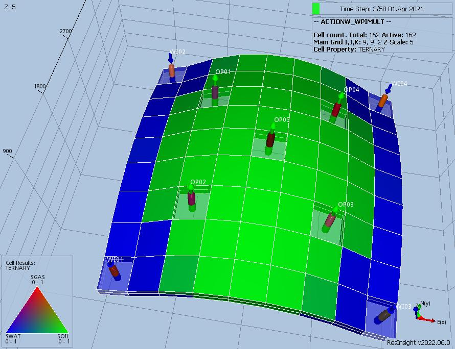

# ACTIONW Test Documentation

Case Name         | Case Desciption                                               | Base Model | Test<br />Type | Results<br />Match | Comments |
----------------- | ------------------------------------------------------------  | ---------- | ----- |------- | ------------------------------------- |
ACTIONW-WPIMULT-00| Base case run, with producers OP01 to OP04 having ACTIONW blocks that applies a PI multiplier 1.00.   | WPIMULT |    | NA     | E100 runs as expected waiting on OPM Flow implementation.
ACTIONW-WPIMULT-01| Producers OP01 to OP04 have an ACTIONW blocks that reduces the PI of the well by 0.900.               | WPIMULT |    | NA     | E100 runs as expected waiting on OPM Flow implementation.
ACTIONW-WPIMULT-02| Various ACTIONW blocks to test behaviour, including nested ACTIONW block (see below).                 | WPIMULT |    | NA     | E100 runs as expected waiting on OPM Flow implementation.
ACTIONW-WPIMULT-03| Various ACTIONW blocks to test behaviour on both producers and injectors (see below).                 | WPIMULT |    | NA     | E100 runs as expected waiting on OPM Flow implementation.
ACTIONW-WPIMULT-04| Various ACTIONW blocks to test behaviour on both producers and injectors (see below).                 | WPIMULT |    | NA     | E100 runs as expected waiting on OPM Flow implementation.
ACTIONW-WPIMULT-05| Various ACTIONW blocks with oil producers productivity indices modified to give more variable results (see below).| WPIMULT |    | NA     | E100 runs as expected waiting on OPM Flow implementation.

**The ACTIONW keyword is currently not supported, but work is ongoing to implement the keyword; thus, these tests are
designed to test the implementation when the keyword has been implemented.**

**Notes:** 

1. _Test Type_ column shows if the case is used for integration testing (_Int_), or regression testing (_Reg_).  
2. _Results Match_ column indicate if the OPM Flow results match the commercial simulator.
3. All models run on five day time steps via the TUNNING keyword.

**Version: 25 November 2022**

### ACTIONW Model (Irregular Corner-Point)

This model is a simple (9, 9, 2) model with five oil producers and four water injectors using an Irregular
Corner-Point grid. This is a three-phase model using MODEL05 PVT and well VFP data. The model has only one group, as shown 
below:
``` 
                   FIELD                                                                     
                   |                                                                         
                   |---PLAT-1                                                                                                                       
``` 



### ACTIONW-00 Description and Results
Base case model with:

 1) The field has an oil rate target of 10,000 m3/d and water injection is via PLAT-1 is set VREP 1.00. 
 2) Base case run with producers OP01 to OP04 having ACTIONW blocks that applies a PI multiplier of 1.00 when the 
 water cut exceeds, 0.20, 0.40 and 0.60. Used for testing the timing of the ACTIONW events, as the run should not 
 change anything.

[ACTIONW_WPIMULT-00 ECL Results](plots/ACTIONW_WPIMULT-00-ECL.md) 

### ACTIONW-01 Description and Results

 1) The field has an oil rate target of 10,000 m3/d and water injection is via PLAT-1 is set VREP 1.00. 
 2) Producers OP01 to OP04 have ACTIONW blocks that multiplies the PI of the well by 0.900 when the water cut exceeds, 
0.20, 0.40 and 0.60.

[ACTIONW_WPIMULT-01 ECL Results](plots/ACTIONW_WPIMULT-01-ECL.md) 

### ACTIONW-02 Description and Results

 1) The field has an oil rate target of 10,000 m3/d and water injection is via PLAT-1 is set VREP 1.00. 
 2) Producer OP01 has a nested ACTIONW block that first tests if the well's water cut exceeds 0.20 (ACTW-01A), if it 
 does then ACTW-01B checks if the well PI is greater than 40.0 and if it is, then multiply the PI by 0.900. 
 ACTW-01A is set to execute three times and ACTW-01B only once, so the action should only be executed once.
 3) For OP02 the ACTW-02A and ACTW-02B are the same as for OP01, except ACTW-02B is allowed to execute twice.
 4) OP03 is the same as OP01, except this should not execute as the ACTW-03A and ACTW-03B should be overwritten by 
 OP04 action blocks.
 5) OP04 is the same as OP01, except this should execute as the ACTW-03A and ACTW-03B overwrite the previous versions, 
 and thus OP04 is choked back but not OP03. This is a deliberate typo test to check if we issue a warning if this occurs.

[ACTIONW_WPIMULT-02 ECL Results](plots/ACTIONW_WPIMULT-02-ECL.md) 

### ACTIONW-03 Description and Results

 1) The field has an oil rate target of 10,000 m3/d and water injection is via PLAT-1 is set VREP 1.00. 
 2) Producer OP01 has an ACTIONW block that tests if the well's total liquid production is greater than 
 2.10E6 (ACTW-01), if it is then the well PI is increased by 1.100. ACTW-01 is set to execute three times. 
 3) OP02 has a ACTIONXW block with ACTW-02 checking if the well's total liquid production is greater than 1.56E6, 
 and if is then the PI is reduced by 0.900, three times.  
 4) ACTI-03 checks if the water injection total for WI03 is greater than 3.0E6 four times, and if it is, then the 
 PI is reduced. 
 5) Finally, ACTI-04 checks if the water injection total for WI04 is greater than 3.2E6 four times, and if it is then 
 the PI is increased four times.

[ACTIONW_WPIMULT-03 ECL Results](plots/ACTIONW_WPIMULT-03-ECL.md)  

### ACTIONW-04 Description and Results

 1) The field has an oil rate target of 10,000 m3/d and water injection is via PLAT-1 is set VREP 1.00. 
 2) Producer OP01 has an ACTIONW block that tests if the well's total liquid production is greater than 2.10E6 
 (ACTW-01), if it is then the well PI is increased by 1.100. ACTW-01 is set to execute three times. 
 3) OP02 has a nested ACTIONXW with ACTW-02A checking if the well's total liquid production is greater than 1.56E6, 
 and if is then ACTW-02B decreases the PI by 0.900. ACTW02A and ACTW-02B are allowed to execute three times. 
 4) ACTI-03A checks if the water injection total for WI03 is greater than 3.0E6 one time, and if it is, then 
 ACTI-03B is called four times to reduce the PI.
 5) Finally, ACTI-04A checks if the water injection total for WI04 is greater than 3.2E6 two times, and if it is then 
 ACTI-04B called four times to reduce the PI.

[ACTIONW_WPIMULT-04 ECL Results](plots/ACTIONW_WPIMULT-04-ECL.md)  

### ACTIONW-05 Description and Results

 1) The field has an oil rate target of 10,000 m3/d and water injection is via PLAT-1 is set VREP 1.00. 
 2) Oil producers productivity indices modified to give more variable results.
 3) ACT-01 checks all wells to see if their water cut is above a certain value, and if so shuts in layer two.

[ACTIONW_WPIMULT-05 ECL Results](plots/ACTIONW_WPIMULT-05-ECL.md)    