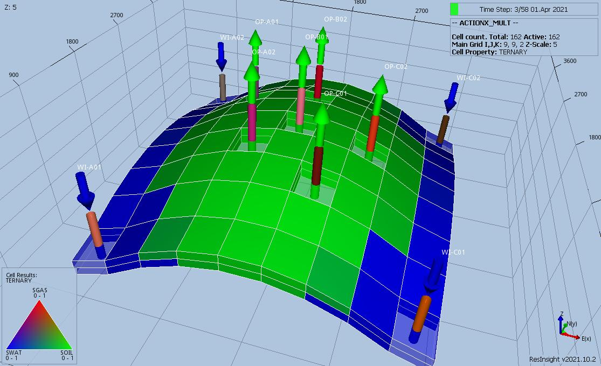
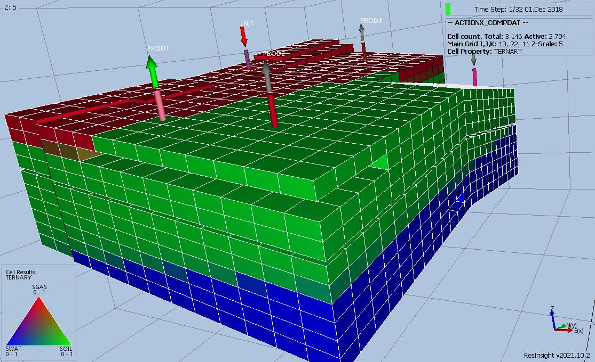
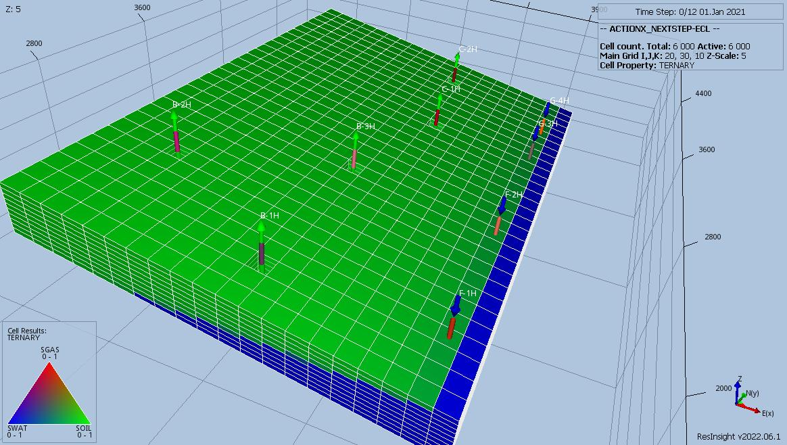
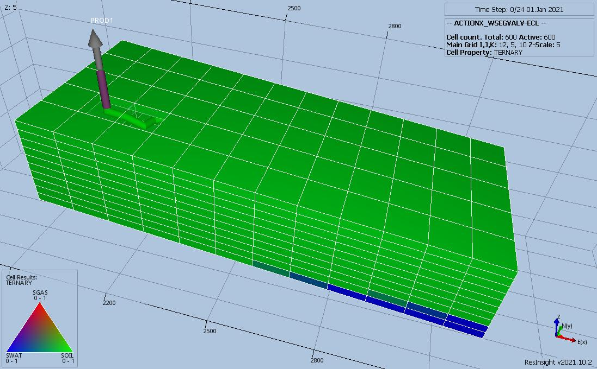

# ACTIONX Test Documentation

Main Keyword | Secondary Keywords | Case Name        | Run Type   | Base Model | Flow<br />Support | Comments |
------------ | ------------------ | ---------------- | ---------  | ---------- | ------- | ------------------------------------- |
BOX          | ENDBOX, MULTX, MULTY, MULTZ                                         | ACTIONX_BOX        | Prediction | MULT       | No    | Model is supported without ACTIONX keyword
COMPDAT      | COMPLUMP, WELOPEN                                                   | ACTIONX_COMPDAT    | History    | MODEL02    | Yes   | 
COMPLUMP     | WELOPEN                                                             | ACTIONX_COMPLUMP   | History    | MODEL02    | Yes   | 
ECHO         | -                                                                   | -                  | -          | -          | -     | Keyword not supported in deck.
ENDBOX       | BOX, MULTX, MULTY, MULTZ                                            | See ACTIONX_BOX    | Prediction | MULT       | No    | 
GCONINJE     | WELOPEN                                                             | ACTIONX_GCONINJE   | Prediction | MODEL02    | No    | 
GCONPROD     | UDQ, WCONINJE, WCONPROD                                             | ACTIONX_GCONPROD   | Prediction | MODEL02    | Yes   | The model is used for regression testing.
GCONSUMP     | GCONPROD, WCONPROD                                                  | ACTIONX_GCONSUMP   | Prediction | MODEL02    | Yes   | 
GRUPNET      | -                                                                   | -                  | -          | -          | -     | Keyword not supported in deck.
GRUPTARG     | -                                                                   | -                  | -          | -          | -     | Keyword not supported in deck.
GRUPTREE     | GCONPROD, GCONINJE, WCONINJE, WELOPEN, WELSSPECS, WGRUPCON          | ACTIONX_GRUPTREE   | Prediction | MODEL02    | No    | 
GSATINJE     | -                                                                   | -                  | -          | -          | -     | Keyword not supported in deck.
GSATPROD     | -                                                                   | -                  | -          | -          | -     | Keyword not supported in deck.
INCLUDE      | COMPSEGS, WELSEGS                                                   | ACTIONX_INCLUDE    | Prediction | WSEGVALV   | Yes   | Users must be cautious about the contents of the included file, as conflicts with the base DATA file (e.g., time progression settings) or keywords unsupported by ACTIONX may cause issues.
MULT         |                                                                     | ACTIONX_MULT       | Prediction | MULT       | Yes   | 
MULT-        | BOX, ENDBOX, MULTX-, MULTY-, MULTZ-                                 | ACTIONX_MULT-      | Prediction | MULT       | No    |  
MULT+        | BOX, ENDBOX  MULTX, MULTY, MULTZ                                    | ACTIONX_MULT+      | Prediction | MULT       | No    | 
MULTX        | BOX, ENDBOX                                                         | ACTIONX_MULTX      | Prediction | MULT       | No    | 
MULTX-       | BOX, ENDBOX                                                         | ACTIONX_MULTX-     | Prediction | MULT       | No    | 
MULTY        | BOX, ENDBOX                                                         | ACTIONX_MULTY      | Prediction | MULT       | No    | 
MULTY-       | BOX, ENDBOX                                                         | ACTIONX_MULTY-     | Prediction | MULT       | No    | 
MULTZ        | BOX, ENDBOX                                                         | ACTIONX_MULTZ      | Prediction | MULT       | No    | 
MULTZ-       | BOX, ENDBOX                                                         | ACTIONX_MULTZ-     | Prediction | MULT       | No    | 
NEXT         | WELTARG                                                             | ACTIONX_NEXT       | Prediction | MODEL05    | No    | NEXT is an alias for NEXSTEP – see NEXTSTEP for documentation.
NEXTSTEP     | WELTARG                                                             | ACTIONX_NEXTSTEP   | Prediction | MODEL05    | No    | 
NOECHO       | -                                                                   | -                  | -          | -          | -     | Keyword not supported in deck.
UDQ          | WCONPROD                                                            | ACTIONX_UDQ        | Prediction | SPE09      | Yes   | The model is used for regression testing.
WCONINJE     | WELOPEN                                                             | ACTIONX_WCONINJE   | Prediction | MODEL02    | No    | 
WCONPROD     | GCONPROD, UDQ, WCONINJE                                             | ACTIONX_WCONPROD   | Prediction | MODEL02    | No    | 
WEFAC        | -                                                                   | ACTIONX_WEFAC      | Prediction | MODEL02    | Yes   | The model is used for regression testing.
WELOPEN      | COMPDAT, COMPLUMP                                                   | ACTIONX_COMPDAT    | History    | MODEL02    | Yes   | 
WELPI        | -                                                                   | ACTIONX_WELPI      | History    | MODEL02    | Yes   | 
WELSPECS     | COMPDAT, WCONPROD                                                   | ACTIONX_WELSPECS   | Fails      | WSEGVALV   | No    | 
WELTARG      | -                                                                   | ACTIONX_WELTARG    | Prediction | WSEGVALV   | Yes   | 
WGRUPCON     | GCONPROD, GCONINJE, WCONINJE, WELOPEN                               | ACTIONX_WGRUPCON   | Prediction | MODEL02    | No    | 
WINJMULT     | -                                                                   | ACTIONX_           | -          | -          | -     | Keyword not supported in deck.
WPIMULT      | -                                                                   | ACTIONX_WPIMULT    | History    | MODEL02    | Yes   | The model is used for regression testing.
WSEGVALV     | COMPSEGS, WELSEGS                                                   | ACTIONX_WSEGVALV   | Prediction | WSEGVALV   | Yes   | 
WTEST        | WECON                                                               | ACTIONX_WTEST      | Prediction | SPE09      | No    | 
WTMULT       | -                                                                   | ACTIONX_WTMULT     | Prediction | MODEL05    | Yes   | 
           

**Version: 20 December 2021**

## ACTIONX Tests Using the MULT Model

This model is is a simple (9, 9, 2) model with with six oil producers and four water injectors using a Irregular Corner-Point 
grid. This a three phase model using MODEL05 PVT and well VFP data. The model has several groups as shown below:
```
                   FIELD                                                                     
                   |                                                                         
                   |---PLAT-1                                                                
                   |   |                                                                     
                   |   |---PLAT-1A                                                           
                   |   |---PLAT-1B                                                           
                   |                                                                         
                   |---PLAT-2  
```

 

### ACTIONX_BOX Description and Results
 1) The field has an oil rate target of 10,000 m3/d and water injection is via PLAT-1 and PLAT-2 is set VREP 0.90.
 2) Well testing is on for physically shut wells.
 3) MULTX, MULTY and MULTZ in the GRID section set to 0.5 for all grid blocks.
 4) MULTX, MULTY and MULTZ in ACTIONX block ACT-01 set to 2.0 for the top layer. Note that ACT-01 is activated prior to the 
    wells being declared, so that the connection factors are the same as the base case.
 5) MULTX, MULTY and MULTZ in ACTIONX block ACT-02 set to 2.0 for the bottom layer. Note that ACT-02 is activated prior to the 
    wells being declared, so that the connection factors are the same as the base case.

### ACTIONX_MULT Description and Results
 1) The field has an oil rate target of 10,000 m3/d and water injection is via PLAT-1 and PLAT-2 is set VREP 0.90.
 2) Well testing is on for physically shut wells.

### ACTIONX_MULT- Description and Results
 1) The field has an oil rate target of 10,000 m3/d and water injection is via PLAT-1 and PLAT-2 is set VREP 0.90.
 2) Well testing is on for physically shut wells.
 3) MULTX-, MULTY- and MULTZ- in the GRID section set to 0.5 for all grid blocks.
 4) MULTX-, MULTY- and MULTZ- in ACTIONX block ACT-01 set to 2.0 for all grid blocks. Note that ACT-01 is activated prior to the 
    wells being declared, so that the connection factors are the same as the base case.

### ACTIONX_MULT+ Description and Results
 1) The field has an oil rate target of 10,000 m3/d and water injection is via PLAT-1 and PLAT-2 is set VREP 0.90.
 2) Well testing is on for physically shut wells.
 3) MULTX in the GRID section set to 0.5 for all grid blocks.
 4) MULTX in ACTIONX block ACT-01 set to 2.0 for all grid blocks. Note that ACT-01 is activated prior to the wells being
    declared, so that the well connection factors are the same as the base case.

### ACTIONX_MULTX- Description and Results
 1) The field has an oil rate target of 10,000 m3/d and water injection is via PLAT-1 and PLAT-2 is set VREP 0.90.
 2) Well testing is on for physically shut wells.
 3) MULTX- in the GRID section set to 0.5 for all grid blocks.
 4) MULTX- in ACTIONX block ACT-01 set to 2.0 for all grid blocks. Note that ACT-01 is activated prior to the wells being
    declared, so that the well connection factors are the same as the base case.

### ACTIONX_MULTX+ Description and Results
 1) The field has an oil rate target of 10,000 m3/d and water injection is via PLAT-1 and PLAT-2 is set VREP 0.90.
 2) Well testing is on for physically shut wells.
 3) MULTX in the GRID section set to 0.5 for all grid blocks.
 4) MULTX in ACTIONX block ACT-01 set to 2.0 for all grid blocks. Note that ACT-01 is activated prior to the wells being
    declared, so that the well connection factors are the same as the base case.

### ACTIONX_MULTY- Description and Results
 1) The field has an oil rate target of 10,000 m3/d and water injection is via PLAT-1 and PLAT-2 is set VREP 0.90.
 2) Well testing is on for physically shut wells.
 3) MULTY- in the GRID section set to 0.5 for all grid blocks.
 4) MULTY- in ACTIONX block ACT-01 set to 2.0 for all grid blocks. Note that ACT-01 is activated prior to the wells being
    declared, so that the well connection factors are the same as the base case.

### ACTIONX_MULTY+ Description and Results
 1) The field has an oil rate target of 10,000 m3/d and water injection is via PLAT-1 and PLAT-2 is set VREP 0.90.
 2) Well testing is on for physically shut wells.
 3) MULTY in the GRID section set to 0.5 for all grid blocks.
 4) MULTY in ACTIONX block ACT-01 set to 2.0 for all grid blocks. Note that ACT-01 is activated prior to the wells being
    declared, so that the well connection factors are the same as the base case.

### ACTIONX_MULTZ- Description and Results
 1) The field has an oil rate target of 10,000 m3/d and water injection is via PLAT-1 and PLAT-2 is set VREP 0.90.
 2) Well testing is on for physically shut wells.
 3) MULTZ- in the GRID section set to 0.5 for all grid blocks.
 4) MULTZ- in ACTIONX block ACT-01 set to 2.0 for all grid blocks. Note that ACT-01 is activated prior to the wells being
    declared, so that the well connection factors are the same as the base case.

### ACTIONX_MULTZ+ Description and Results
 1) The field has an oil rate target of 10,000 m3/d and water injection is via PLAT-1 and PLAT-2 is set VREP 0.90.
 2) Well testing is on for physically shut wells.
 3) MULTZ in the GRID section set to 0.5 for all grid blocks.
 4) MULTZ in ACTIONX block ACT-01 set to 2.0 for all grid blocks. Note that ACT-01 is activated prior to the wells being
    declared, so that the well connection factors are the same as the base case.

---   
## ACTIONX Tests Using the MODEL02 Model   
This case has standard wells, 3 producers and 2 injectors. Well OP03 has modified completions compared to the base case model
and the water oil contact of equilibrium region 2 has been moved to get a stronger well water cut development.
 1) Production wells with preferred phase (OIL, GAS)
    PROD1 - OIL
    PROD2 - OIL
    PROD3 - GAS
 2) Injection wells with preferred phase (GAS, WATER)
    INJ1 - WATER
    INJ2 - GAS
    Note that both injection wells inject both gas and water at various times.
 3) All wells get their PI values adjusted at least once, with wells PROD2, PROD3 and INJ2 getting their PI adjusted an extra
    time and wells PROD1 and INJ1 having their PI adjusted at the same time as the well is opened.
 4) Well PROD3 has modified completions compared to the base case model.
 5) The water oil contact of equilibrium region 2 has been moved to get a stronger well water cut development.

  

### ACTIONX_COMPDAT Description and Results
The model has been modified to test the COMPDAT keyword with the ACTIONX keyword, as follows:
 1) The case is based on with the input deck re-factored to match the manual style, and with the well declarations declared at
    the beginning of the run.
 2) ACTIONX COMPLUMP - PROD2 completions are defined in ACT-01, instead of the deck and ACT02 opens completion 2, well is opened
                       in the deck.
 3) ACTIONX COMPLUMP - INJ1 completions are defined in ACT-01 and ACT-04 shuts completion 1 and opens completion 2.
 4) ACTIONX COMPDAT -  PROD1 connections 09-10, INJ1 connections 08-11 defined in ACT-01.
 5) ACTIONX COMPDAT -  PROD2 connections 10-11 defined in ACT-02.
 6) ACTIONX COMPDAT -  PROD3 connections 07-10 connections defined in ACT-03.

### ACTIONX_COMPLUMP Description and Results
The model has been modified to test the COMPLUMP keyword with the ACTIONX keyword, as follows:
 1) The case is based on  with the input deck re-factored to match the manual style, and with the well declarations declared at
    the beginning of the run.
 2) ACTIONX COMPLUMP - PROD2 completions are defined in ACT-01, instead of the deck and ACT02 opens completion 2, well is opened
                       in the deck.
 3) ACTIONX COMPLUMP - INJ1 completions are defined in ACT-01 and ACT-03 shuts completion 1 and opens completion 2.

The results should therefore be identical to the original case, ../model2/0B_WELPI_MODEL2.DATA.

### ACTIONX_GCONINJE Description and Results
The model tests the use of the ACTIONX and GCONINJE keywords to control gas and water injection rates.
 1) Production wells with preferred phase (OIL, GAS)
    OP01  - OIL
    OP02  - OIL
    OP03  - OIL (Completion 2)
 2) Injection wells with preferred phase (GAS, WATER)
    GI01 - GAS
    WI01 - WAT
 3) ACTIONX GCONINJE - Re-inject 0.95 of produced gas up 200e3 m3/day
 4) ACTIONX GCONINJE - Voidage replacement with makeup water with maximum 4000 m3/day.

### ACTIONX_GCONPROD Description and Results
The model tests the use of the ACTIONX and GCONPROD keywords to control gas production. This run is a depletion case, with no
pressure support from the producers or injectors.
 1) Production wells with preferred phases.
    OP01  - OIL
    OP02  - OIL
    OP03  - OIL (Completion 2)
 2) Injection wells with preferred phases.
    GI01 - GAS (not active)
    WI01 - WAT (not active)
 3) ACTIONX GCONPROD - Set max gas rate for when GOR >= 150 m3/m3.
 4) ACTIONX GCONPROD - Once GOR >= 200 m3/m3 cut back gas rate by UDA variable.
 5) ACTIONX GCONPROD - Once FOPR <= 500 then convert to gas field.
 6) ACTIONX WCONPROD - Gas field minimum gas rate of 50E3 m3/day then shut-in all wells and exit.

### ACTIONX_GCONSUMP Description and Results
The model tests the use of the ACTIONX and the GCONSUMP keyword to consume fuel at various stages. In addition, the GCONPROD
keyword is employed to control gas production. This run is a prediction depletion case, with no pressure support from the
producers or injectors, and with the field converted to a gas field operation with the ACTIONX ACT-02 block.
 1) Production wells with preferred phases.
    OP01  - OIL
    OP02  - OIL
    OP03  - OIL (Completion 2)
 2) Injection wells with preferred phases.
    GI01 - GAS (not active)
    WI01 - WAT (not active)
 3) ACTIONX GCONSUMP - Set max gas rate for when GOR >= 150 m3/m3 and increase gas consumption.
 4) ACTIONX GCONSUMP - Once GOR >= 200 m3/m3 and OPR <=1500 m3/d then convert to gas field with increased gas consumption.

Although the case runs, we are unable to check the gas sales and fuel gas consumption volumes as the required summary vectors
are currently not written out.

### ACTIONX_GRUPTREE Description and Results
The model tests the use of the ACTIONX and GRUPTREE keywords to switch wells to different groups, together with group controls
and controlling gas and water injection rates.
 1) Production wells with preferred phase (OIL, GAS)
    OP01  - OIL
    OP02  - OIL
    OP03  - OIL (Completion 2)
 2) Injection wells with preferred phase (GAS, WATER)
    GI01 - GAS
    WI01 - WAT
 3) ACTIONX WGRUPCON - GI01 and all oil wells on group control with guide rates under the MAIN group.
 4) ACTIONX GRUPTREE - All producers on group control and each producer is assigned to a different group.
 5) ACTIONX GRUPTREE - All injectors on group control under separate groups and voidage replacement with water, set to a
    maximum of 4.0E3 m3/day.

### ACTIONX_WCONINJE Description and Results
The model tests the use of the ACTIONX and WCONINJE keywords to control gas and water injection rates.
 1) Production wells with preferred phase (OIL, GAS)
    OP01  - OIL
    OP02  - OIL
    OP03  - OIL (Completion 2)
 2) Injection wells with preferred phase (GAS, WATER)
    GI01 - GAS
    WI01 - WAT
 3) ACTIONX WCONINJE - Inject 100E3 m3/day of gas and no water.
 4) ACTIONX WCONINJE - Inject 150E3 m3/day of gas and 3.0E3 m3/d of water.
 5) ACTIONX WCONINJE - Inject 200E3 m3/day of gas and 3.5E3 m3/d of water.
 6) ACTIONX WCONINJE - Inject 200E3 m3/day of gas and 4.0E3 m3/d of water when FGOR >= 200 m3/m3.

### ACTIONX_WCONPROD Description and Results
The model tests the use of the ACTIONX and WCONPROD keywords to control gas production. This run is a depletion case, with no
pressure support from the producers or injectors.
 1) Production wells with preferred phases.
    OP01  - OIL
    OP02  - OIL
    OP03  - OIL (Completion 2)
 2) Injection wells with preferred phases.
    GI01 - GAS (not active)
    WI01 - WAT (not active)
 3) UDQ              - Variables and calculations to calculate cut back rates
 4) ACTIONX_WCONPROD - OP01 GOR >= 150 m3/m3 cut back gas rate by UDA variable
 5) ACTIONX_WCONPROD - OP02 GOR >= 150 m3/m3 cut back gas rate by UDA variable.
 6) ACTIONX_WCONPROD - OP03 GOR >= 150 m3/m3 cut back gas rate by UDA variable.
 7) ACTIONX_WCONPROD - Once FOPR <= 500 then convert to gas field.
 8) ACTIONX_WCONPROD - Gas field minimum gas rate of 2.0E6 m3/day then shut-in all wells and exit.

### ACTIONX_WEFAC Description and Results
The model tests the use of the ACTIONX and GCONINJE keywords to control gas and water injection rates.
 1) Production wells with preferred phase (OIL, GAS)
    OP01  - OIL
    OP02  - OIL
    OP03  - OIL (Completion 2)
 2) Injection wells with preferred phase (GAS, WATER)
    GI01 - GAS
    WI01 - WAT
 3) ACTIONX  WEFAC - Increase all oil wells uptime from 0.80 to 0.90.
 4) ACTIONX  WEFAC - Increase all oil wells uptime from 0.95 to 0.95.
 5) ACTIONX  WEFAC - Increase all injection wells uptime from 0.80 to 1.00

### ACTIONX_WELPI Description and Results
The model has been modified to test the WELPI keyword with the ACTIONX keyword, as follows:
 1) The input deck has been re-factored to match the manual style, and with the well declarations declared at the beginning of
    the run.
 2) Instead of the well productivity indices being modified in the deck, they are implemented via the ACTIONX keyword instead
     (ACT-01 to ACT-04). The results should therefore be identical to the original case ../model2/0B_WELPI_MODEL2.DATA.

### ACTIONX_WPIMULT Description and Results
The model has been modified to test the WPIMULT keyword with the ACTIONX keyword, as follows:
 1) The input deck has been re-factored to match the manual style, and with the well declarations declared at the beginning of
    the run.
 2) For this case, instead of the well productivity indices being modified in the deck, they are implemented via the ACTIONX
     keyword (ACT-01 to ACT04), using the WPIMULT keyword. The multipliers are derived from the WELPI none productivity case
     divided by the WELPI base case run. Thus, results should therefore be close/identical to the original WELPI case.

---                                    

## ACTIONX Tests Using the MODEL05 Model 
The model employs Gas Lift with no optimization via the setting a constant gas lift value via the WELTARG keyword, as well
using GCONINJE(GUIPHASE) equal to NETV. NETV defines that guide rates for the group injection and is set according to the groups
net reservoir voidage rate. The model has a total of five oil producers and four water injectors, as well as various groups 
as shown below:
```  
                                      FIELD
                                        |
                                      PLAT-A
                         ---------------+---------------------
                        |                                    |
                       M5S                                  M5N
               ---------+----------                     -----+-------
              |                   |                    |            |
             B1                  G1                   C1           F1
          ----+------          ---+---              ---+---       ---+---
         |    |     |         |      |             |      |      |      |
       B-1H  B-2H  B-3H     G-3H    G-4H         C-1H   C-2H    F-1H   F-2H
```  
 

### ACTIONX_NEXT Description and Results
Modifications to MODEL05 include:
 1) No gas lift optimization.
 2) Group PLAT-A has an oil rate target of 5,000 m3/d, water limit of 4,000 m3/d, and a liquid limit of 7,500 m3/d. The maximum 
    water injection rate is set to 10,000 m3/d with voidage replacement.
 3) Groups M5S and M5N are under group control with no oil rate targets, but water injection is via NETV guide rate.
 4) All oil producers have a maximum oil rate of 1,500 m3/d, a 3,000 m3/d liquid handling constraint, and a minimum THP 
    constraint of 20 barsa. The wells are under direct group control.
 5) All water injectors are opened with a maximum water injection rate of 4,000 m3/d and a maximum BHP of 225 barsa and are 
    subject to group control.  
 6) ACTIONX – NEXT with 0.5 single step and adds gas lift via WELTARG.
 7) ACTIONX – NEXT with 1.0 steps going forward, until next NEXT in main deck of 2.5 days.

### ACTIONX_NEXTSTEP Description and Results
Same as ACTIONX_NEXT, but using the NEXTSTEP keyword instead.


### ACTIONX_WTMULT Description and Results
Modifications to MODEL05 include:
 1) No gas lift optimization.
 2) Group PLAT-A has an oil rate target of 5,000 m3/d, water limit of 4,000 m3/d, and a liquid limit of 7,500 m3/d. The maximum 
    water injection rate is set to 10,000 m3/d with voidage replacement.
 3) Groups M5S and M5N are under group control with no oil rate targets, but water injection is via NETV guide rate.
 4) Wells B-1H, -2H and 3H are opened with a maximum oil rate of 750 m3/d, a 3,000 m3/d liquid handling constraint, and a  
    minimum THP constraint of 20 barsa. The wells are under direct group control.
 5) Wells C-1H and C-2H are opened with a maximum oil rate of 500 m3/d, a 3,000 m3/d liquid handling constraint, and a minimum  
    THP constraint of 20 barsa. The wells are under direct group control.
 6) All water injectors are opened with a maximum water injection rate of 1,000 m3/d and a maximum BHP of 225 barsa and are 
    subject to group control.  
 7) ACTIONX – WTMULT INCREASES THE GAS LIFT RATE FOR ALL OIL WELLS.
 9) ACTIONX – WTMULT INCREASES THE WATER INJECTION LIMIT FOR ALL INJECTORS.
 8) ACTIONX – WTMULT INCREASES THE OIL RATE FOR ALL WELLS IN TWO STEPS.

---
## ACTIONX Tests Using the SPE09 Model   
This simulation is based on the data given in Ninth SPE Comparative Solution Project:

   "A Reexamination of Black-Oil Simulation", by J.E. Killough, Journal of Petroleum Technology, 1995

A data set from one of the participants was supplied to the participants of SPE 9. Some of the information in this
data set has been used here as well. The origin of information or data used in this simulation is specified in comments.
This does not include data whose origin - should be obvious to the reader.

Note:  
 1) This version users a Cartesian Regular Grid; however, OPM Flow does not have an OLDTRAN option that is normally used
     with this type of grid. This means that OPM Flow users the NEWTRAN transmissibility calculation instead, that is
     normally used to calculate the transmissibilities Corner Point Geometry grids. 
 2) NEWTRAN has been added to this input deck but is not required as OPM Flow only has this option.
 3) This is the corner-point geometry version of SPE09.

 


### ACTIONX_UDQ Description and Results
The model has been modified to test both the WECON and WTEST keywords as follows:
 1) All wells have there initial rates set at the begining of the run with no additional changes and their BHP datum depth
    defaulted instead of set to 9110 ft.
 2) UDQ              - GOR limits and oil rate cutback value defined by UDQ variables.
 3) ACTIONX WCONPROD - beam back oil rate if GOR >= 2.0 Mscf/stb for all oil wells.
 4) ACTIONX WCONPROD - beam back oil rate if GOR >= 3.0 Mscf/stb for all oil wells.
 5) ACTIONX WCONPROD - beam back oil rate if GOR >= 4.0 mscf/stb for all oil wells.
 6) Minimum economic oil rate set to 25 stb/d and shut-in well.

### ACTIONX_WTEST Description and Results
The model has been modified to test both the WECON and WTEST keywords as follows:
 1) All wells have there initial rates set at the begining of the run with no additional changes and their BHP datum depth
    defaulted instead of set to 9110 ft.
 2) Initial WECON - defines well economic limits ORAT=NONE     , WCUT=0.95 and GOR=2.0 Mscf/stb.
 3) ACTIONX WECON - defines well economic limits ORAT=100 stb/d, WCUT=0.95 and GOR=3.0 Mscf/stb.
 4) ACTIONX WECON - defines well economic limits ORAT=100 stb/d, WCUT=0.95 and GOR=4.0 Mscf/stb.
```   
     WELL     TST    TST    NO.    STRT
     NAME     INTV   TYPE   TSTS   TIME
     ----     ----   ----   ----   ----
     WTEST
     'OP0*'   30.0   PE     1      0.0 /
     'OP1*'   30.0   PE     2     15.0 /
     'OP2*'   30.0   PE     3     30.0 /
     /
```   

---   
## ACTIONX Tests Using the WSEGVALV Model   
The WSEGVALV model is a test case for modeling an Inflow Control Devise ("ICD") for multi-segment wells using the WSEGVALV
keyword in the SCHEDULE section. In addition the COMPSEGS and WELSEGS keywords are used to define PROD1 the single multi-segment 
well in the model.  The grid is a simple (12, 5, 10) in the (x, y, z) dimensions and has one well (PROD1). All three phases are 
active, but only the oil and water phases are initially present.  

  
  
### ACTIONX_INCLUDE Description and Results  
This model is based on the WSEGVALV model and has been modified to test the INCLUDE keyword to load the COMPSEGS, WELSEGS and
WSEGVALV keywords within an ACTIONX block.

  
### ACTIONX_WELSPECS Description and Results
This model is based on the WSEGVALV model and has been modified to test the WELSPECS, COMPDAT, WCONPROD keywords with the
ACTIONX keyword.

Run fails, but fix currently in progress. 

### ACTIONX_WELTARG Description and Results
The model has been modified as follows:
 1) ACTIONX WELTARG - PROD1 set oil rate target.
 2) ACTIONX WELTARG - PROD1 set VFPPROD table and ESP speed (LIFT).
 3) ACTIONX WELTARG - PROD1 set THP and ESP speed (LIFT).
 4) ACTIONX WELTARG - PROD1 set ESP speed (LIFT).

### ACTIONX_WSEGVALV Description and Results
This model is based on the WSEGVALV model and has been modified to test the COMPSEGS, WELSEGS and WSEGVALV keywords with the
ACTIONX keyword.

---  
