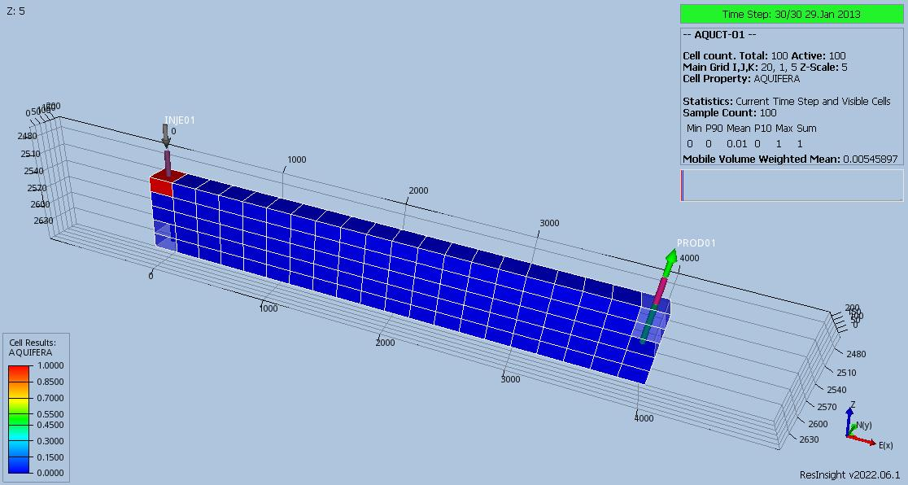
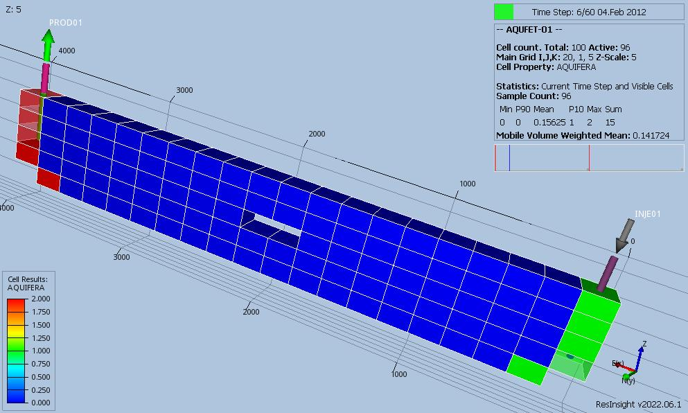
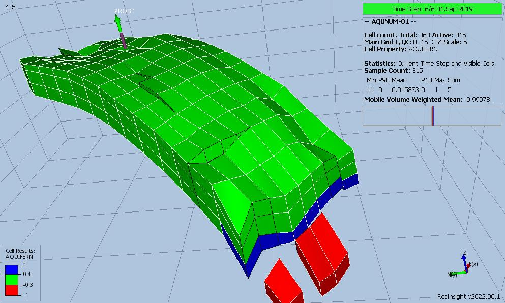
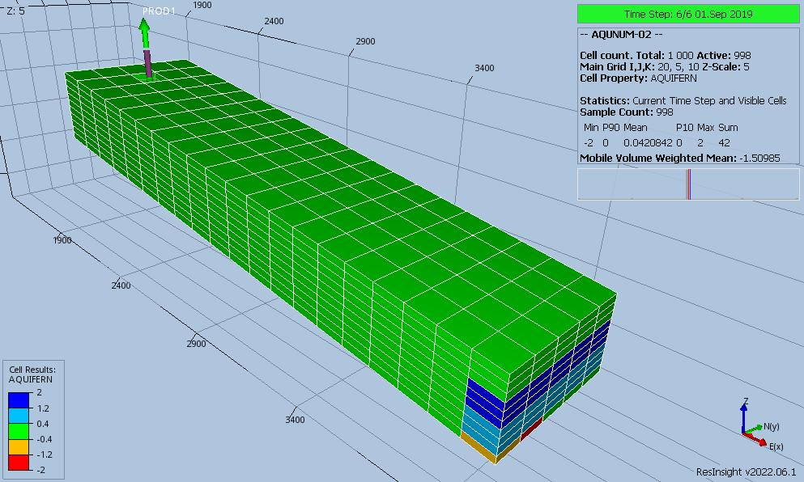

# Aquifer Test Documentation

Case Name  | Case Desciption                                  | Base Model | Test<br />Type | Results<br />Match | Comments |
---------  | -----------------------------                    | ---------- | ---- | ------- | ------------------------------------- |
AQUCT-01   | Carter-Tracy aquifer (2D_OW_CTAQUIFER).          | AQUCT-01   | Reg  | Yes     | Perfect match.
AQUFET-01  | Fetkovich aquifer (2D_FETKOVICHAQUIFER).         | AQUFET-01  | Reg  | Yes     | Perfect match.
AQUNUM-01  | Numerical aquifer (3D_1AQU_3CELLS.DATA).         | AQUNUM-01  | Reg  | Yes     | Good match, differences due to time step size.
AQUNUM-02  | Numerical aquifer (3D_2AQU_NUM.DATA).            | AQUNUM-02  | Reg  | Yes     | Very good match, differences due to time step size.

**Notes:** 

1. _Test Type_ column shows if the case is used for integration testing (_Int_), or regression testing (_Reg_).
2. _Results Match_ column indicate if the OPM Flow results match the commercial simulator.


**Version: 7 November 2022**
    
### AQUCT-01 Description and Results

Carter-Tracy Aquifer Connections.


``` 
--                                                                              
--                      CARTER-TRACY AQUIFER DESCRIPTION                            
--                                                                              
--      ID   DATUM   AQF    AQF    AQF    AQF     AQF     AQF  INFL   PVT  AQU
--      NUM  DEPTH   PRESS  PERM   PORO   RCOMP   RE      DZ   ANGLE  NUM  TAB
--                                                    
AQUCT
       1    2000.0   269    100   0.3    3.0e-5   330     10   360.0   1    2 /
/
--                                                                              
--                      ANALYTIC AQUIFER CONNECTION                            
--                                                                              
--       ID     ---------- BOX ---------   CONNECT  AQF    AQF     ADJOIN         
--       NUMBER I1  I2   J1  J2   K1  K2   FACE     INFLX  MULTI   CELLS                                                                                            
AQUANCON
         1       1   1    1   1    1   1   J-       1.0    1.0     NO /
/
``` 

[AQUCT-01 ECL Results](plots/AQUCT-01-ECL.md)  

---

### AQUFET-01 Description and Results

Fetkovich Aquifer Connections



```
--                                                                              
--                      FETKOVICH AQUIFER DESCRIPTION                            
--                                                                              
--      ID   DATUM   AQF    AQF    AQF     AQF    AQF   SALT
--      NUM  DEPTH   PRESS  VOLM   COMP    PI     PVT   CONC
--                                                    
AQUFETP
        1   2512.5   290   1.9e8   3.0e-5  50                 /
        2   2512.5    1*   1.9e8   3.0e-5  50                 /
/
--                                                                              
--                      ANALYTIC AQUIFER CONNECTION                            
--                                                                              
--       ID     ---------- BOX ---------   CONNECT  AQF    AQF     ADJOIN         
--       NUMBER I1  I2   J1  J2   K1  K2   FACE     INFLX  MULTI   CELLS                                                                                            
AQUANCON
         1      1    2    1   1    1   5    I-       0.8    1*      NO  /
         2     19   20    1   1    1   5    I+       1.     1*      NO /
/
```

[AQUFET-01 ECL Results](plots/AQUFET-01-ECL.md) 

---

### AQUNUM-01 Description and Results



```
--                                                                              
--       NUMERICAL AQUIFER DESCRIPTION                            
--                                                                              
--       ID     - LOCATION - AQF        AQF     AQF   AQF  AQF    AQF   PVT SATNUM       
--       NUMBER  I1  J1  K1  AREA       LENGTH  PORO  PERM DEPTH  PRES  TAB TAB          
--                                                                                 
AQUNUM
         1       1    1   1  1000000.0  10000   0.25  400  2585.0 285.0	 1   1  / 
         1       3    1   1  1500000.0  20000   0.24  600  2585.0 285.0	 1   1  / 
         1       4    1   1  2000000.0  30000   0.23  700  2585.0 285.0	 1   1  / 
/
--                                                                              
--       NUMERICAL AQUIFER CONNECTIONS                           
--                                                                              
--       ID     ---------- BOX ---------   CONNECT   TRANS   TRANS   ADJOIN            
--       NUMBER I1  I2   J1  J2   K1  K2   FACE      MULT    OPTN    CELLS                                                                                   
AQUCON
         1      1    8    3   3   3   3   'J-'       1.00     1             /
/ 
```
[AQUNUM-01 ECL Results](plots/AQUNUM-01-ECL.md) 

---

### AQUNUM-02 Description and Results

Numerical Aquifer Case #2



```
--                                                                              
--       NUMERICAL AQUIFER DESCRIPTION                            
--                                                                              
--       ID     - LOCATION - AQF         AQF     AQF   AQF   AQF      AQF     PVT SATNUM       
--       NUMBER  I1  J1  K1  AREA        LENGTH  PORO  PERM  DEPTH    PRES    TAB TAB          
--                                                                                 
AQUNUM
        1        20   1  10   1000000.0  10000   0.25  500   2098.53  258.128  1   1  / 
        2        20   2  10   4000000.5  3000    0.22  3000  2098.53  258.128  1   1  / 
/
--                                                                              
--       NUMERICAL AQUIFER CONNECTIONS                           
--                                                                              
--       ID     ---------- BOX ---------   CONNECT   TRANS   TRANS   ADJOIN            
--       NUMBER I1  I2   J1  J2   K1  K2   FACE      MULT    OPTN    CELLS                                                                                   
AQUCON
         1     20   20    1   5    7   9   'I+'      0.88      1          /
         2     20   20    1   5    4   6   'I+'      0.55      1          /

```

[AQUNUM-02 ECL Results](plots/AQUNUM-02-ECL.md) 
   
---                                              