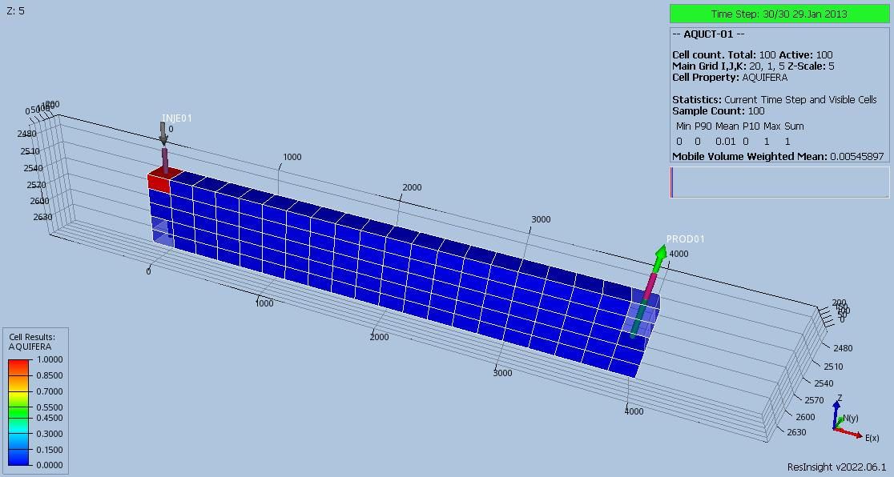
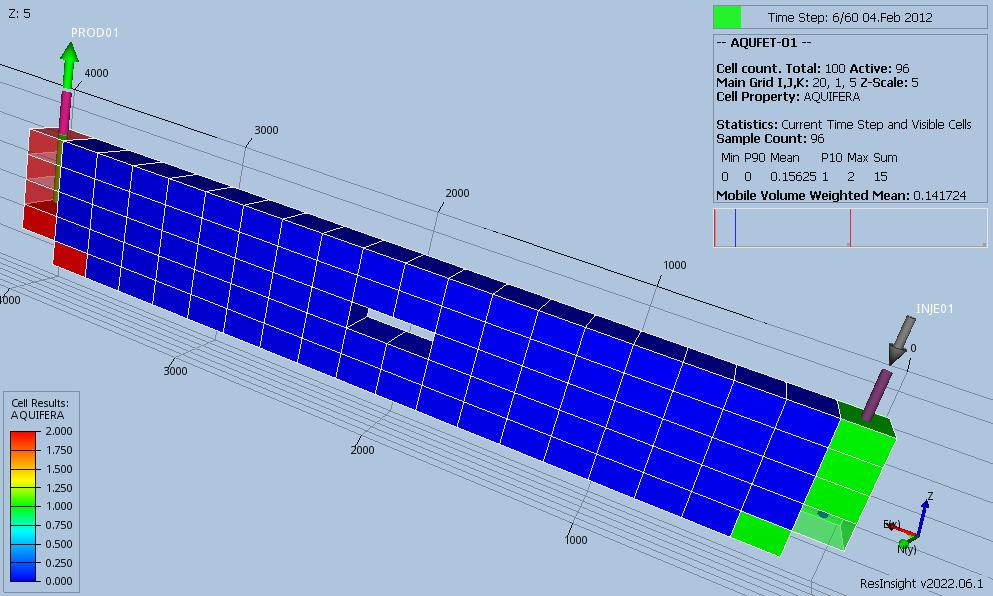
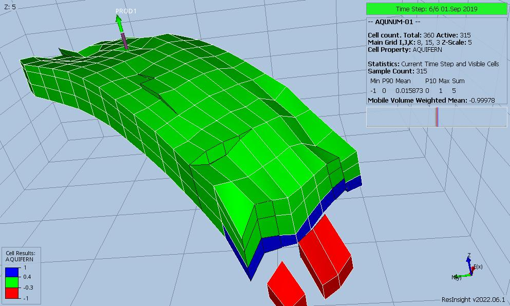
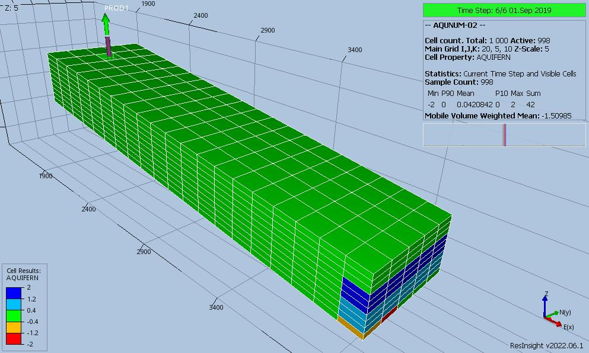

# Aquifer Test Documentation

Case Name  | Case Desciption                                  | Base Model | Test<br />Type | Flow<br />Support | Comments |
---------  | -----------------------------                    | ---------- | ---- | ------- | ------------------------------------- |
AQUCT-01   | Carter-Tracy aquifer (2D_OW_CTAQUIFER).          | AQUCT-01   | Reg  | Yes     | 
AQUCT-02   | Carter-Tracy aquifer, gas/water model.           | AQUCT-02   | Reg  | Yes     | 
AQUCT-03   | Carter-Tracy aquifer, single-phase water model.  | AQUCT-03   | Reg  | Yes     | 
AQUFET-01  | Fetkovich aquifer (2D_FETKOVICHAQUIFER).         | AQUFET-01  | Reg  | Yes     | 
AQUNUM-01  | Numerical aquifer (3D_1AQU_3CELLS).              | AQUNUM-01  | Reg  | Yes     | 
AQUNUM-02  | Numerical aquifer (3D_2AQU_NUM).                 | AQUNUM-02  | Reg  | Yes     | 
AQUFLUX-03 | Constant flux aquifer, gas/water model.          | AQUFLUX-03 | Reg  | Yes     | 

**Notes:** 

1. _Test Type_ column shows if the case is used for integration testing (_Int_), or regression testing (_Reg_).


**Version: 4 September 2026**
    
### AQUCT-01 Description and Results

Carter-Tracy Aquifer Connections.


``` 
--                                                                              
--                      CARTER-TRACY AQUIFER DESCRIPTION                            
--                                                                              
--      ID   DATUM   AQF    AQF    AQF    AQF     AQF     AQF  INFL   PVT  AQU
--      NUM  DEPTH   PRESS  PERM   PORO   RCOMP   RE      DZ   ANGLE  NUM  TAB
--                                                    
AQUCT
       1    2000.0   269    100   0.3    3.0e-5   330     10   360.0   1    2 /
/
--                                                                              
--                      ANALYTIC AQUIFER CONNECTION                            
--                                                                              
--       ID     ---------- BOX ---------   CONNECT  AQF    AQF     ADJOIN         
--       NUMBER I1  I2   J1  J2   K1  K2   FACE     INFLX  MULTI   CELLS                                                                                            
AQUANCON
         1       1   1    1   1    1   1   J-       1.0    1.0     NO /
/
``` 

---

### AQUCT-02 Description and Results

Carter-Tracy aquifer in a gas/water model (no oil phase). The gas/water contact is
placed above the model, so the pore volume is fully water saturated and no free gas
is present at any time. FGIP stays identically zero and the field water balance
closes as d(FWIP) + FWPT = AAQT:1.

```
     PROD (BHP)                                    Carter-Tracy
        ^                                            aquifer
        |                                               |
   +-------+-------+-------+-------+-------+            |
   |  I=1  |  I=2  |  I=3  |  I=4  |  I=5  | <==========+
   +-------+-------+-------+-------+-------+

   5 x 1 x 1 grid, 100 x 100 x 10 m cells, top at 1500 m, fully water saturated.
```

AQUCT-03 and AQUFLUX-03 use the same geometry.

```
--      ID   DATUM   AQF    AQF    AQF    AQF       AQF    AQF  INFL   PVT  AQU
--      NUM  DEPTH   PRESS  PERM   PORO   RCOMP     RE     DZ   ANGLE  NUM  TAB
AQUCT
        1    1500    1*     400    0.24   1.192e-4  13000  100  180    1    1*  0 /
/
--       ID     ---------- BOX ---------   CONNECT  AQF    AQF     ADJOIN
--       NUMBER I1  I2   J1  J2   K1  K2   FACE     INFLX  MULTI   CELLS
AQUANCON
         1      5   5    1   1    1   1    I+                              /
/
```

---

### AQUCT-03 Description and Results

Carter-Tracy aquifer in a single-phase water model. WATER is the only active phase,
so the model carries a single conservation equation. The field water balance closes
as d(FWIP) + FWPT = AAQT:1. The aquifer description is identical to AQUCT-02.

---

### AQUFLUX-03 Description and Results

Constant flux aquifer in a gas/water model (no oil phase). Same model as AQUCT-02,
with a constant flux aquifer in place of the Carter-Tracy one. FGIP stays identically
zero and the field water balance closes as d(FWIP) + FWPT = AAQT:1.

```
--      ID   FLUX
--      NUM  RATE
AQUFLUX
        1    0.5 /
/
--       ID     ---------- BOX ---------   CONNECT  AQF    AQF     ADJOIN
--       NUMBER I1  I2   J1  J2   K1  K2   FACE     INFLX  MULTI   CELLS
AQUANCON
         1      5   5    1   1    1   1    I+                              /
/
```

---

### AQUFET-01 Description and Results

Fetkovich Aquifer Connections



```
--                                                                              
--                      FETKOVICH AQUIFER DESCRIPTION                            
--                                                                              
--      ID   DATUM   AQF    AQF    AQF     AQF    AQF   SALT
--      NUM  DEPTH   PRESS  VOLM   COMP    PI     PVT   CONC
--                                                    
AQUFETP
        1   2512.5   290   1.9e8   3.0e-5  50                 /
        2   2512.5    1*   1.9e8   3.0e-5  50                 /
/
--                                                                              
--                      ANALYTIC AQUIFER CONNECTION                            
--                                                                              
--       ID     ---------- BOX ---------   CONNECT  AQF    AQF     ADJOIN         
--       NUMBER I1  I2   J1  J2   K1  K2   FACE     INFLX  MULTI   CELLS                                                                                            
AQUANCON
         1      1    2    1   1    1   5    I-       0.8    1*      NO  /
         2     19   20    1   1    1   5    I+       1.     1*      NO /
/
```

---

### AQUNUM-01 Description and Results



```
--                                                                              
--       NUMERICAL AQUIFER DESCRIPTION                            
--                                                                              
--       ID     - LOCATION - AQF        AQF     AQF   AQF  AQF    AQF   PVT SATNUM       
--       NUMBER  I1  J1  K1  AREA       LENGTH  PORO  PERM DEPTH  PRES  TAB TAB          
--                                                                                 
AQUNUM
         1       1    1   1  1000000.0  10000   0.25  400  2585.0 285.0	 1   1  / 
         1       3    1   1  1500000.0  20000   0.24  600  2585.0 285.0	 1   1  / 
         1       4    1   1  2000000.0  30000   0.23  700  2585.0 285.0	 1   1  / 
/
--                                                                              
--       NUMERICAL AQUIFER CONNECTIONS                           
--                                                                              
--       ID     ---------- BOX ---------   CONNECT   TRANS   TRANS   ADJOIN            
--       NUMBER I1  I2   J1  J2   K1  K2   FACE      MULT    OPTN    CELLS                                                                                   
AQUCON
         1      1    8    3   3   3   3   'J-'       1.00     1             /
/ 
```
---

### AQUNUM-02 Description and Results

Numerical Aquifer Case #2



```
--                                                                              
--       NUMERICAL AQUIFER DESCRIPTION                            
--                                                                              
--       ID     - LOCATION - AQF         AQF     AQF   AQF   AQF      AQF     PVT SATNUM       
--       NUMBER  I1  J1  K1  AREA        LENGTH  PORO  PERM  DEPTH    PRES    TAB TAB          
--                                                                                 
AQUNUM
        1        20   1  10   1000000.0  10000   0.25  500   2098.53  258.128  1   1  / 
        2        20   2  10   4000000.5  3000    0.22  3000  2098.53  258.128  1   1  / 
/
--                                                                              
--       NUMERICAL AQUIFER CONNECTIONS                           
--                                                                              
--       ID     ---------- BOX ---------   CONNECT   TRANS   TRANS   ADJOIN            
--       NUMBER I1  I2   J1  J2   K1  K2   FACE      MULT    OPTN    CELLS                                                                                   
AQUCON
         1     20   20    1   5    7   9   'I+'      0.88      1          /
         2     20   20    1   5    4   6   'I+'      0.55      1          /

```

---                                              
