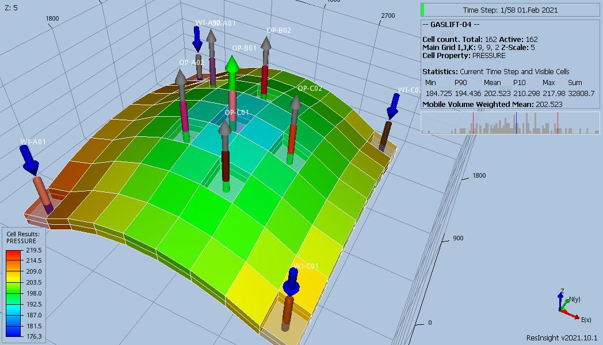
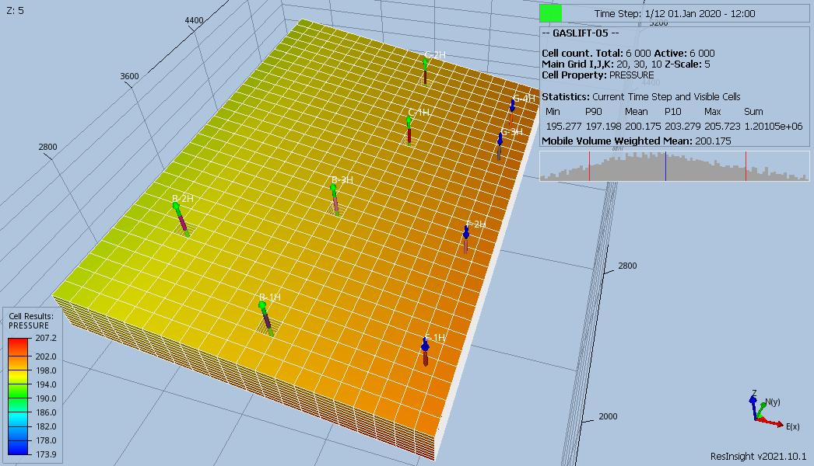

# GASLIFT Test Documentation

Case Name | Case Desciption                                               | Base Model | Results<br />Match | Comments |
--------- | -----------------------------                                 | ---------- | ------- | ------------------------------------- |
GASLIFT-01| Two-Phase, Cartesian regular, with variable GLIFT             | GASLIFT    | Fails  | Two-Phase not supported.
GASLIFT-02| Two-Phase, Corner-Point, with variable GLIFT                  | GASLIFT    | Fails  | Two-Phase not supported.
GASLIFT-03| Three-Phase, Corner-Point, variable GLIFT, MODEL05 PVT        | GASLIFT    | Yes    | Fair to good well match - results apprear reasonable. 
GASLIFT-04| Three-Phase, Corner-Point, variable GLIFT, MODEL05 PVT/VFP    | GASLIFT    | Yes    | Fair to good well match - results apprear reasonable. 
GASLIFT-05| Base                                                          | MODEL05    | Yes    | Generally good well match except at end due to lack of gas lift.
GASLIFT-06| Base and group ORAT=6000                                      | MODEL05    | Mixed  | Generally good well match, except C1-1H and C-2H.  
GASLIFT-07| Base and group LIFTOPT(OPTLIFT)=NO                            | MODEL05    | No     | Different, gas lift not applied in some casesB-1H for example, Should be similar to GASLIFT-05.
GASLIFT-08| Base and group ORAT=6000, Max ALQ from VFP                    | MODEL05    | Mixed  | Field matches, but well results are variable, with some being well matched (B-1H) others not (B-2H).  
GASLIFT-09| Base and group ORAT=6000, Max ALQ from VFP, TSTEP=15          | MODEL05    | No     | Different, no gas lift on several wells (B-1H, B-3H, C-1H).
GASLIFT-10| Base and group ORAT=6000, Max ALQ from VFP, TSTEP=15, WTEST   | MODEL05    | Yes    | Field matches, WTEST works, well B-3H and C-2H different.
GASLIFT-11| Base and group ORAT=6000, Max ALQ from VFP, GLIFTLIM(MXLIFT)  | MODEL05    | Yes    | Field matches, no gas lift on several wells B-2H and C-1H. 
GASLIFT-12| MSW Base for Multi-Segment Wells                              | MODEL05    | No     | Different, either no gas lift (B-2H) or insufficent gas lift (B-1H, B-3H, and C-2H). 
GASLIFT-13| MSW and BRANPROP and NODEPROP                                 | MODEL05    | No     | Different, either no gas lift (B-2H) or insufficent gas lift (B-1H, B-3H, and C-2H), various "switching" messages.
GASLIFT-14| MSW and BRANPROP and NODEPROP(GASLIFT)=YES                    | MODEL05    | No     | Different, either no gas lift (B-2H and B-3H) or insufficent gas lift (B-1H,
GASLIFT-15| MSW and BRANPROP and NODEPROP(GASLIFT)=YES, RESTART run       | MODEL05    | No     | Both simulators fail - ignore results for now,  will investigate further.
           
**Notes:** 

1.   _Results Match_ column indicate if the OPM Flow results match the commercial simulator, see the GASLIFT.odp document for comparisons.
2.   Under comments, _Complete_ means that the test case is completed, it does not mean that the runs are necessarily comparable to the commercial simulator.
3.   All cases run with one day time steps for comparison purposes.

**Version: 03 October 2022**

### GASLIFT Model (Irregular Corner-Point)

This model is a simple Two Phase (9, 9, 2) model with six oil producers and four water injectors using a Cartesian regular grid. 
The model has several groups as shown below:
``` 
                   FIELD                                                                     
                   |                                                                         
                   |---PLAT-1                                                                
                   |   |                                                                     
                   |   |---PLAT-1A                                                           
                   |   |---PLAT-1B                                                           
                   |                                                                         
                   |---PLAT-2                                                                
``` 



### GASLIFT-01 Description and Results

The model tests the use Gas Lift Optimization via the of the LIFTOPT and WLIFTOPT keywords.
 1) The field has an oil rate target of 10,000 m3/d and group PLAT-2 has a liquid rate limit of 3,000 m3/d and all oil wells
    are on gas lift optimization. Water injection via PLAT-1 and PLAT-2 is set VREP 0.90.
 2) Well testing is on for physically shut wells.
 3) Gas lift optimization with lift gas increments of 4E4 m3/day starts at the beginning of the run.
 4) Gas lift optimization is switched off on 2021-08-01.
 5) Gas lift optimization is switched on on 2021-10-01.
 6) Gas lift optimization minimum economic gradient set to 6E3 m3/m3 on 2022-02-01 and FIELD oil rate set to unlimited.
 7) Well lift optimization weighting factor set to 3.0 for wells OP-A01, OP-B01 and OP-C02 2022-04-01.
 8) Maximum group PLAT-1 available lift gas set to 9E5 m3 and FIELD ORAT set to 10E3 m3/day on 2022-08-01. 

[GASLIFT-01 ECL Results](plots/GASLIFT-01-ECL.md) 

### GASLIFT-02 Description and Results

The model tests the use of Gas Lift Optimization via the LIFTOPT and WLIFTOPT keywords and is based on GASLIFT-01.DATA, it
**differs by introducing an irregular corner-point geometry.**
 1) The field has an oil rate target of 10,000 m3/d and group PLAT-2 has a liquid rate limit of 3,000 m3/d and all oil wells
    are on gas lift optimization. Water injection via PLAT-1 and PLAT-2 is set VREP 0.90.
 2) Well testing is on for physically shut wells.
 3) Gas lift optimization with lift gas increments of 4E4 m3/day starts at the beginning of the run.
 4) Gas lift optimization is switched off on 2021-08-01.
 5) Gas lift optimization is switched on on 2021-10-01.
 6) Gas lift optimization minimum economic gradient set to 6E3 m3/m3 on 2022-02-01 and FIELD oil rate set to unlimited.
 7) Well lift optimization weighting factor set to 3.0 for wells OP-A01, OP-B01 and OP-C02 2022-04-01.
 8) Maximum group PLAT-1 available lift gas set to 9E5 m3 and FIELD ORAT set to 10E3 m3/day on 2022-08-01. 

[GASLIFT-02 ECL Results](plots/GASLIFT-02-ECL.md) 

### GASLIFT-03 Description and Results

The model tests the use of Gas Lift Optimization via the LIFTOPT and WLIFTOPT keywords and is based on GASLIFT-02.DATA, it
**differs by introducing a three phase model with more complex PVT**.
 1) The field has an oil rate target of 10,000 m3/d and group PLAT-2 has a liquid rate limit of 3,000 m3/d and all oil wells
    are on gas lift optimization. Water injection via PLAT-1 and PLAT-2 is set VREP 0.90.
 2) Well testing is on for physically shut wells.
 3) Gas lift optimization with lift gas increments of 4E4 m3/day starts at the beginning of the run.
 4) Gas lift optimization is switched off on 2021-08-01.
 5) Gas lift optimization is switched on on 2021-10-01.
 6) Gas lift optimization minimum economic gradient set to 6E3 m3/m3 on 2022-02-01 and FIELD oil rate set to unlimited.
 7) Well lift optimization weighting factor set to 3.0 for wells OP-A01, OP-B01 and OP-C02 2022-04-01.
 8) Maximum group PLAT-1 available lift gas set to 9E5 m3 and FIELD ORAT set to 10E3 m3/day on 2022-08-01. 

[GASLIFT-03 ECL Results](plots/GASLIFT-03-ECL.md) 

### GASLIFT-04 Description and Results
The model tests the use of Gas Lift Optimization via the LIFTOPT and WLIFTOPT keywords and is based on GASLIFT-03.DATA, it 
**differs by introducing ALQ lift curves in the VFP tables.**
 1) The field has an oil rate target of 10,000 m3/d and group PLAT-2 has a liquid rate limit of 3,000 m3/d and all oil wells
    are on gas lift optimization. Water injection via PLAT-1 and PLAT-2 is set VREP 0.90.
 2) Well testing is on for physically shut wells.
 3) Gas lift optimization with lift gas increments of 4E4 m3/day starts at the beginning of the run.
 4) Gas lift optimization is switched off on 2021-08-01.
 5) Gas lift optimization is switched on on 2021-10-01.
 6) Gas lift optimization minimum economic gradient set to 6E3 m3/m3 on 2022-02-01 and FIELD oil rate set to unlimited.
 7) Well lift optimization weighting factor set to 3.0 for wells OP-A01, OP-B01 and OP-C02 2022-04-01.
 8) Maximum group PLAT-1 available lift gas set to 9E5 m3 and FIELD ORAT set to 10E3 m3/day on 2022-08-01. 

[GASLIFT-04 ECL Results](plots/GASLIFT-04-ECL.md) 

### GASLIFT MODEL05 Model (Irregular Corner-Point)

This model is based on MODEL05 (20, 30, 10) with a total of five oil producers and four water injectors, as well as various 
groups as shown below:
``` 
                                      FIELD
                                        |
                                      PLAT-A
                         ---------------+---------------------
                        |                                    |
                       M5S                                  M5N
               ---------+----------                     -----+-------
              |                   |                    |            |
             B1                  G1                   C1           F1
          ----+------          ---+---              ---+---       ---+---
         |    |     |         |      |             |      |      |      |
       B-1H  B-2H  B-3H     G-3H    G-4H         C-1H   C-2H    F-1H   F-2H
``` 



### GASLIFT-05 Description and Results

The model tests the use of Gas Lift Optimization via the LIFTOPT and WLIFTOPT keywords, as well as GCONINJE item10 = NETV.
NETV defines that guide rates for the groups injection should be set according to the groups net reservoir voidage rate. This is
the base run for this series of cases. 
 1) Group PLAT-A has an oil rate target of 4,000 m3/d with maximum water injection rate of 5,000 m3/d with voidage replacement.
 2) Groups M5S and M5N have no oil targets but water injection is via NETV guide rated.
 3) All oil producers have an oil target of 1,500 m3/d and a 3,000 m3/d liquid handling constraint. The wells are not under
    direct group control.
 4) Injectors F-1H and F-2H are opened with maximum water injection rate of 4,000 m3/d subject to group control.  
 5) Injectors G-3H and G-4H are opened with maximum water injection rate of 4,000 m3/d subject to group control.
 
[GASLIFT-05 ECL Results](plots/GASLIFT-05-ECL.md)

### GASLIFT-06 Description and Results

The model tests the use of Gas Lift Optimization via the LIFTOPT and WLIFTOPT keywords, as well as GCONINJE item10 = NETV.
NETV defines that guide rates for the groups injection should be set according to the groups net reservoir voidage rate. This run
**differs from the base case run (GASLIFT-05) by increasing the group PLAT-A oil rate target from 4,000 to 6,000 m3/d.** 
 1) **Group PLAT-A has an oil rate target of 6,000 m3/d with maximum water injection rate of 5,000 m3/d with voidage replacement.**
 2) Groups M5S and M5N have no oil targets but water injection is via NETV guide rated.
 3) All oil producers have an oil target of 1,500 m3/d and a 3,000 m3/d liquid handling constraint. The wells are not under
    direct group control.
 4) Injectors F-1H and F-2H are opened with maximum water injection rate of 4,000 m3/d subject to group control.  
 5) Injectors G-3H and G-4H are opened with maximum water injection rate of 4,000 m3/d subject to group control.

[GASLIFT-06 ECL Results](plots/GASLIFT-06-ECL.md) 

### GASLIFT-07 Description and Results

The model tests the use of Gas Lift Optimization via the LIFTOPT and WLIFTOPT keywords, as well as GCONINJE item10 = NETV.
NETV defines that guide rates for the groups injection should be set according to the groups net reservoir voidage rate. This run
**differs from the base case run (GASLIFT-05) by changing LIFTOPT(OPTLIFT) from YES to NO.** 
 1) Group PLAT-A has an oil rate target of 6,000 m3/d with maximum water injection rate of 5,000 m3/d with voidage replacement.
 2) Groups M5S and M5N have no oil targets but water injection is via NETV guide rated.
 3) All oil producers have an oil target of 1,500 m3/d and a 3,000 m3/d liquid handling constraint. The wells are not under
    direct group control.
 4) Injectors F-1H and F-2H are opened with maximum water injection rate of 4,000 m3/d subject to group control.  
 5) Injectors G-3H and G-4H are opened with maximum water injection rate of 4,000 m3/d subject to group control.
 6) **Set LIFTOPT(OPTLIFT) to NO for gas lift optimization to be performed only for the first Newtonian iteration.**
 
[GASLIFT-07 ECL Results](plots/GASLIFT-07-ECL.md) 

### GASLIFT-08 Description and Results

The model tests the use of Gas Lift Optimization via the LIFTOPT and WLIFTOPT keywords, as well as GCONINJE item10 = NETV.
NETV defines that guide rates for the groups injection should be set according to the groups net reservoir voidage rate. This run
**differs from the case GASLIFT-06 by defaulting the maximum well gas lift to the maximum value on the VFP table (219E3 m3/d),
instead of the hard coded 150E3 m3/d.** 
 1) Group PLAT-A has an oil rate target of 6,000 m3/d with maximum water injection rate of 5,000 m3/d with voidage replacement.
 2) Groups M5S and M5N have no oil targets but water injection is via NETV guide rated.
 3) All oil producers have an oil target of 1,500 m3/d and a 3,000 m3/d liquid handling constraint. The wells are not under
    direct group control.
 4) Injectors F-1H and F-2H are opened with maximum water injection rate of 4,000 m3/d subject to group control.  
 5) Injectors G-3H and G-4H are opened with maximum water injection rate of 4,000 m3/d subject to group control.

[GASLIFT-08 ECL Results](plots/GASLIFT-08-ECL.md) 

### GASLIFT-09 Description and Results

The model tests the use of Gas Lift Optimization via the LIFTOPT and WLIFTOPT keywords, as well as GCONINJE item10 = NETV.
NETV defines that guide rates for the groups injection should be set according to the groups net reservoir voidage rate. This run
**differs from case GASLIFT-08 by setting the gas list optimization from every time step to every 15 days.**
 1) Group PLAT-A has an oil rate target of 6,000 m3/d with maximum water injection rate of 5,000 m3/d with voidage replacement.
 2) Groups M5S and M5N have no oil targets but water injection is via NETV guide rated.
 3) All oil producers have an oil target of 1,500 m3/d and a 3,000 m3/d liquid handling constraint. The wells are not under
    direct group control.
 4) Injectors F-1H and F-2H are opened with maximum water injection rate of 4,000 m3/d subject to group control.  
 5) Injectors G-3H and G-4H are opened with maximum water injection rate of 4,000 m3/d subject to group control.

[GASLIFT-09 ECL Results](plots/GASLIFT-09-ECL.md) 

### GASLIFT-10 Description and Results

The model tests the use of Gas Lift Optimization via the LIFTOPT and WLIFTOPT keywords, as well as GCONINJE item10 = NETV.
NETV defines that guide rates for the groups injection should be set according to the groups net reservoir voidage rate. This run
**differs from case GASLIFT-09 by testing the wells via WTEST(TIME=15).**
 1) Group PLAT-A has an oil rate target of 6,000 m3/d with maximum water injection rate of 5,000 m3/d with voidage replacement.
 2) Groups M5S and M5N have no oil targets but water injection is via NETV guide rated.
 3) All oil producers have an oil target of 1,500 m3/d and a 3,000 m3/d liquid handling constraint. The wells are not under
    direct group control.
 4) Injectors F-1H and F-2H are opened with maximum water injection rate of 4,000 m3/d subject to group control.  
 5) Injectors G-3H and G-4H are opened with maximum water injection rate of 4,000 m3/d subject to group control.
 
[GASLIFT-10 ECL Results](plots/GASLIFT-10-ECL.md) 

### GASLIFT-11 Description and Results

The model tests the use of Gas Lift Optimization via the LIFTOPT and WLIFTOPT keywords, as well as GCONINJE item10 = NETV.
NETV defines that guide rates for the groups injection should be set according to the groups net reservoir voidage rate. This run
**differs from the case GASLIFT-08 by setting the maximum group gas lift to 50E4 m3/d, via GLIFTLIM(MXLIFT).**
 1) Group PLAT-A has an oil rate target of 6,000 m3/d with maximum water injection rate of 5,000 m3/d with voidage replacement.
 2) Groups M5S and M5N have no oil targets but water injection is via NETV guide rated.
 3) All oil producers have an oil target of 1,500 m3/d and a 3,000 m3/d liquid handling constraint. The wells are not under
    direct group control.
 4) Injectors F-1H and F-2H are opened with maximum water injection rate of 4,000 m3/d subject to group control.  
 5) Injectors G-3H and G-4H are opened with maximum water injection rate of 4,000 m3/d subject to group control.

[GASLIFT-11 ECL Results](plots/GASLIFT-11-ECL.md) 

### GASLIFT-12 Description and Results

The model tests the use of Gas Lift Optimization via the of the LIFTOPT and WLIFTOPT keywords, as well as GCONINJE item10 = NETV.
NETV defines that guide rates for the groups injection should be set according to the groups net reservoir voidage rate. This 
run is based on GASLIFT-05, and differs by using **Multi-Segment Wells** instead of conventional wells. 
 1) **Group PLAT-A has an oil rate target of 4,000 m3/d with maximum water injection rate of 5,000 m3/d with voidage replacement.**
 2) Groups M5S and M5N have no oil targets but water injection is via NETV guide rated.
 3) All oil producers have an oil target of 1,500 m3/d and a 3,000 m3/d liquid handling constraint. The wells are not under
    direct group control.
 4) Injectors F-1H and F-2H are opened with maximum water injection rate of 4,000 m3/d subject to group control.  
 5) Injectors G-3H and G-4H are opened with maximum water injection rate of 4,000 m3/d subject to group control.

[GASLIFT-12 ECL Results](plots/GASLIFT-12-ECL.md) 

### GASLIFT-13 Description and Results
The model tests the use of Gas Lift Optimization via the of the LIFTOPT and WLIFTOPT keywords, as well as GCONINJE item10 = NETV.
NETV defines that guide rates for the groups injection should be set according to the groups net reservoir voidage rate. This 
run is based on GASLIFT-12, **and differs by using an Extended Network via the BRANPROP and NODEPROP keywords.** 

This model is based on MODEL05 (20, 30, 10) with a total of five oil producers and four water injectors, as well as various 
groups as shown below:
```  
                                      FIELD
                                        |
                                      PLAT-A
                         ---------------+---------------------
                        |                                    |
                       M5S                                  M5N
               ---------+----------                     -----+-------
              |                   |                    |            |
          ----+------          ---+---              ---+---       ---+---
         |    |     |         |      |             |      |      |      |
       B-1H  B-2H  B-3H     G-3H    G-4H         C-1H   C-2H    F-1H   F-2H
 ```  
 1) Group PLAT-A has an oil rate target of 4,000 m3/d with maximum water injection rate of 5,000 m3/d with voidage replacement.
 2) Groups M5S and M5N have no oil targets but water injection is via NETV guide rated.
 3) All oil producers have an oil target of 1,500 m3/d and a 3,000 m3/d liquid handling constraint. The wells are not under
    direct group control.
 4) Injectors F-1H and F-2H are opened with maximum water injection rate of 4,000 m3/d subject to group control.  
 5) Injectors G-3H and G-4H are opened with maximum water injection rate of 4,000 m3/d subject to group control.
 
[GASLIFT-13 ECL Results](plots/GASLIFT-13-ECL.md) 

### GASLIFT-14 Description and Results
The model tests the use of Gas Lift Optimization via the of the LIFTOPT and WLIFTOPT keywords, as well as GCONINJE item10 = NETV.
NETV defines that guide rates for the groups injection should be set according to the groups net reservoir voidage rate. This 
run is based on GASLIFT-13, **and differs by reporting gas lift for all producing groups via NODEPROP(GASLIFT)=YES.** 
 1) Group PLAT-A has an oil rate target of 4,000 m3/d with maximum water injection rate of 5,000 m3/d with voidage replacement.
 2) Groups M5S and M5N have no oil targets but water injection is via NETV guide rated.
 3) All oil producers have an oil target of 1,500 m3/d and a 3,000 m3/d liquid handling constraint. The wells are not under
    direct group control.
 4) Injectors F-1H and F-2H are opened with maximum water injection rate of 4,000 m3/d subject to group control.  
 5) Injectors G-3H and G-4H are opened with maximum water injection rate of 4,000 m3/d subject to group control.
 
[GASLIFT-14 ECL Results](plots/GASLIFT-14-ECL.md) 

### GASLIFT-15 Description and Results
The model tests the use of Gas Lift Optimization via the of the LIFTOPT and WLIFTOPT keywords, as well as GCONINJE item10 = NETV.
NETV defines that guide rates for the groups injection should be set according to the groups net reservoir voidage rate. This 
run is based on GASLIFT-13, **and differs by reporting gas lift for all producing groups via NODEPROP(GASLIFT)=YES.** 
 1) Group PLAT-A has an oil rate target of 4,000 m3/d with maximum water injection rate of 5,000 m3/d with voidage replacement.
 2) Groups M5S and M5N have no oil targets but water injection is via NETV guide rated.
 3) All oil producers have an oil target of 1,500 m3/d and a 3,000 m3/d liquid handling constraint. The wells are not under
    direct group control.
 4) Injectors F-1H and F-2H are opened with maximum water injection rate of 4,000 m3/d subject to group control.  
 5) Injectors G-3H and G-4H are opened with maximum water injection rate of 4,000 m3/d subject to group control.
 6) RESTART run.

**Note both OPM Flow and the commerical simulator fail - will investgate later.**
 
[GASLIFT-15 ECL Results](plots/GASLIFT-15-ECL.md) 

