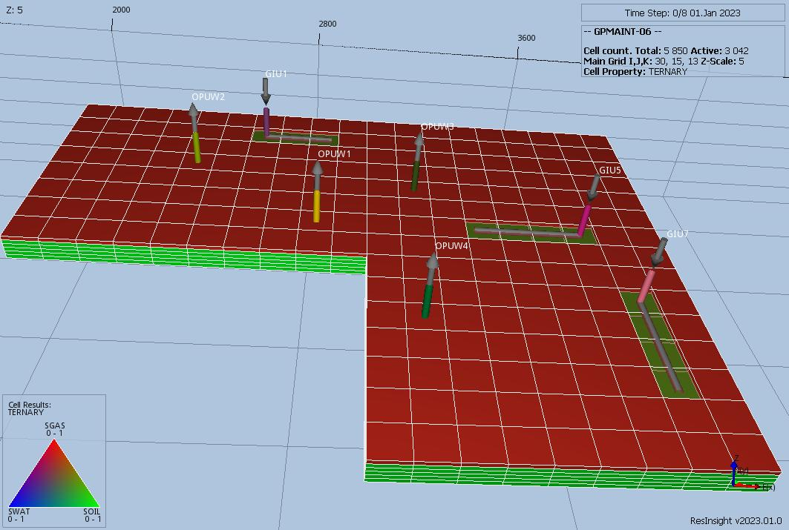

# GPMAINT Test Documentation

Case Name   | Case Desciption                                                                                    | Base Model | Test<br />Type | Results<br />Match | Comments |
------------|----------------------------------------------------------------------------------------------------|------------|----------------| ------------------------------------- |
GPMAINT-01  | Base case GPMAINT using FIPNUM equal to 2 for LOWEAST group, and GPMAINT(GRPCNTL) equal to WINS    | GPMAINT    |      | Yes    | Very good match on field production, injection volumes, and pressure. Missing FIPNUM 2 region data.           <br /><br /> Commercial simulator runs as expected.
GPMAINT-02  | GPMAINT using FIPLAYER equal to 2 for LOWEAST group, and GPMAINT(GRPCNTL) equal to WINS            | GPMAINT    |      | Yes    | Very good match on field production, injection volumes, and pressure. Missing FIPNUM/FIPLAYER 2 region data.  <br /><br /> Commercial simulator runs as expected.
GPMAINT-03  | GPMAINT using FIPAREAS equal to 6 for LOWEAST group, and GPMAINT(GRPCNTL) equal to WINS            | GPMAINT    |      | Yes    | Very good match on field production, injection volumes, and pressure. Missing FIPAREAS 6 region data.         <br /><br /> Commercial simulator runs as expected.
GPMAINT-04  | GPMAINT using FIPNUM equal to 2 for LOWEAST group, GPMAINT(GRPCNTL) equal to WINS with GCONINJE    | GPMAINT    |      | No     | Poor match, due to more extreme oscillations, missing FIPNUM 2 region data                                    <br /><br /> Commercial simulator runs as expected.
GPMAINT-05  | GPMAINT using FIPAREAS equal to 4 and 6, and GPMAINT(GRPCNTL) equal to WINJ and WINS with GCONINJE | GPMAINT    |      | No     | Poor match. Missing FIPAREAS 4, 5 and 6 regions.                                                              <br /><br /> Commercial simulator runs as expected.
GPMAINT-06  | GPMAINT using FIPLAYER  equal to 1, and GPMAINT(GRPCNTL) equal to GINJ                             | GPMAINT    |      | Yes    | Very good match on field production, injection volumes, and pressure. Missing FIPNUM/FIPLAYER 1 region data.  <br /><br /> Commercial simulator runs as expected.
GPMAINT-07  | GPMAINT using FIPAREAS equal to 1, 2 and 3, and GPMAINT(GRPCNTL) equal to GINS and GINJ            | GPMAINT    |      | Yes    | Very good match on field production, injection volumes, and pressure. Missing FIPAREAS region data.           <br /><br /> Commercial simulator runs as expected.
GPMAINT-08  | GPMAINT using FIPLAYER equal to 1, and GPMAINT(GRPCNTL) equal to OINJ                              | GPMAINT    |      | No     | Timing of oil injection is off by 3 years, and then additional volume injected to catch up.                   <br /><br /> Commercial simulator runs as expected.
GPMAINT-09  | GPMAINT using FIPNUM equal to 1, and GPMAINT(GRPCNTL) equal to OINS                                | GPMAINT    |      | No     | Timing of oil injection is off by 3 years, and then additional volume injected to catch up, same as GPMAINT08.<br /><br /> Commercial simulator runs as expected.
GPMAINT-10  | GPMAINT using FIPAREAS equal to 4 and 6, and GPMAINT(GRPCNTL) equal to PROD with GCONINJE          | GPMAINT    |      | No/Yes | Good match up to 2029, and deviates due to different gas production. Missing FIPAREAS region data.            <br /><br /> Commercial simulator runs as expected.

**Notes:**

1. _Test Type_ column shows if the case is used for integration testing (_Int_), or regression testing (_Reg_).
2. _Results Match_ column indicate if the OPM Flow results match the commercial simulator.

**Version: 26 January 2023**

### GPMAINT Model Description  (Regular Corner-Point)
#### Upper Reservoir



#### Upper Reservoir FIPAREAS


#### Lower Reservoir


#### Lower Reservoir FIPAREAS


This model is based MODEL04 and consists of a (30, 15, 13) Regular Corner-Point Grid, with two separate reservoirs: an Upper
Reservoir (layers 1 - 6), a Shale Inactive Layer (7), and a Lower Reservoir (layers 8 - 13). In addition, the FIPNUM array has
been introduced to identify the two reservoirs, together with two FIPxxxxx arrays, FIPLAYER and FIPAREAS. The former is
identical to the FIPNUM array, whereas, the latter breaks each reservoir into three separate reporting regions, resulting in six
FIP regions.

There are a total of 12 oil producers and eight water injection wells, and all wells using the multi segment well model. Secondly
the surface network has been changed, so that wells OPL1, WID1 and WID2 now all belong to the same group, LOWEAST, and
consequently, AQF group has been removed, as shown below:

```

                                          FIELD
                                            |
              ------------------------------+-----------------------------------
                                |                        |
                              UPPER                    LOWER
                         ------+------            +------+-------------+
                        |            |                   |             |
                      MAIN          SE                 CENTRAL      LOWEAST
                 ------+-----        +-----+-----+       +      +-----+-----+
                |           |        |     |     |       |      |     |     |
               NW          NE       OPU6  OPU7  WIU4     |     OPL1  WID1  WID2
                |    +-----+-----+                       |
                |    |     |     |           +-----+-----+-----+-----+-----+
                |   OPU4  OPU5  WIU3         |     |     |     |     |     |
                |                           OPL2  OPL3  OPL4  OPL5  WIL1  WIL2
             ---+--+-----+-----+-----+
             |     |     |     |     |
            OPU1  OPU2  OPU3  WIU1  WIU2
```
In the above figure the UPPER reservoir wells have been renamed for a gas-oil reservoir as follows:
1) WIU1 in group NW has been renamed to OPUW1,
2) WIU2 in group NW has been renamed to OPUW2,
3) WIU3 in group NE has been renamed to OPUW3,
4) WIU4 in group SE has been renamed to OPUW4,
5) OPU1 in group NW has been renamed to GIU1,
6) OPU5 in group NE has been renamed to GIU5, and
7) OPU7 in group SE has been renamed to GIU7,

since the Upper reservoir is now a gas-oil reservoir.

The model is used to test the GPMAINT keyword using different configurations of the keyword and the various FIP regions.

## RESULTS

### GPMAINT-01 Lower Oil-Water Reservoir Description and Results

Base case model with:

 1) Only the LOWEAST wells are active, with GPMAINT set to:
```
    -- GRUP  CNTL   FIPNUM  FIP      PRESS   ALPHA  BETA
    -- NAME  MODE   REGION  FIPNAME  TARGET  CONST  CONST
    GPMAINT
    LOWEAST  WINS   2       1*       145     120.0  15.0       /
    /
```
[GPMAINT-01 ECL Results](plots/GPMAINT-01-ECL.md)

---

### GPMAINT-02 Lower Oil-Water Reservoir Description and Results

 1) Only the LOWEAST wells are active, with GPMAINT set to:
```
    -- GRUP  CNTL   FIPNUM  FIP      PRESS   ALPHA  BETA
    -- NAME  MODE   REGION  FIPNAME  TARGET  CONST  CONST
    GPMAINT
    LOWEAST  WINS   2       LAYER    145     120.0  15.0       /
    /
```

[GPMAINT-02 ECL Results](plots/GPMAINT-02-ECL.md)

---

### GPMAINT-03 Lower Oil-Water Reservoir Description and Results

 1) Only the LOWEAST wells are active, with GPMAINT set to:
```
    -- GRUP  CNTL   FIPNUM  FIP      PRESS   ALPHA  BETA
    -- NAME  MODE   REGION  FIPNAME  TARGET  CONST  CONST
    GPMAINT
    LOWEAST  WINS   6       AREAS    145     120.0  15.0       /
    /
```

[GPMAINT-03 ECL Results](plots/GPMAINT-03-ECL.md)

---

### GPMAINT-04 Lower Oil-Water Reservoir Description and Results

 1) Only the LOWEAST wells are active, with GPMAINT set to:
```
    -- GRUP  CNTL   FIPNUM  FIP      PRESS   ALPHA  BETA
    -- NAME  MODE   REGION  FIPNAME  TARGET  CONST  CONST
    GPMAINT
    LOWEAST  WINS   2       1*       145     120.0  15.0       /
    /
```
 2) Intially restrict water injection GCONINJE via:
```
    -- GRUP  FLUID CNTL   SURF   RESV   REINJ  VOID  GRUP  GUIDE  GUIDE GRUP  GRUP
    -- NAME  TYPE  MODE   RATE   RATE   FRAC   FRAC  CNTL  RATE   DEF   REINJ RESV
    GCONINJE
    FIELD    WAT   NONE   500    1*     1*     1.0    NO   1*     1*    1*    1*   /
    LOWEAST  WAT   NONE   1000   1*     1*     1.0    YES  1*     1*    1*    1*   /
    /
```
 3) And then the Field surface rate is increase to 2,000 m3/d at 2024-01-01. After which pressure maintenance is switched off at
    2029-01-01 using GPMAINT(GRPCNTL) set to NONE, which means the last injection target rate is maintained as a limit.

[GPMAINT-04 ECL Results](plots/GPMAINT-04-ECL.md)

---
### GPMAINT-05 Lower Oil-Water Reservoir Description and Results

 1) Only the LOWEAST wells are active, with GPMAINT set to:
```
    -- GRUP  CNTL   FIPNUM  FIP      PRESS   ALPHA  BETA
    -- NAME  MODE   REGION  FIPNAME  TARGET  CONST  CONST
    GPMAINT
    CENTRAL  WINJ   4       AREAS    100     120.0  15.0       /
    LOWEAST  WINS   6       AREAS    145     120.0  15.0       /
    /
```
 2) Intially restrict water injection using GCONINJE:
```
    -- GRUP  FLUID CNTL   SURF   RESV   REINJ  VOID  GRUP  GUIDE  GUIDE GRUP  GRUP
    -- NAME  TYPE  MODE   RATE   RATE   FRAC   FRAC  CNTL  RATE   DEF   REINJ RESV
    GCONINJE
    FIELD    WAT   NONE   800    1*     1*     1.0    NO   1*     1*    1*    1*   /
    LOWEAST  WAT   NONE   1000   1*     1*     1.0    YES  1*     1*    1*    1*   /
    /
```
 3) And then the Field surface rate is increase to 2,000 m3/d at 2024-01-01, after which pressure maintenance is switched off at
    2029-01-01 for the LOWEAST group using GPMAINT(GRPCNTL) set to NONE, which means the last injection target rate is maintained as a limit.
 4) Finally, at 2030-01-01 the LOWEAST group water injection rate is set to zero.

[GPMAINT-05 ECL Results](plots/GPMAINT-05-ECL.md)

---

### GPMAINT-06 Upper Gas-Oil Reservoir Description and Results

 1) Only the UPPER NW and NE wells are intially active, with GPMAINT set to:
```
    -- GRUP  CNTL   FIPNUM  FIP      PRESS   ALPHA  BETA
    -- NAME  MODE   REGION  FIPNAME  TARGET  CONST  CONST
    GPMAINT
    UPPER    GINJ   1       LAYER    150     350.0  2.0        /
    /
```
 2) Then on January 1, 2027 the UPPER SE wells come on stream, with GPMAINT set to:
```
    -- GRUP  CNTL   FIPNUM  FIP      PRESS   ALPHA  BETA
    -- NAME  MODE   REGION  FIPNAME  TARGET  CONST  CONST
    GPMAINT
    UPPER    GINJ   1       LAYER    145     350.0  2.0        /
    /
```

[GPMAINT-06 ECL Results](plots/GPMAINT-06-ECL.md)

---

### GPMAINT-07 Upper Gas-Oil Reservoir Description and Results

 1) Only the UPPER NW and NE wells are intially active, with GPMAINT set to:
```
    -- GRUP  CNTL   FIPNUM  FIP      PRESS   ALPHA  BETA
    -- NAME  MODE   REGION  FIPNAME  TARGET  CONST  CONST
    GPMAINT
    NW       GINS   1       AREAS    150     300.0  2.0        /
    NE       GINJ   2       AREAS    150     80.0   5.0        /
    /
```
 2) Then on January 1, 2027 the UPPER SE wells come on stream, with GPMAINT set to:
```
    -- GRUP  CNTL   FIPNUM  FIP      PRESS   ALPHA  BETA
    -- NAME  MODE   REGION  FIPNAME  TARGET  CONST  CONST
    GPMAINT
    SE       GINS   3       AREAS    155     200.0  2.0        /
    /
```
Challenging to get a stable run using GINJS for all three regions.

[GPMAINT-07 ECL Results](plots/GPMAINT-07-ECL.md)

---

### GPMAINT-08 Upper Gas-Oil Reservoir Description and Results

 1) Here, wells OPUW1 to OPUW4 are oil injectors, and well GIU5 is the only gas producer. All other wells are non-producing.
 2) Initial gas production rate set to 1E6 m3/d, and then on July 1, 2023 reset to 1E5 m3/d, in order for the oil injectors to
    support the reservoir pressure.
 3) GPMAINT is set at the start of the run, but does not come into effect until the reservoir pressure falls to 110 barsa,
    and is defined as:
```
    -- GRUP  CNTL   FIPNUM  FIP      PRESS   ALPHA  BETA
    -- NAME  MODE   REGION  FIPNAME  TARGET  CONST  CONST
    GPMAINT
    UPPER    OINJ   1       LAYER    110     180.0  2.0        /
    /
```

[GPMAINT-08 ECL Results](plots/GPMAINT-08-ECL.md)

---

### GPMAINT-09 Upper Gas-Oil Reservoir Description and Results

 1) Here, wells OPUW1 to OPUW4 are oil injectors, and well GIU5 is the only gas producer. All other wells are non-producing.
 2) Initial gas production rate set to 1E6 m3/d, and then on July 1, 2023 reset to 1E5 m3/d, in order for the oil injectors to
    support the reservoir pressure.
 3) GPMAINT is set at the start of the run, but does not come into effect until the reservoir pressure falls to 110 barsa,
    and is defined as:
```
    -- GRUP  CNTL   FIPNUM  FIP      PRESS   ALPHA  BETA
    -- NAME  MODE   REGION  FIPNAME  TARGET  CONST  CONST
    GPMAINT
    UPPER    OINS   1       1*       110     180.0  2.0        /
    /
```

[GPMAINT-09 ECL Results](plots/GPMAINT-09-ECL.md)

---

### GPMAINT-10 Lower Oil-Water Reservoir Description and Results

 1) Only the LOWEAST wells are active, with GPMAINT set to:
```
    -- GRUP  CNTL   FIPNUM  FIP      PRESS   ALPHA  BETA
    -- NAME  MODE   REGION  FIPNAME  TARGET  CONST  CONST
    GPMAINT
    CENTRAL  PROD   4       AREAS    135     120.0  15.0       /
    LOWEAST  PROD   6       AREAS    145     120.0  15.0       /
    /
```
 2) Intially restrict water injection using GCONINJE:
```
    -- GRUP  FLUID CNTL   SURF   RESV   REINJ  VOID  GRUP  GUIDE  GUIDE GRUP  GRUP
    -- NAME  TYPE  MODE   RATE   RATE   FRAC   FRAC  CNTL  RATE   DEF   REINJ RESV
    GCONINJE
    FIELD    WAT   NONE   800    1*     1*     1.0    NO   1*     1*    1*    1*   /
    LOWEAST  WAT   NONE   1000   1*     1*     1.0    YES  1*     1*    1*    1*   /
    /
```
 3) And then the Field surface rate is increase to 1,000 m3/d at 2024-01-01, after which pressure maintenance is switched off at
    2029-01-01 for the LOWEAST group using GPMAINT(GRPCNTL) set to NONE, which means the last injection target rate is maintained as a limit.
 4) Finally, at 2030-01-01 the LOWEAST group water injection rate is set to zero.

[GPMAINT-10 ECL Results](plots/GPMAINT-10-ECL.md)
