# GRUPCNTL- Group Control Case Test Documentation

Case Name   | Case Desciption                            | Model   | Results<br />Match | Comments |
----------- | ------------------------------------------ | --------| ------- | ------------------------------------- |
GRUPCNTL-01 | 0A1_GRCTRL_LRAT_ORAT_BASE_MODEL2_MSW       | MODEL02 |  Yes    | Perfect match for 2022-04            
GRUPCNTL-02 | 0A1_GRCTRL_LRAT_ORAT_BASE_MODEL2_STW       | MODEL02 |         |                                       
GRUPCNTL-03 | 0A2_GRCTRL_LRAT_ORAT_GGR_BASE_MODEL2_MSW   | MODEL02 |         |                                       
GRUPCNTL-04 | 0A2_GRCTRL_LRAT_ORAT_GGR_BASE_MODEL2_STW   | MODEL02 |         |                                       
GRUPCNTL-05 | 0A3_GRCTRL_LRAT_LRAT_BASE_MODEL2_MSW       | MODEL02 |         |                                       
GRUPCNTL-06 | 0A3_GRCTRL_LRAT_LRAT_BASE_MODEL2_STW       | MODEL02 |         |                                       
GRUPCNTL-07 | 0A4_GRCTRL_LRAT_LRAT_GGR_BASE_MODEL2_MSW   | MODEL02 |         |                                       
GRUPCNTL-08 | 0A4_GRCTRL_LRAT_LRAT_GGR_BASE_MODEL2_STW   | MODEL02 |         |                                       
GRUPCNTL-09X | 9_2A_DEPL_GCONPROD_1L_MSW                  | MODEL02 |         |                                       
GRUPCNTL-10X | 9_2A_DEPL_GCONPROD_1L_STW                  | MODEL02 |         |                                       
GRUPCNTL-11X | 9_2B_DEPL_GCONPROD_2L_MSW                  | MODEL02 |         |                                       
GRUPCNTL-12X | 9_2B_DEPL_GCONPROD_2L_STW                  | MODEL02 |         |                                       
GRUPCNTL-13X | 9_3A_GINJ_REIN-G_MSW                       | MODEL02 |         |                                       
GRUPCNTL-14X | 9_3A_GINJ_REIN-G_STW                       | MODEL02 |         |                                       
GRUPCNTL-15X | 9_3B_GINJ_GAS_EXPORT_MSW                   | MODEL02 |         |                                       
GRUPCNTL-16X | 9_3B_GINJ_GAS_EXPORT_STW                   | MODEL02 |         |                                       
GRUPCNTL-17X | 9_3C_GINJ_GAS_GCONSUMP_MSW                 | MODEL02 |         |                                       
GRUPCNTL-18X | 9_3C_GINJ_GAS_GCONSUMP_STW                 | MODEL02 |         |                                       
GRUPCNTL-19X | 9_3D_GINJ_GAS_MAX_EXPORT_MSW               | MODEL02 |         |                                       
GRUPCNTL-20X | 9_3D_GINJ_GAS_MAX_EXPORT_STW               | MODEL02 |         |                                       
GRUPCNTL-21X | 9_3E_GAS_MIN_EXPORT_MSW                    | MODEL02 |         |                                       
GRUPCNTL-22X | 9_3E_GAS_MIN_EXPORT_STW                    | MODEL02 |         |                                       
GRUPCNTL-23X | 9_4A_WINJ_MAXWRATES_MAXBHP_GCONPROD_1L_MSW | MODEL02 |         |                                       
GRUPCNTL-24X | 9_4A_WINJ_MAXWRATES_MAXBHP_GCONPROD_1L_STW | MODEL02 |         |                                       
GRUPCNTL-25X | 9_4B_WINJ_VREP-W_MSW                       | MODEL02 |         |                                       
GRUPCNTL-26X | 9_4B_WINJ_VREP-W_STW                       | MODEL02 |         |                                       
GRUPCNTL-27X | 9_4C_WINJ_GINJ_VREP-W_REIN-G_MSW           | MODEL02 |         |                                       
GRUPCNTL-28X | 9_4C_WINJ_GINJ_VREP-W_REIN-G_STW           | MODEL02 |         |                                       
GRUPCNTL-29X | 9_4D_WINJ_GINJ_GAS_EXPORT_MSW              | MODEL02 |         |                                       
GRUPCNTL-30X | 9_4D_WINJ_GINJ_GAS_EXPORT_STW              | MODEL02 |         |                                       
GRUPCNTL-31X | 9_4E_WINJ_GINJ_GUIDERATE_MSW               | MODEL02 |         |                                       
GRUPCNTL-32X | 9_4E_WINJ_GINJ_GUIDERATE_STW               | MODEL02 |         |                                                  
**Notes:** 

1.   _Results Match_ column indicate if the OPM Flow results match the commercial simulator, see the GASLIFT.odp document for comparisons.
2.   Under comments, _Complete_ means that the test case is completed, it does not mean that the runs are necessarily comparable to the commercial simulator.
3.   All cases run with one day time steps for comparison purposes.

**Version: 06 October 2022**

### GRUPCNT MODEL02 Model (Regular Corner-Point)
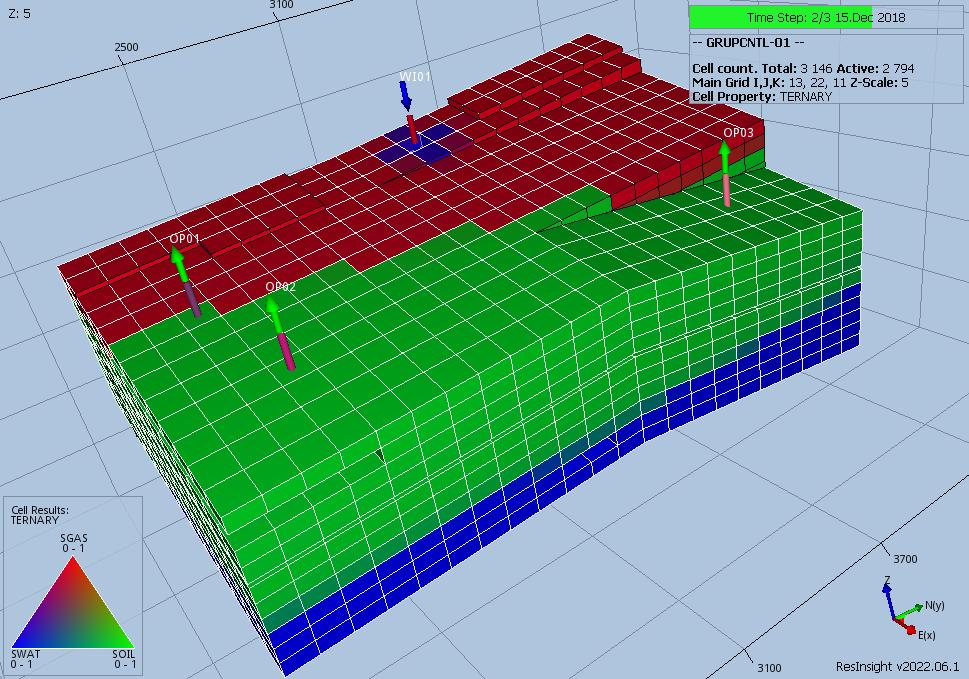

This case is based on MODEL02 and is intended to verify various aspects of group and well control inter-actions. The  model is 
is a (13, 22, 11) model with Regular Corner-Point grid. This is a three-phase model using MODEL02 PVT based on the Norne model.
The model has several groups as shown below:
```                                                        
                                                        FIELD                                                                  
                                                          |                                                                    
                                                     --------------
                                                      |           |
                                                    INJE        PROD  
                                                                  |
                                                               -------- 
                                                              |        |
                                                             WGRP1    WGRP2
```  
## RESULTS

###  GRUPCNTL-01 Results
1.  The case has three producers (no VFP) and one water injector.
2.  Producers are multi-segment wells.
3.  Group PROD is under LRAT control, and is limited by ORAT.
4.  GUIDERAT data set at the well level.


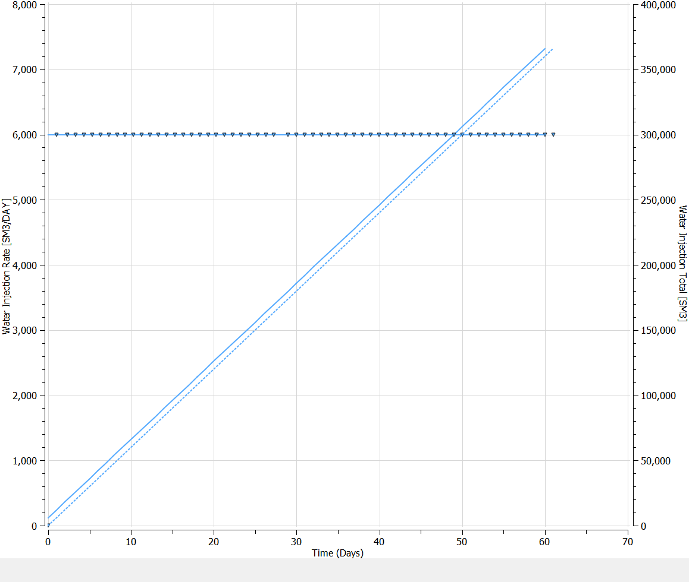
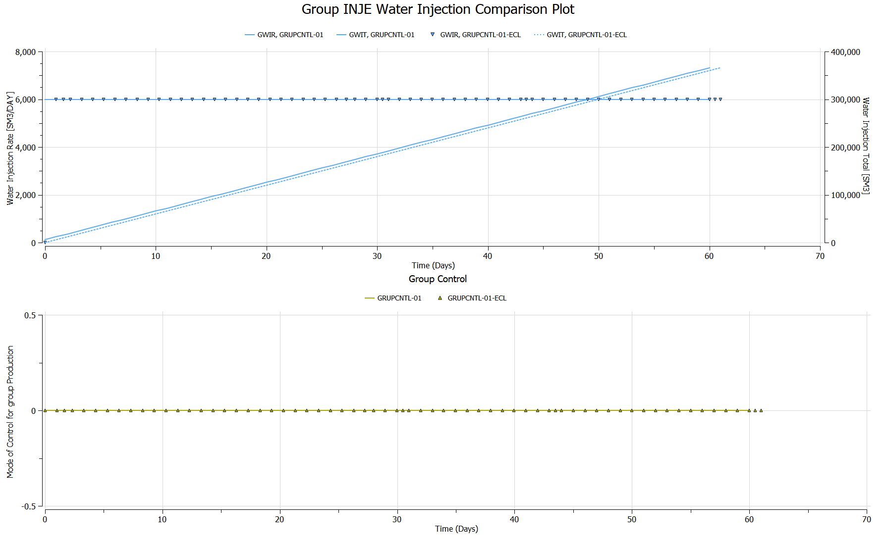
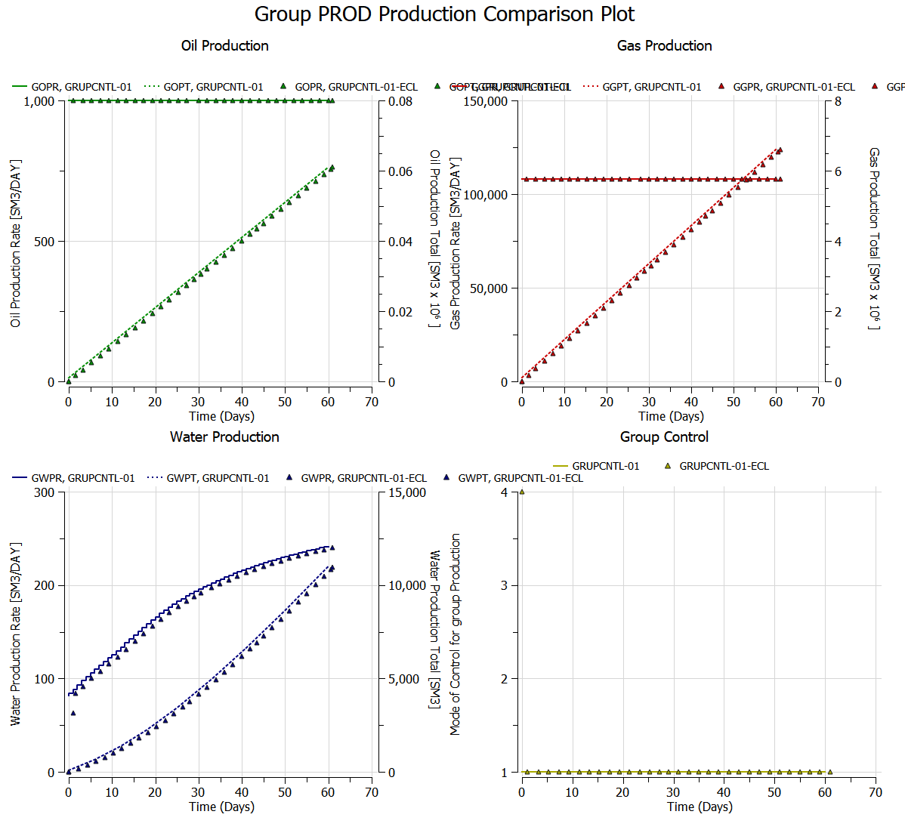
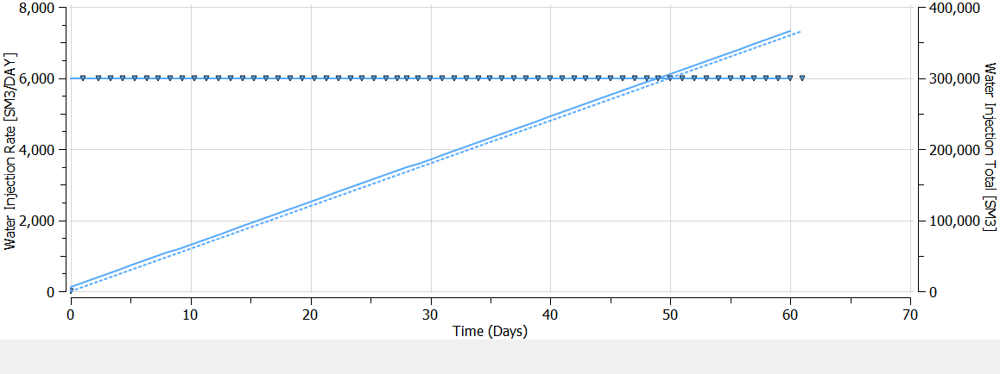

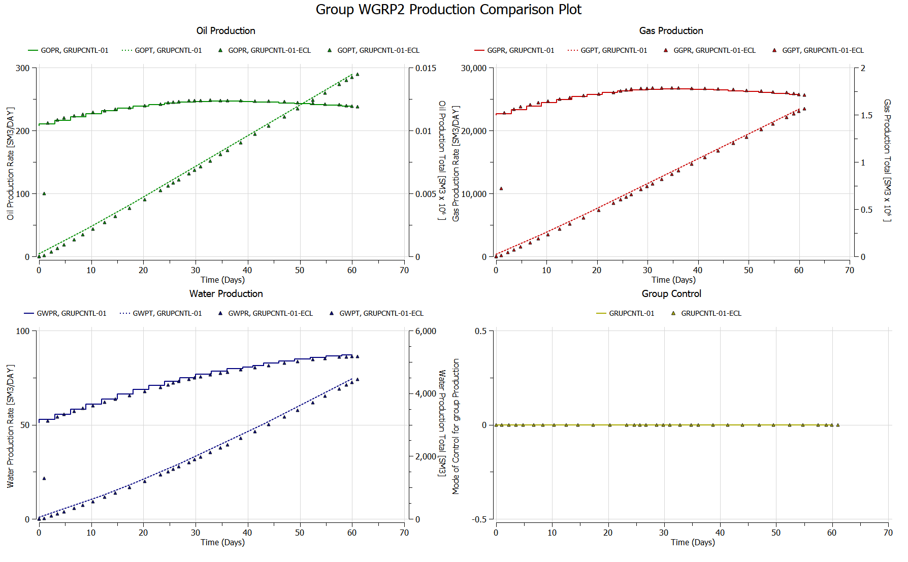
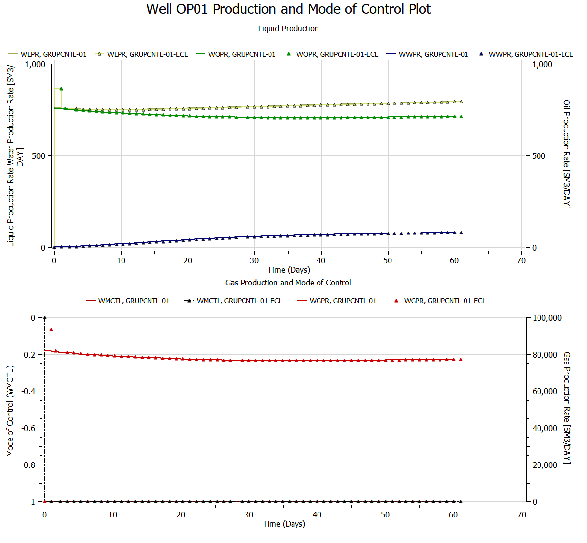
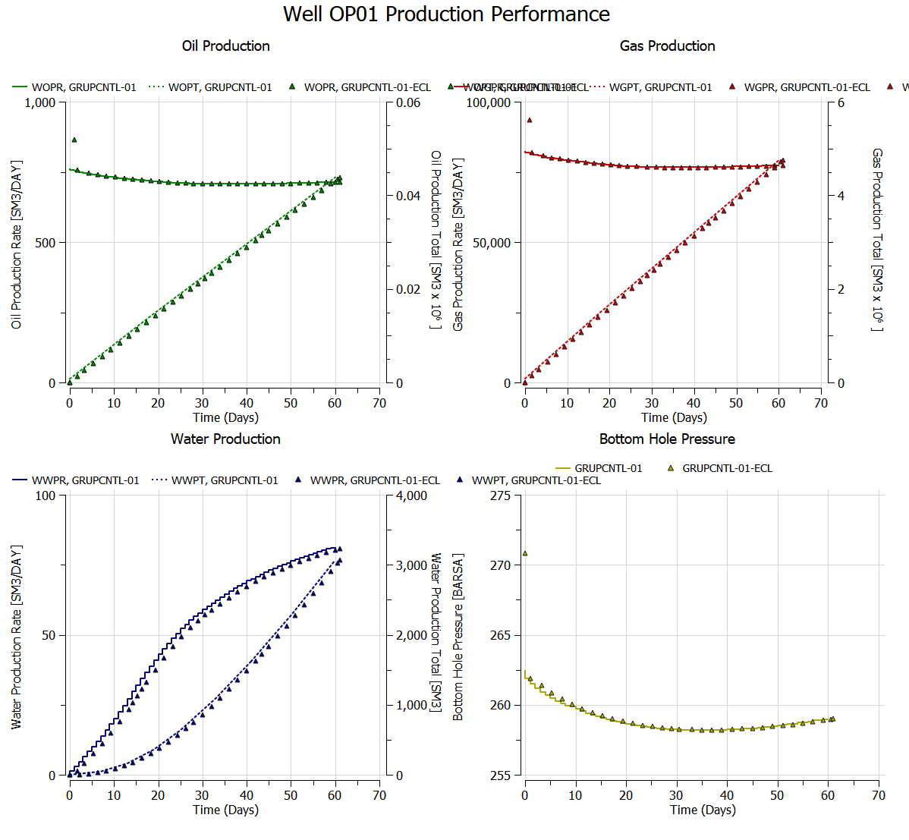
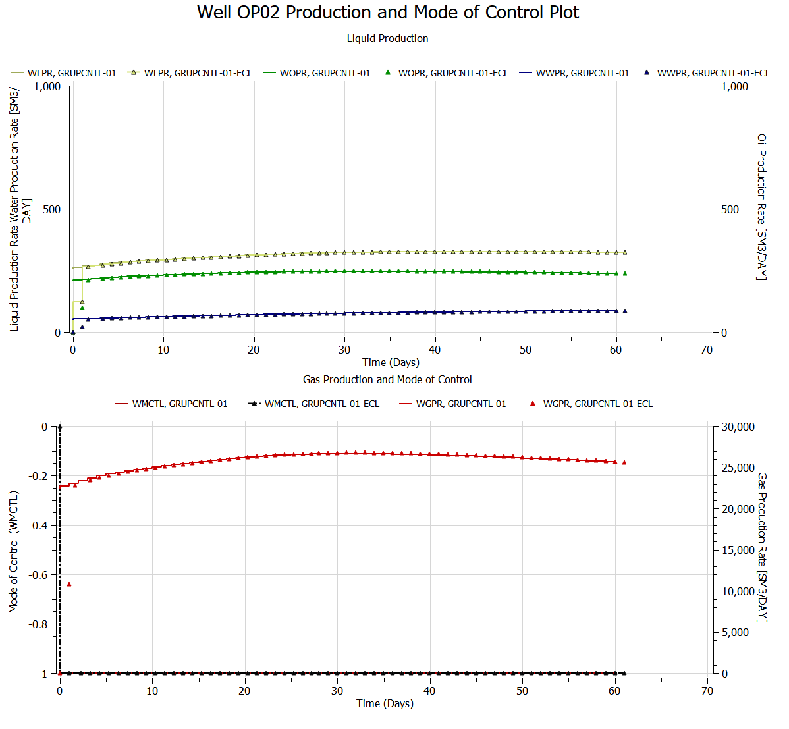
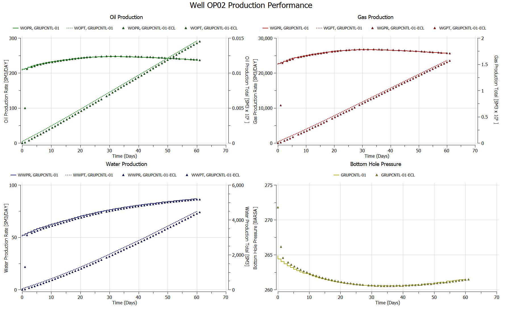
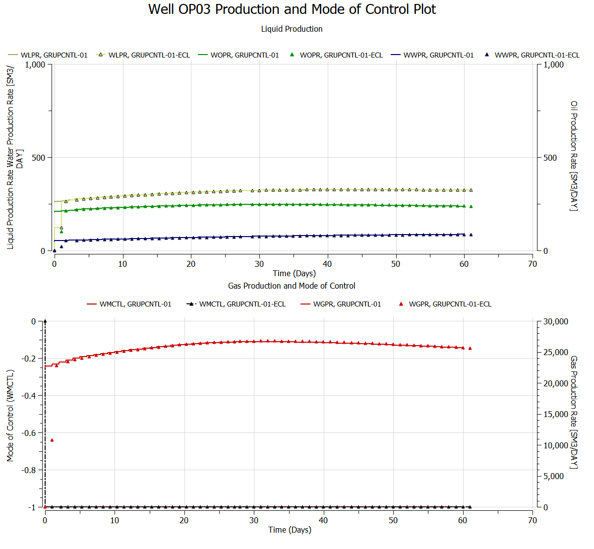
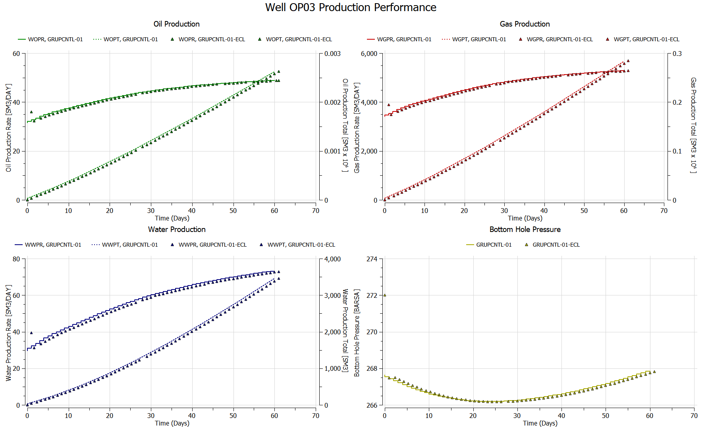


###  GRUPCNTL-02 Results
###  GRUPCNTL-03 Results
###  GRUPCNTL-04 Results
###  GRUPCNTL-05 Results
###  GRUPCNTL-06 Results
###  GRUPCNTL-07 Results
###  GRUPCNTL-08 Results
###  GRUPCNTL-09 Results
###  GRUPCNTL-10 Results

###  GRUPCNTL-11 Results
###  GRUPCNTL-12 Results
###  GRUPCNTL-13 Results
###  GRUPCNTL-14 Results
###  GRUPCNTL-15 Results
###  GRUPCNTL-16 Results
###  GRUPCNTL-17 Results
###  GRUPCNTL-18 Results
###  GRUPCNTL-19 Results
###  GRUPCNTL-20 Results

###  GRUPCNTL-21 Results
###  GRUPCNTL-22 Results
###  GRUPCNTL-23 Results
###  GRUPCNTL-24 Results
###  GRUPCNTL-25 Results
###  GRUPCNTL-26 Results
###  GRUPCNTL-27 Results
###  GRUPCNTL-27 Results
###  GRUPCNTL-29 Results
###  GRUPCNTL-30 Results

###  GRUPCNTL-31 Results
###  GRUPCNTL-32 Results


### Field and Group Control Mode Reference
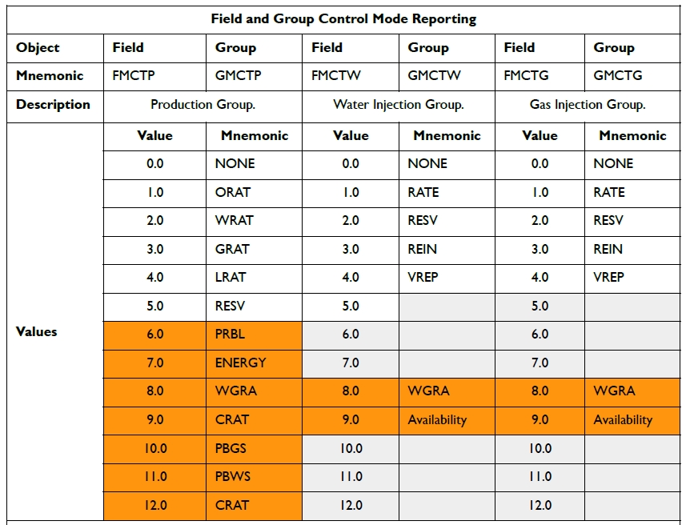

### Field and Group Control Mode Reference
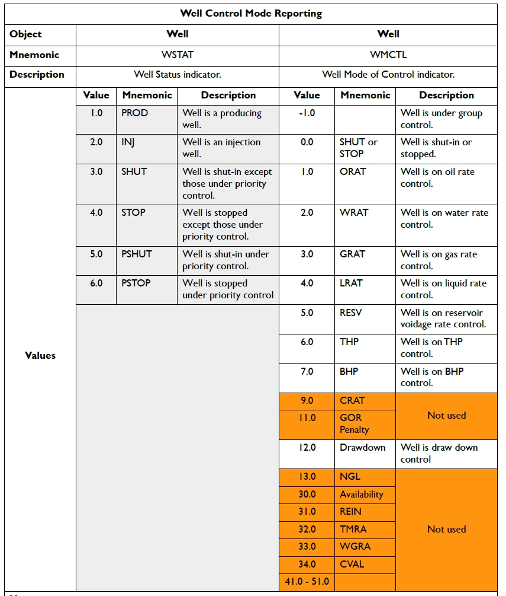
