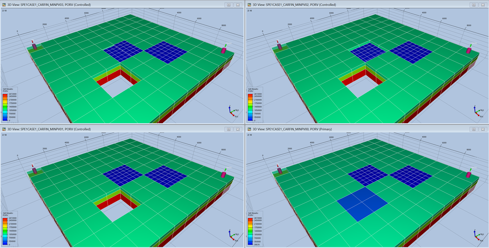

# Test Combination of CARFIN, ENDFIN and MINPV/MINPVV

**SPE1CASE1_CARFIN_MINPV00** – SPE1CASE1_CARFIN + PORO reduced from 0.3 to 0.1 in global cells (7-8, 3-4, 1-3).

**SPE1CASE1_CARFIN_MINPV01** – SPE1CASE1_CARFIN_MINPV00 + MINPV is used on the global grid to deactivate four columns of cells (7-8, 3-4, 1-3).

**SPE1CASE1_CARFIN_MINPV02** – SPE1CASE1_CARFIN_MINPV01 + MINPVV is used on the global grid to deactivate the top global layer of LGR1 (5-6, 5-6, 1).

**SPE1CASE1_CARFIN_MINPV03** – SPE1CASE1_CARFIN_MINPV01 + MINPVV is used on the local grid LGR1 to deactivate local cells (1-6, 1-3, 1).

*Figure: Impact of MINPV/MINPVV on Global and Local Grids (Commercial Simulator)*
