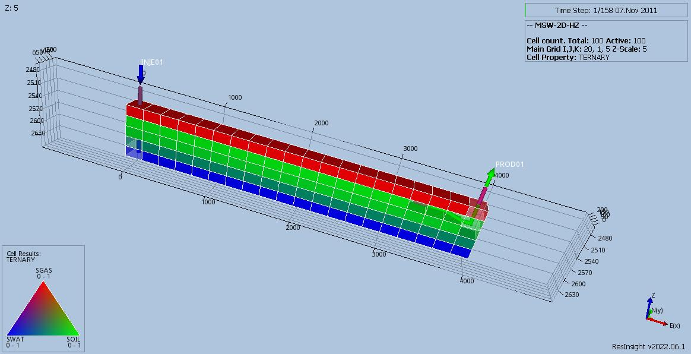
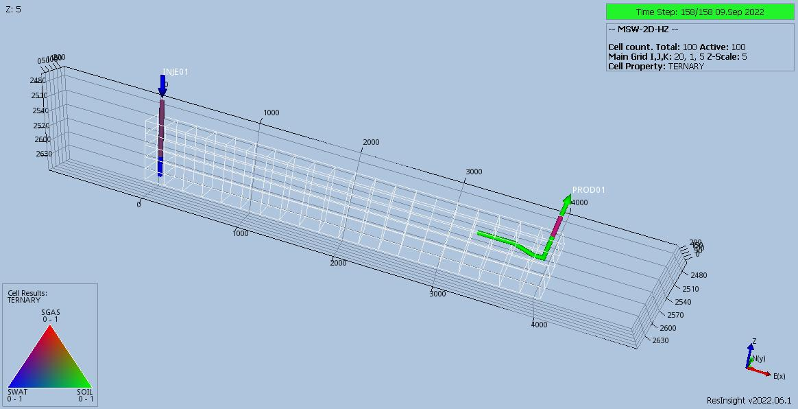

# MSW (Multi-Segment Well) Test Documentation

Case Name         | Case Desciption                                               | Base Model | Test Type | Results Match | Comments |
----------------- | ------------------------------------------------------------  | ---------- | ----- |------- | ------------------------------------- |
MSW-3D            | Base model to test a production multi-segment well (PROD01) in a 3D grid.                           | MSW-3D  | Reg | Yes        | Perfect match with commercial simulator.
MSW-3D-01         | Error checking test, missing some COMPDAT connections.                                              | MSW-3D  |     | No, but OK | OPM Flow stops with "Error: Problem with keyword COMPSEG"    E100 will run with warning messages "CONNECTION WILL BE IGNORED".
MSW-3D-02         | Error checking test, missing some COMPSEGS connections.                                             | MSW-3D  |     | Yes        | OPM Flow stops with "Error: Problem with keyword COMPSEG"    E100 stops with errors "NOT ALL CONNECTIONS ASSIGNED TO WELL SEGMENTS".
MSW-3D-03         | Error checking test, missing some WELSEGS connections.                                              | MSW-3D  |     | Yes        | OPM Flow stops with "Error: Problem with keyword WELSEGS"    E100 stops with error "CALCULATING THE MATRIX ORDER".
MSW-3D-04         | Error checking test, missing all COMPDAT connections.                                               | MSW-3D  |     | Yes        | OPM Flow stops with "Error: Problem with keyword WELSEGS - Missing COMPSEGS keyword"    E100 stops with multiple warnings and two errors "NO CONNECTIONS WITH THE GRID".
MSW-3D-05         | Error checking test, missing all COMPSEGS connections.                                              | MSW-3D  |     | Yes        | OPM Flow OPM Flow stops with "Error: Problem with keyword WELSEGS - Missing COMPSEGS keyword"    E100 stops with error "NOT ALL CONNECTIONS ASSIGNED TO WELL SEGMENTS".
MSW-3D-06         | Error checking test, missing all WELSPSEGS connections.                                             | MSW-3D  |     | No         | OPM Flow crashes with Segmentation Fault    E100 stops with error "CANNOT BE SPECIFIED IN KEYWORD COMPSEGS".
MSW-3D-07         | Error checking test, revert to original WELSEGS keyword to check for warnings                       | MSW-3D  |     | No         | OPM Flow Will run with **no** warning messages    E100 will run with warning messages " THIS IS NOT PHYSICAL"

**Notes:** 

1. _Test Type_ column shows if the case is used for integration testing (_Int_), or regression testing (_Reg_).  
2. _Results Match_ column indicate if the OPM Flow results match the commercial simulator.

**Version: 21 December 2022**

### Multi-Segment Horizontal Well 2D Model (Cartesian Regular Grid Model)       
   
This model is a simple three-phase (20, 1, 5) Cartesian regular 2D grid model that users the rock and fluid properties 
from the Norne full field model. The model has one standard water injector (INJE01) and one multi-segment horizontal 
oil well producer  (PROD01). Previous versions of this case had inconsistent WELSEGS parameters, which have been 
corrected in this version.

### MSW-2D-HZ Description and Results

Base case model with:

1) Base model to test a production horizontal multi-segment well (PROD01) in a 2D grid.
2) Maximum well water injection rate set to 1,500 m3/d subject to a maximum BHP of 450 barsa .
3) Oil production is controlled by a minimum BHP of 260 barsa.
4) Multi-segment well SUMMARY vectors that are currently supported are now written out.  

**Results Pending**

### MSW-2D-HZ-01 Description and Results

This case is the same as the base case model, except it has the inconsistent WELSEGS parameters when run with the 
commercial simulator, and is thus used to test the error checking abilities of OPM Flow. The model is run in NOSIM mode.

**Results Pending**

### Multi-Segment Well 3D Model (Cartesian Regular Grid Model)

This model is a simple three-phase (10, 10, 10) Cartesian regular grid model that users the rock and fluid properties 
from the Norne full field model. The model has one standard water injector (INJE01) and one multi-segment oil well 
producer (PROD01). Previous versions of this case had inconsistent WELSEGS parameters, which have been corrected in 
this version.

### MSW-3D Description and Results

Base case model with:

1) Base model to test a production multi-segment well (PROD01) in a 3D grid.                  
2) Maximum well water injection rate set to 15,000 m3/d subject to a maximum BHP of 450 barsa
3) Oil production is controled by a minimum BHP of 260 barsa.     
4) Multi-segment well SUMMARY vectors that are currently supported are now written out.

[MSW-3D ECL Results](plots/MSW-3D-ECL.md)

### MSW-3D-01 Description and Results

This case is based on the Base case run, MSW, and differs by commenting out some layers in the COMPDAT keyword to check
if errors or warning messages are issued for this type of error. The model is run in NOSIM mode for checking purposes 
only. 

### MSW-3D-02 Description and Results

This case is based on the Base case run, MSW, and differs by commenting out some layers in the COMPSEGS keyword to 
check if errors or warning messages are issued for this type of error. The model is run in NOSIM mode for checking
purposes only. 

### MSW-3D-03 Description and Results

This case is based on the Base case run, MSW, and differs by commenting out some layers in the WELSEGS keyword to 
check if errors or warning messages are issued for this type of error. The model is run in NOSIM mode for checking
purposes only. 

### MSW-3D-04 Description and Results

This case is based on the Base case run, MSW, and differs by commenting out all layers in the COMPDAT keyword to check
if errors or warning messages are issued for this type of error. The model is run in NOSIM mode for checking purposes 
only. 

### MSW-3D-05 Description and Results

This case is based on the Base case run, MSW, and differs by commenting out all layers in the COMPSEGS keyword to 
check if errors or warning messages are issued for this type of error. The model is run in NOSIM mode for checking
purposes only. 

### MSW-3D-06 Description and Results

This case is based on the Base case run, MSW, and differs by commenting out all layers in the WELSEGS keyword to 
check if errors or warning messages are issued for this type of error. The model is run in NOSIM mode for checking
purposes only. 

### MSW-3D-07 Description and Results

This case is based on the Base case run, MSW, and differs by using the original WELSEGS keyword to check if errors 
or warning messages are issued for inconsistent data on this keyword. The model is run in NOSIM mode for checking 
purposes only. 
