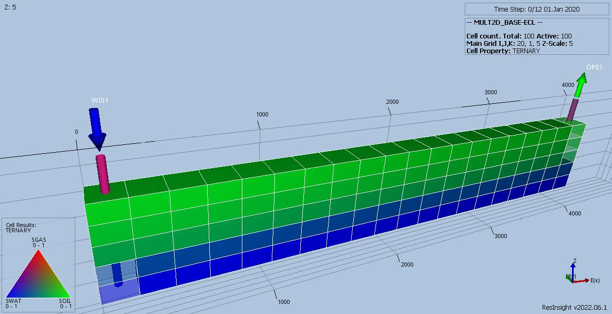
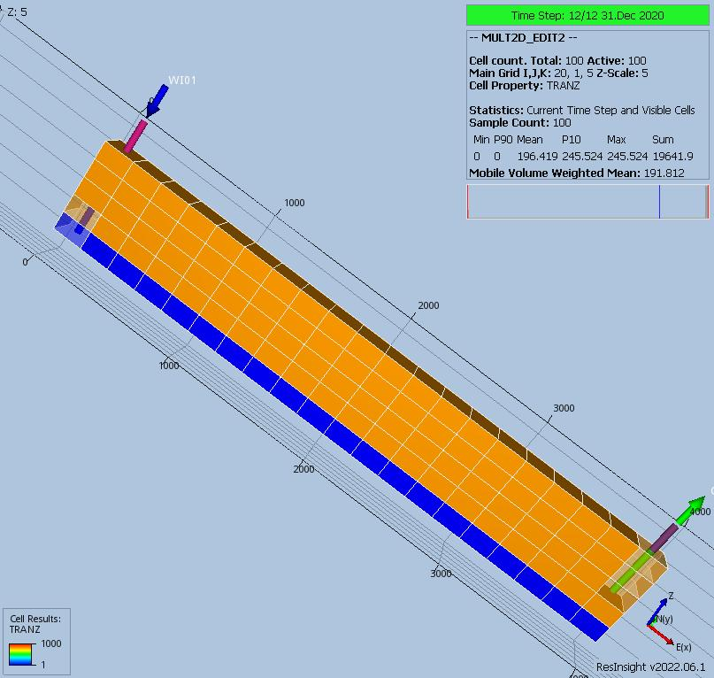
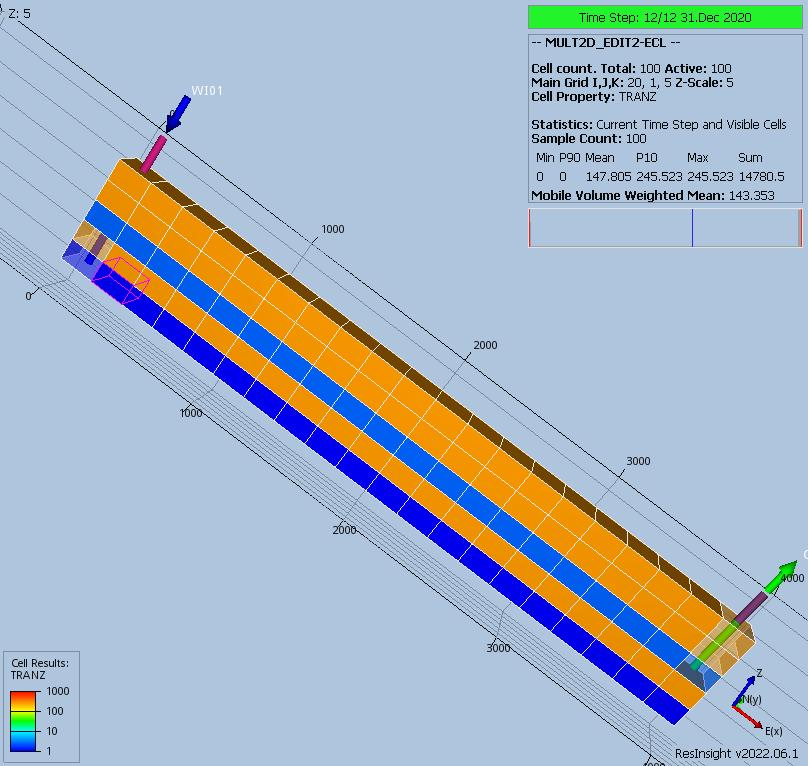
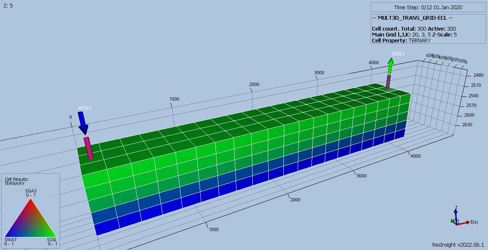

# MULT Documentation

Case Name           | Case Desciption                                               | Base Model | Test Type | Results Match | Comments |
------------------- | ------------------------------------------------------------  | ---------- | ----- |------- | ------------------------------------------ |
MULT2D_BASE         | Base case 2D model.                                           | MULT2D     |       |  Yes   | Identical to commercial simulator.         |
MULT2D_EDIT1        | EDIT: Layer 3 MULTZ x 0.000                                   | MULT2D     |       |  Yes   | Identical to commercial simulator.         |
MULT2D_EDIT2        | EDIT: Layer 3 MULTZ x 100.0, Layer 3 MULTZ x  0.01            | MULT2D     |       |  No    | Only last MULTZ should be applied.         |
MULT2D_GRID1        | GRID: Layer 3 MULTZ x 0.000                                   | MULT2D     |       |  Yes   | Identical to commercial simulator.         |
MULT2D_GRID2        | GRID: Layer 3 MULTZ x 100.0, Layer 3 MULTZ x  0.01            | MULT2D     |       |  Yes   | Identical to commercial simulator.         |
MULT2D_GRID2_EDIT2  | GRID: Layer 3 MULTZ x 0.0 and 0.01, EDIT MULTZ 0.0 and 100.0  | MULT2D     |       |  No    | Only last MULTZ should be applied.         |
MULT2D_SCHD1        | SCHD: Layer 3 MULTZ x 0.000                                   | MULT2D     |       |  Yes   | Identical to commercial simulator.         |
MULT2D_SCHD2        | SCHD: Layer 3 MULTZ x 100.0, Layer 3 MULTZ x  0.01            | MULT2D     |       |  Yes   | Identical to commercial simulator.         |
MULT2D_TRANS        | GRID: Base PERM, EDIT exported TRANX, TRANY and TRANZ         | MULT2D     |       |  Yes   | Identical to commercial simulator.         |
MULT2D_TRANS_NOPERM | GRID: No PERM, EDIT exported TRANX, TRANY and TRANZ           | MULT2D     |       |  Yes   | Both simulators STOP due to missing PERMs' |
MULT3D_BASE         | Base case 3D model.                                           | MULT3D     |       |  Yes   | Identical to commercial simulator.         |
MULT3D_GRID2_EDIT2  | GRID: Layer 3 MULTZ x 0.0 and 0.01, EDIT MULTZ 0.0 and 100.0  | MULT3D     |       |  No    | Only last MULTZ should be applied.         |
MULT3D_TRANS        | GRID: Base PERM, EDIT exported TRANX, TRANY and TRANZ         | MULT3D     |       |  Yes   | Identical to commercial simulator.         |
MULT3D_TRANS_GRID   | GRID: Base PERM*0.5, EDIT original exported TRANX/Y/Z         | MULT3D     |       |  Yes   | Identical to commercial simulator.         |

Simple test cases to verify implementation of MULT series of keywords in OPM Flow and to act as developer test cases.
Tests consistes of both two and three dimensional, two phase model based on MODEL1, with simplified properties (MULT1).
Both models run in less than one second.

**Notes:**

1. _Test Type_ column shows if the case is used for integration testing (_Int_), or regression testing (_Reg_).
2. _Results Match_ column indicate if the OPM Flow results match the commercial simulator.
3. All models run as is with _no_ TUNNING keyword.

**Version: 30 December 2022**

### MULT2D Model (Cartesian Regular 2D Grid)

Base case run for comparison with other 2D cases, derived from MODEL01, two dimensional cross section model
20 x 1 x 5 (x, y, z) with field average permeability values. Two Phase heavy oil PVT with oil viscosity set to 50
instead of 835 cP, to get reasonable oil rate production.

### MULT2D_BASE Description and Results
Base case run for comparison with other 2D cases.
 1) Base model with variable permeability values replaced by field averages for all grid blocks.
 2) OP01 producing in layers 1 to 3, and WI injecting in layers 4 to 5.
 3) GRID Section Modifications
     1) Layer 3 MULTZ x NONE
     2) Layer 3

[MULT2D_BASE ECL Results](plots/MULT2D_BASE-ECL.md)

---

### MULT2D_EDIT1 Description and Results
 1) OP01 producing in layers 1 to 3, and WI injecting in layers 4 to 5.
 2) EDIT Section Modifications
     1) Layer 3 MULTZ x 0.000
     2)

[MULT2D_EDIT1 ECL Results](plots/MULT2D_EDIT1-ECL.md)

---

### MULT2D_EDIT2 Description and Results
 1) OP01 producing in layers 1 to 3, and WI injecting in layers 4 to 5.
 2) EDIT Section Modifications
     1) Layer 3 MULTZ x 100.0
     2) Layer 3 MULTZ x  0.01

Should give different results to the base case as only the last modification should be applied. However, in OPM Flow
the multiple MULT keywords applied in the EDIT section give the same results to the base case, meaning MULT is applied
cumulatively. Only the last entry is applied in the commercial simulator.

[MULT2D_EDIT2 ECL Results](plots/MULT2D_EDIT2-ECL.md)

---

### MULT2D_GRID1 Description and Results
 1) OP01 producing in layers 1 to 3, and WI injecting in layers 4 to 5.
 2) GRID Section Modifications
     1) Layer 3 MULTZ x 0.000
     2)

[MULT2D_GRID1 ECL Results](plots/MULT2D_GRID1-ECL.md)

---

### MULT2D_GRID2 Description and Results
 1) OP01 producing in layers 1 to 3, and WI injecting in layers 4 to 5.
 2) GRID Section Modifications
    1) Layer 3 MULTZ x 100.0
    2) Layer 3 MULTZ x  0.01

[MULT2D_GRID2 ECL Results](plots/MULT2D_GRID2-ECL.md)

---

### MULT2D_GRID2_EDIT2 Description and Results
 1) OP01 producing in layers 1 to 3, and WI injecting in layers 4 to 5.
 2) GRID Section Modifications
     1) Layer 3 MULTZ x   0.0
     2) Layer 3 MULTZ x  0.01
 3) EDIT Section Modifications
     1) Layer 3 MULTZ x   0.0
     2) Layer 3 MULTZ x 100.0

Should give **same** results to the base case as only the last modification should be applied. However, in OPM Flow
the multiple MULT keywords applied in the EDIT section give the different results to the base case, meaning MULT is applied
cumulatively. Only the last entry is applied in both the commercial simulator. See MULT2D_EDIT2 Description and Results
for an example.

[MULT2D_GRID2_EDIT2 ECL Results](plots/MULT2D_GRID2_EDIT2-ECL.md)

---

### MULT2D_SCHD1 Description and Results
 1) OP01 producing in layers 1 to 3, and WI injecting in layers 4 to 5.
 2) SCHEDULE Section Modifications
     1) Layer 3 MULTZ x 0.000
     2)

[MULT2D_SCHD1 ECL Results](plots/MULT2D_SCHD1-ECL.md)

---

### MULT2D_SCHD2 Description and Results
 1) OP01 producing in layers 1 to 3, and WI injecting in layers 4 to 5.
 2) SCHEDULE Section Modifications
     1) Layer 3 MULTZ x 100.0
     2) Layer 3 MULTZ x  0.01

[MULT2D_SCHD2 ECL Results](plots/MULT2D_SCHD2-ECL.md)

---

### MULT2D_TRANS Description and Results
 1) OP01 producing in layers 1 to 3, and WI injecting in layers 4 to 5.
 2) GRID Section Modifications
     1) Base permeability data.
     2)
 3) EDIT Section Modifications
     1) Base case TRANX, TRANY, and TRANZ
     2)

[MULT2D_TRANS ECL Results](plots/MULT2D_TRANS-ECL.md)

---

### MULT2D_TRANS_NOPERM Description and Results
 1) OP01 producing in layers 1 to 3, and WI injecting in layers 4 to 5.
 2) GRID Section Modifications
     1) No permeability data.
     2)
 3) EDIT Section Modifications
     1) Base case TRANX, TRANY, and TRANZ
     2)

This run should stop with an error message saying insufficient data to compute transmissibilities, which it now does
as of 2022-12-30.

**MULT2D_TRANS_NOPERM ECL No Results**

---

---

### MULT3D Model (Cartesian Regular 3D Grid)
MULTX/Y/Z Base Case 3D and is based on the 2D model to check if inconsistencies are a result of working in two
dimensions, as oppose to three.  Model is 20 x 3 x 5 (x, y, z) with same properties as 2D model.

### MULT3D_BASE Description and Results

Base case run for comparison with other 3D cases.
 1) Base model with variable permeability values replaced by field averages for all grid blocks.
 2) OP01 producing in layers 1 to 3, and WI injecting in layers 4 to 5.
 3) GRID Section Modifications
     1) Layer 3 MULTZ x NONE
     2) Layer 3

[MULT3D_BASE ECL Results](plots/MULT3D_BASE-ECL.md)

---

### MULT3D_GRID2_EDIT2 Description and Results
 1) OP01 producing in layers 1 to 3, and WI injecting in layers 4 to 5.
 2) GRID Section Modifications
     1) Layer 3 MULTZ x   0.0
     2) Layer 3 MULTZ x  0.01
 3) EDIT Section Modifications
     1) Layer 3 MULTZ x   0.0
     2) Layer 3 MULTZ x 100.0

Should give the **same** results as the base case, as only the last modification should be applied. However, in OPM Flow
the multiple MULT keywords applied in the EDIT section give the same results as the base case, meaning MULT is applied
cumulatively. Only the last entry is applied in the commercial simulator. See MULT2D_EDIT2 Description and Results
for an example.

[MULT3D_GRID2_EDIT2 ECL Results](plots/MULT3D_GRID2_EDIT2-ECL.md)

---

### MULT3D_TRANS Description and Results
 1) OP01 producing in layers 1 to 3, and WI injecting in layers 4 to 5.
 2) GRID Section Modifications
     1) Base permeability data.
     2)
 3) EDIT Section Modifications
     1) Base case TRANX, TRANY, and TRANZ
     2)

[MULT3D_TRANS ECL Results](plots/MULT3D_TRANS-ECL.md)

---

### MULT3D_TRANS_GRID Description and Results
This case checks to see if TRANX, TRANY, TRANZ arrays are applied and used in the EDIT section. The run should give the same
results as the base case.
 1) OP01 producing in layers 1 to 3, and WI injecting in layers 4 to 5.
 2) GRID Section Modifications---
     1) Base permeability data.
     2) Multiply PERMX, PERMY AND PERMZ by 0.5000 (should be over written by TRANX, TRANY and TRANZ in the EDIT section).
 3) EDIT Section Modifications
     1) Base case TRANX, TRANY, and TRANZ.
     2)
 4) SCHEDULE Section
      1) WPIMULT times 2 to offset MULTIPLY on PERMX, PERMY AND PERMZ in the GRID Section.

[MULT3D_TRANS_GRID ECL Results](plots/MULT3D_TRANS_GRID-ECL.md)

---
