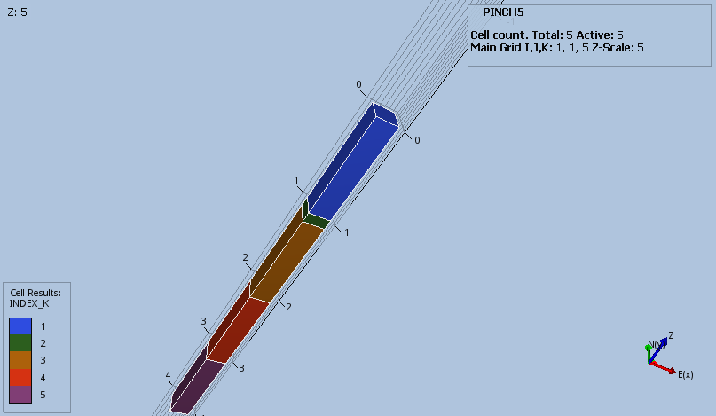
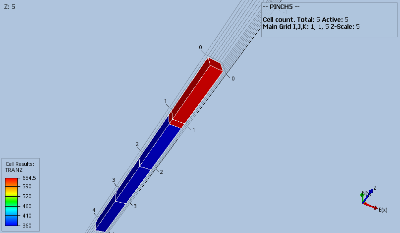

# PINCH Test Documentation

Case Name               | Case Desciption                                                     | Base Model | Test<br />Type | Results<br />Match | Comments |
-----------------       | -------------------------------------------------------------       | ---------- | ----- |------- | ------------------------------------- |
PINCH5                  | Base case 2D five layer model with no modifications.                | PINCH5     |       | NA     |  Results are correct.
PINCH5_GAP1             | DZ, MINPV, and PINCH GAP modification #1, layer 2 inactive.         | PINCH5     |       | NA     |  Results are correct.
PINCH5_GAP2             | DZ, MINPV, and PINCH GAP modification #2, layers 2 and 3 inactive.  | PINCH5     |       | NA     |  Results are correct.
PINCH5_GAP3             | DZ, MINPV, and PINCH GAP modification #2, layers 2 to 4 inactive.   | PINCH5     |       | NA     |  Results are correct.
PINCH5_NOGAP1           | DZ, MINPV, and PINCH NOGAP modification #1, layer 2 inactive.       | PINCH5     |       | NA     |  Option currently not supported, show commercial simulator results.        
PINCH5_NOGAP2           | DZ, MINPV, and PINCH NOGAP modification #2, layers 2 and 3 inactive | PINCH5     |       | NA     |  Option currently not supported, show commercial simulator results.
PINCH5_NOGAP3           | DZ, MINPV, and PINCH NOGAP modification #2, layers 2 to 4 inactive. | PINCH5     |       | NA     |  Option currently not supported, show commercial simulator results.
PINCH_MULTZ_ALL         |                                                                     |            |       | NA     |  Documentation ongoing.                                             
PINCH_MULTZ-\_ALL       |                                                                     |            |       | NA     |  Documentation ongoing.                                             
PINCH_MULTZ_ALL_BARRIER |                                                                     |            |       | NA     |  Documentation ongoing.                                             
PINCH_MULTZ_ALL_BARRIER |                                                                     |            |       | NA     |  Documentation ongoing.                                             
PINCH_NONE              |                                                                     |            |       | NA     |  Documentation ongoing.                                             

**Currently, OPM Flow does not support PINCH(PINCHOPT) equal to NOGAP; thus, these tests map used for when the option
has been implemented.**

**Notes:** 

1. _Test Type_ column shows if the case is used for integration testing (_Int_), or regression testing (_Reg_).  
2. _Results Match_ column indicate if the OPM Flow results match the commercial simulator.

**Version: 05 January 2023**
                               
### PINCH5 Model (Cartesian Regular Grid) Description and Results

The model is a simple (1, 1, 5) model with five vertically stacked cells, no MINPV and no PINCH directives included.
It is meant as a base case to verify the grid and grid transmissibilities, and compare with the other PINCH5 test 
cases.




---

### PINCH5_GAP1 Description and Results
Base case model with:
```
DZ
   1 .1 1 1 1 /  
MINPV
   0.5
/
PINCH
   0.5   GAP   1*   1*
/
```
[PINCH5_GAP1 Results](plots/PINCH5_GAP1.md) 

---


### PINCH5_GAP2 Description and Results
Base case model with the combination of DZ, MINPV and PINCH with the GAP option:     
```
DZ
   1 .1 .2 1 1 /
MINPV
   0.5
/
PINCH
   0.5   GAP   1*   1*
/
```
[PINCH5_GAP2 Results](plots/PINCH5_GAP2.md) 

---

### PINCH5_GAP3 Description and Results
Base case model with the combination of DZ, MINPV and PINCH with the GAP option:     
```
DZ
   1 .1 .3 .2 1 /
MINPV
   0.5
/
PINCH
   0.41   GAP   1*   1*
/
```
[PINCH5_GAP3 Results](plots/PINCH5_GAP3.md) 

---

BBBBBBBBBBBBBBBBBBBBB


### PINCH5_NOGAP1 Description and Results
Base case model with the combination of DZ, MINPV and PINCH with the NOGAP option:     
```
DZ
   1 .1 1 1 1 /
MINPV
   0.5
/
PINCH
   0.5   NOGAP   1*   1*
/
```
[PINCH5_NOGAP1 Results](plots/PINCH5_NOGAP1_ECL.md) 

---

### PINCH5_NOGAP2 Description and Results
Base case model with the combination of DZ, MINPV and PINCH with the NOGAP option:     
```
DZ
   1 .1 .2 1 1 /
MINPV
   0.5
/
PINCH
   0.5   NOGAP   1*   1*
/
```
[PINCH5_NOGAP2 Results](plots/PINCH5_NOGAP2_ECL.md) 

---

### PINCH5_NOGAP3 Description and Results
Base case model with the combination of DZ, MINPV and PINCH with the NOGAP option:     
```
DZ
   1 .1 .3 .2 1 /
MINPV
   0.5
/
PINCH
   0.41   NOGAP   1*   1*
/
```
[PINCH5_NOGAP3 Results](plots/PINCH5_NOGAP3_ECL.md) 

---
