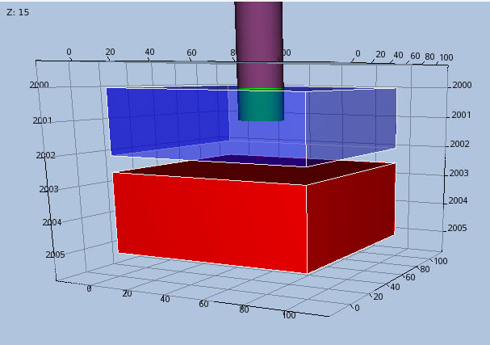
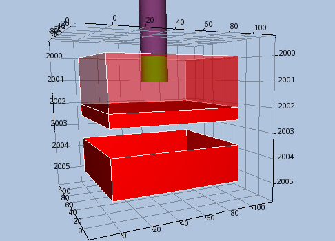

# PINCH Test Documentation

 Case Name                 | Case Desciption                                                         | Base Model  | Test<br />Type | Results<br />Match | Comments |
---------------------------|-------------------------------------------------------------------------|-------------|-----|------- | ------------------------------------- |
 PINCH05                   | Base case 2D five layer model with no modifications.                    | PINCH05     |     | NA     |  Results are correct.
 PINCH05_GAP1              | DZ, MINPV, and PINCH GAP modification #1, layer 2 inactive.             | PINCH05     |     | NA     |  Results are correct.
 PINCH05_GAP2              | DZ, MINPV, and PINCH GAP modification #2, layers 2 and 3 inactive.      | PINCH05     |     | NA     |  Results are correct.
 PINCH05_GAP3              | DZ, MINPV, and PINCH GAP modification #2, layers 2 to 4 inactive.       | PINCH05     |     | NA     |  Results are correct.
 PINCH05_NOGAP1            | DZ, MINPV, and PINCH NOGAP modification #1, layer 2 inactive.           | PINCH05     |     | NA     |  Option currently not supported, **show commercial simulator results instead**.
 PINCH05_NOGAP2            | DZ, MINPV, and PINCH NOGAP modification #2, layers 2 and 3 inactive     | PINCH05     |     | NA     |  Option currently not supported, **show commercial simulator results instead**.
 PINCH05_NOGAP3            | DZ, MINPV, and PINCH NOGAP modification #2, layers 2 to 4 inactive.     | PINCH05     |     | NA     |  Option currently not supported, **show commercial simulator results instead**.
 PINCH10_NOPINCH           | MINPV and no PINCH keyword.                                             | PINCH10     | Reg | NA     |  Results are correct.
 PINCH_MULTZ_ALL           | PINCH(PINCHMUL) equal to ALL and MULTZ = 1.0                            | PINCH_MULTZ | Reg | NA     |  Results are correct.
 PINCH_MULTZ-\_ALL         | Same as PINCH_MULTZ_ALL, but using MULTZ- instead.                      | PINCH_MULTZ |     | NA     |  Results are correct.
 PINCH_MULTZ_ALL_BARRIER   | PINCH(PINCHMUL) equal to ALL and MULTZ = 1.0, except layer 10 equal 0.0 | PINCH_MULTZ | Reg | NA     |  Results are correct.
 PINCH_MULTZ-\_ALL_BARRIER | Same as PINCH_MULTZ_ALL_BARRIER, but using MULTZ- instead.              | PINCH_MULTZ |     | NA     |  Results are correct.
 PINCH_NONE                | Drogon synthetic reservoir model.                                       | DROGON      |     | NA     |  Fails to run due to ENDSCALE(DIRECT) set to DIRECT as only the default value of NODIR is supported, as well as PCW and PCG keywords not supported.

**Currently, OPM Flow does not support PINCH(PINCHOPT) equal to NOGAP; thus, these tests map used for when the option
has been implemented.**

**Notes:**

1. _Test Type_ column shows if the case is used for integration testing (_Int_), or regression testing (_Reg_).
2. _Results Match_ column indicate if the OPM Flow results match the commercial simulator.

**Version: 21 February 2023**

### PINCH05 Model (Cartesian Regular Grid) Description and Results

The model is a simple (1, 1, 5) model with five vertically stacked cells, no MINPV and no PINCH directives included.
It is meant as a base case to verify the grid and grid transmissibilities, and compare with the other PINCH5 test
cases.


---

### PINCH05_GAP1 Description and Results
Base case model with:
```
DZ
   1 .1 1 1 1 /
MINPV
   0.5
/
PINCH
   0.5   GAP   1*   1*
/
```
[PINCH05_GAP1 Results](plots/PINCH05_GAP1.md)

---


### PINCH05_GAP2 Description and Results
Base case model with the combination of DZ, MINPV and PINCH with the GAP option:
```
DZ
   1 .1 .2 1 1 /
MINPV
   0.5
/
PINCH
   0.5   GAP   1*   1*
/
```
[PINCH05_GAP2 Results](plots/PINCH05_GAP2.md)

---

### PINCH05_GAP3 Description and Results
Base case model with the combination of DZ, MINPV and PINCH with the GAP option:
```
DZ
   1 .1 .3 .2 1 /
MINPV
   0.5
/
PINCH
   0.41   GAP   1*   1*
/
```
[PINCH05_GAP3 Results](plots/PINCH05_GAP3.md)

---

### PINCH05_NOGAP1 Description and Results
Base case model with the combination of DZ, MINPV and PINCH with the NOGAP option:
```
DZ
   1 .1 1 1 1 /
MINPV
   0.5
/
PINCH
   0.5   NOGAP   1*   1*
/
```
[PINCH05_NOGAP1 Results](plots/PINCH05_NOGAP1_ECL.md)

---

### PINCH05_NOGAP2 Description and Results
Base case model with the combination of DZ, MINPV and PINCH with the NOGAP option:
```
DZ
   1 .1 .2 1 1 /
MINPV
   0.5
/
PINCH
   0.5   NOGAP   1*   1*
/
```
[PINCH05_NOGAP2 Results](plots/PINCH05_NOGAP2_ECL.md)

---

### PINCH05_NOGAP3 Description and Results
Base case model with the combination of DZ, MINPV and PINCH with the NOGAP option:
```
DZ
   1 .1 .3 .2 1 /
MINPV
   0.5
/
PINCH
   0.41   NOGAP   1*   1*
/
```
[PINCH05_NOGAP3 Results](plots/PINCH05_NOGAP3_ECL.md)

---

### PINCH10_NOPINCH Description and Results
The PINCH10 model is testing MINPV with **no** PINCH keyword. Grid dimension is 1x1x10, one
well is completed in cell 1,1,1 and cell 1,1,2 should be inactive due to its pore volume
being below the threshold volume set with MINPV:
```
MINPV
 100 /

```
[PINCH10_NOPINCH Results](plots/PINCH10_NOPINCH.md)

---

### PINCH_MULTZ_ALL Description and Results
PINCH(PINCHMUL) equal to ALL, which results in the pinch-out transmissibility being calculated from the minimum value
of the MULTZ of the active cell at the top of the pinch-out and all the inactive cells in the pinch-out vertical
column. Here, MULTZ is set to 1.0
```
MULTZ
 19*1.0 /
PINCH
     1*      'GAP'     1*  'TOPBOT'  'ALL'  / --default values
```

[PINCH_MULTZ_ALL Results](plots/PINCH_MULTZ_ALL_PLUS.md)

---

### PINCH_MULTZ-_ALL Description and Results
Same as PINCH_MULTZ_ALL, but using MULTZ- instead, that is:
```
MULTZ-
 19*1.0 /
PINCH
     1*      'GAP'     1*  'TOPBOT'  'ALL'  / --default values
```

[PINCH_MULTZ-\_ALL Results](plots/PINCH_MULTZ_ALL_MINUS.md)

---

### PINCH_MULTZ_ALL_BARRIER Description and Results
PINCH(PINCHMUL) equal to ALL, which results in the pinch-out transmissibility being calculated from the minimum value
of the MULTZ of the active cell at the top of the pinch-out and all the inactive cells in the pinch-out vertical
column. Here, MULTZ is set to 1.0, except layer 10 where MULTZ is set equal 0.0 to enable a barrier.
```
MULTZ
 19*1.0 /
PINCH
     1*      'GAP'     1*  'TOPBOT'  'ALL'  / --default values
EQUALS
 'MULTZ' 0.0 4* 10 10 /
/
```

[PINCH_MULTZ_ALL_BARRIER Results](plots/PINCH_MULTZ_ALL_BARRIER_PLUS.md)

---

### PINCH_MULTZ-_ALL_BARRIER Description and Results
Same as PINCH_MULTZ_ALL, but using MULTZ- instead, that is:
```
MULTZ-
 9*1.0 0.0 9*1.0 /
PINCH
     1*      'GAP'     1*  'TOPBOT'  'ALL'  / --default values
```

[PINCH_MULTZ-\_ALL_BARRIER Results](plots/PINCH_MULTZ_ALL_BARRIER_MINUS.md)

---

### PINCH_NONE Description and Results
Drogon synthetic reservoir model.

No results as the case fails to run due to ENDSCALE(DIRECT) set to DIRECT as only the default value of NODIR is
supported, as well as PCW and PCG keywords also not supported.

**Not Documented and No Results**

---

### Model T1A Description and Results

Grid dimension: 1 x 1 x 4 


Model input properties

 Property      | layer 1 | layer 2 | layer 3 | Layer 4 |
---------------|---------|---------|---------|---------|
 DX            | 100     | 100     | 100     | 100     
 DY            | 100     | 100     | 100     | 100     
 DZ            | 2.0     | 0.25    | 0.25    | 2.5      
 PORO          | 0.25    | 0.05    | 0.05    | 0.25      
 PERMZ         | 100     | 100     | 100     | 100       


Layer 2 and 3 cells inactive due to MINPV. The gap from bottom layer 1 to top layer 4 is 0.5 meters 

	



There are a total of 4 versions of this model T1A, T1B, T1C and T1D

**T1B**
same as above but PERMZ layer 2 and 3  = 0.0


**T1C**
same as T1A but MULTZ layer 2 and 3  = 0.0


**T1D**
same as T1A but MULTZ layer 1 = 0.0


**Sensitivities** 


Datafile      | Model  | Item 1 | Item 2 | Item 3 | Item 4 | Item 5 | Non-zero<br />NNC |
--------------|--------|--------|--------|--------|--------|--------|-------------------|
T1A_NOPINCH.DATA | T1A |  |  |  |  |  |   No
T1B_NOPINCH.DATA | T1B |  |  |  |  |  |   No
T1C_NOPINCH.DATA | T1C |  |  |  |  |  |   No
T1D_NOPINCH.DATA | T1D |  |  |  |  |  |   No
T1A_GAP.DATA | T1A | 0.001 | GAP | 1E+20 | TOPBOT | TOP |   Yes
T1B_GAP.DATA | T1B | 0.001 | GAP | 1E+20 | TOPBOT | TOP |   Yes
T1B1_GAP.DATA | T1B | 0.001 | GAP | 1E+20 | ALL | TOP |   No
T1C1_GAP.DATA | T1C | 0.001 | GAP | 1E+20 | TOPBOT | TOP |   Yes
T1C2_GAP.DATA | T1C | 0.001 | GAP | 1E+20 | TOPBOT | ALL |   No
T1C3_GAP.DATA | T1C | 0.001 | GAP | 1E+20 | ALL | ALL |   No
T1D1_GAP | T1D | 0.001 | GAP | 1E+20 | TOPBOT | TOP |   No
T1A_NOGAP.DATA | T1A | 0.001 | NOGAP | 1E+20 | TOPBOT | TOP |   No
T1A1_NOGAP.DATA | T1A | 0.3 | NOGAP | 1E+20 | TOPBOT | TOP |   No
T1A2_NOGAP.DATA | T1A | 0.6 | NOGAP | 1E+20 | TOPBOT | TOP |   Yes
T1B_NOGAP.DATA | T1B | 0.6 | NOGAP | 1E+20 | TOPBOT | TOP |   Yes
T1B1_NOGAP.DATA | T1B | 0.6 | NOGAP | 1E+20 | ALL | TOP |   No
T1C1_NOGAP.DATA | T1C | 0.6 | NOGAP | 1E+20 | TOPBOT | TOP |   Yes
T1C2_NOGAP.DATA | T1C | 0.6 | NOGAP | 1E+20 | TOPBOT | ALL |   No
T1C3_NOGAP.DATA | T1C | 0.6 | NOGAP | 1E+20 | ALL | ALL |   No
T1D1_NOGAP.DATA | T1D | 0.6 | NOGAP | 1E+20 | TOPBOT | TOP |   No


---

### Model T2A Description and Results

Grid dimension: 1 x 1 x 3 


Model input properties


 Property      | layer 1 | layer 2 | layer 3 |
---------------|---------|---------|---------|
 DX            | 100     | 100     | 100     
 DY            | 100     | 100     | 100     
 DZ            | 2.0     | 0.5     | 1.5     
 PORO          | 0.25    | 0.25    | 0.25      
 PERMZ         | 100     | 100     | 100       


There are no inactive layers in this model. The gap from bottom layer 2 to top layer 3 is 1.0 meter 

	



**Sensitivities** 


Datafile      | Model  | Item 1 | Item 2 | Item 3 | Item 4 | Item 5 | Non-zero<br />TranZ |
--------------|--------|--------|--------|--------|--------|--------|-------------------|
T2A_NOPINCH.DATA | T2A |  |  |  |  |  |   Yes
T2A_GAP.DATA | T2A | 0.001 | GAP | 1E+20 | TOPBOT | TOP |   Yes
T2A1_GAP.DATA | T2A | 0.001 | GAP | 0.9 | TOPBOT | TOP |   No
