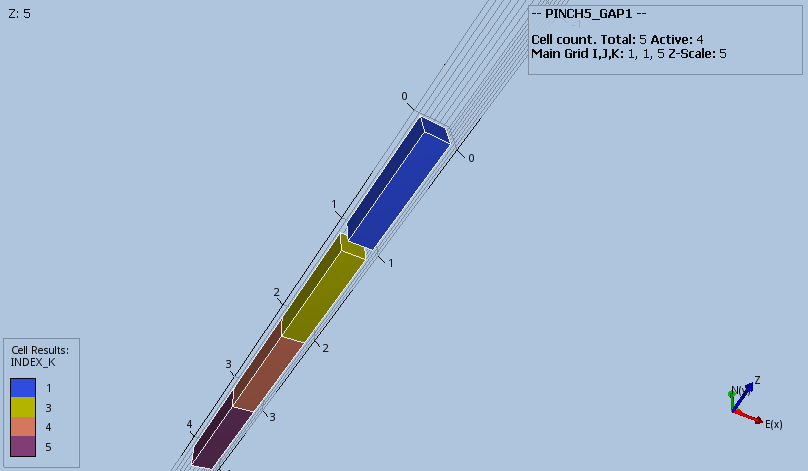
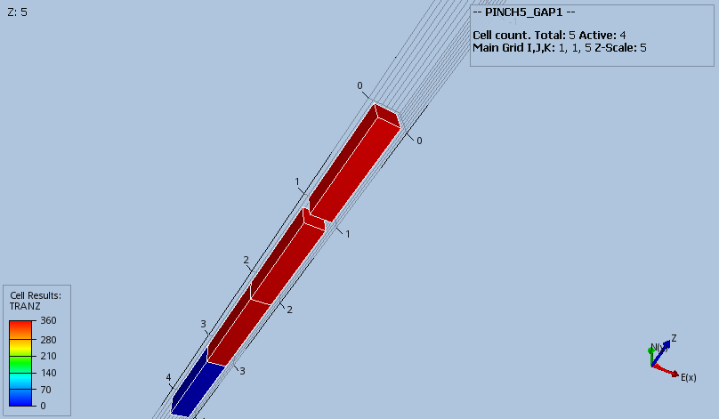

#### PINCH5_GAP1 Results
Base case model with the combination of DZ, MINPV and PINCH with the GAP option should result in layer 2 getting 
pinched out and resulting in a connection between layers 1 and 3.
```
DZ
   1 .1 1 1 1 /  
MINPV
   0.5
/
PINCH
   0.5   GAP   1*   1*
/
```
_Base Case_


_Modified_

Layer 2 inactive. 




                    