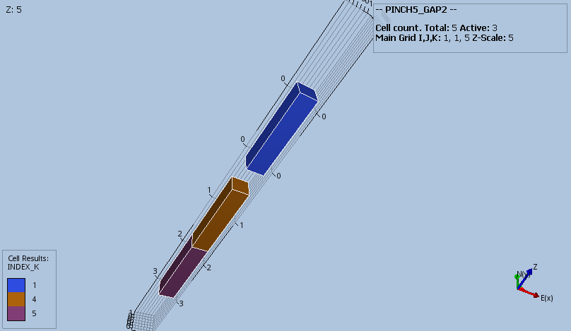
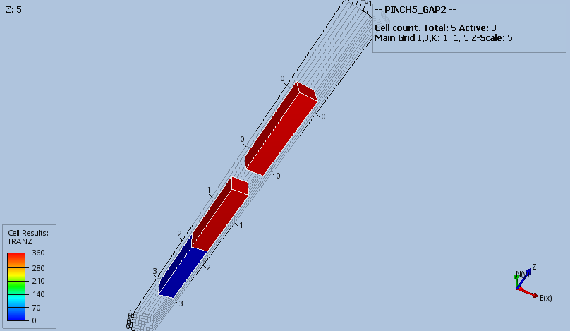

#### PINCH5_GAP2 Results
Base case model with the combination of DZ, MINPV and PINCH with the GAP option should result in layer 2
and 3 getting pinched out and resulting in a connection between layers 1 and 4.
```
DZ
   1 .1 .2 1 1 /
MINPV
   0.5
/
PINCH
   0.5   GAP   1*   1*
/
```

_Base Case_


_Modified_



