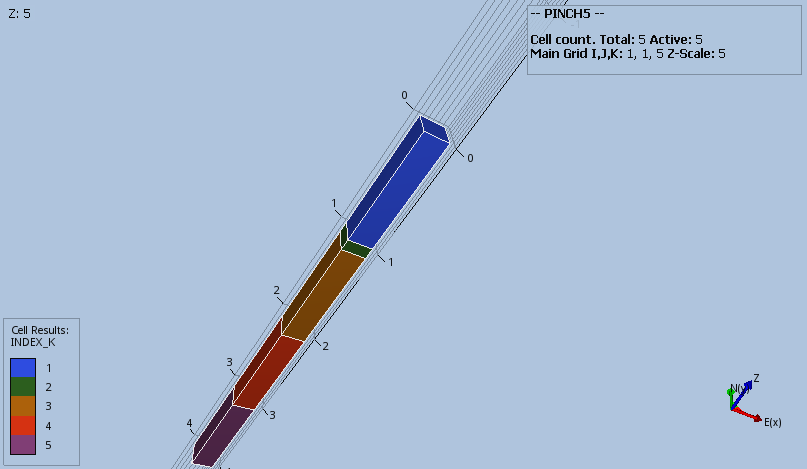

#### PINCH5_GAP3 Results
The combination of DZ, MINPV and PINCH with the GAP option should result in layers 2, 3 and 4 getting pinched out and  
resulting in a connection between layers 1 and 5.        
```
DZ
   1 .1 .3 .2 1 /
MINPV
   0.5
/
PINCH
   0.41   GAP   1*   1*
/
```

_Base Case_



_Modified_


