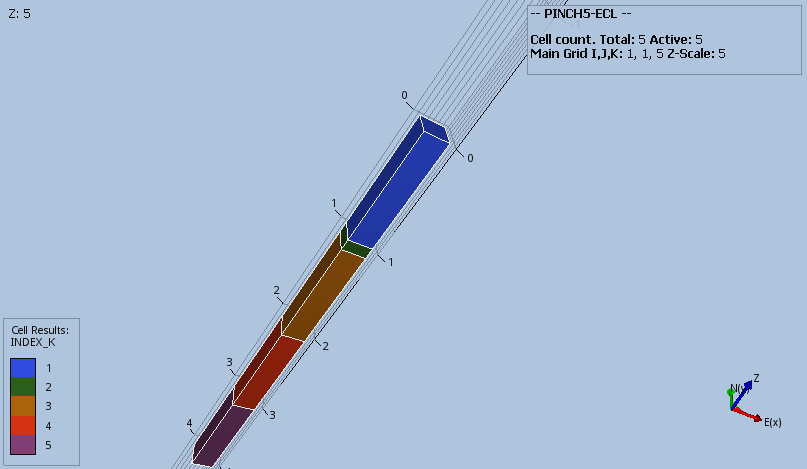

#### PINCH5_NOGAP3 Results
The combination of DZ, MINPV and PINCH with the GAP option should result in layers 2, 3 and 4 getting pinched out, but  
resulting in **no** connection between layers 1 and 5.        

```
DZ
   1 .1 .3 .2 1 /
MINPV
   0.5
/
PINCH
   0.41   NOGAP   1*   1*
/
```
_Base Case_



_Modified_

Layer 2 inactive. 


                                   