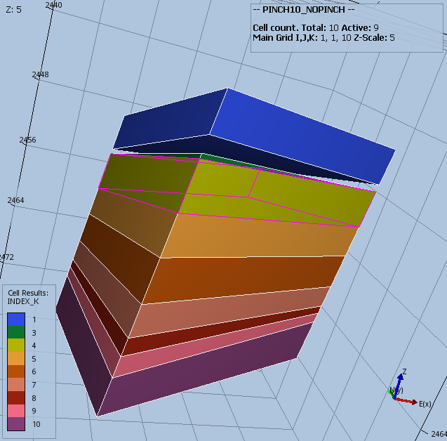
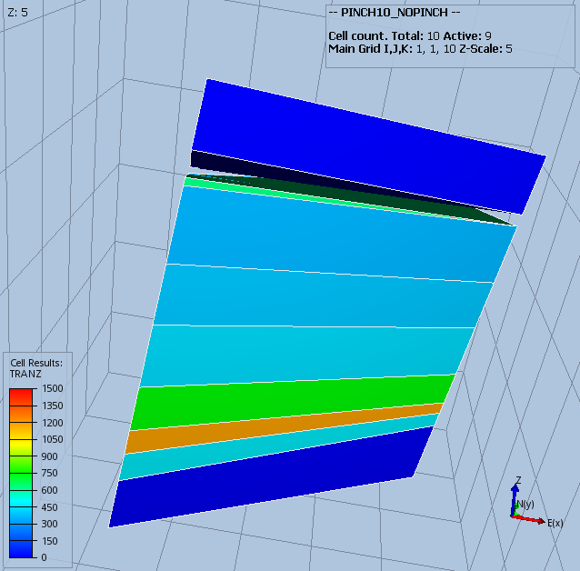

#### PINCH10_NOPINCH Results
PINCH10 model with MINPV and **no** PINCH keyword:
```
MINPV
 100 /

```

_Modified_

Cell 1,1,2 should be a barrier for vertical communication. Cell 1,1,3 to
1,1,10 should not be affected by production in cell 1,1,1.




