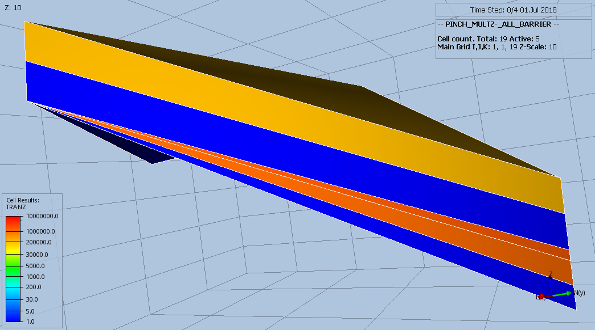

#### PINCH_MULTZ-_ALL_BARRIER Results
Same as PINCH_MULTZ_ALL, but using MULTZ- instead, that is:
```
MULTZ-
 9*1.0 0.0 9*1.0 /
PINCH
     1*      'GAP'     1*  'TOPBOT'  'ALL'  / --default values
```
This should generate a barrier for vertical flow as layer 10 has been made inactive.

_Base Case_


_Modified_



