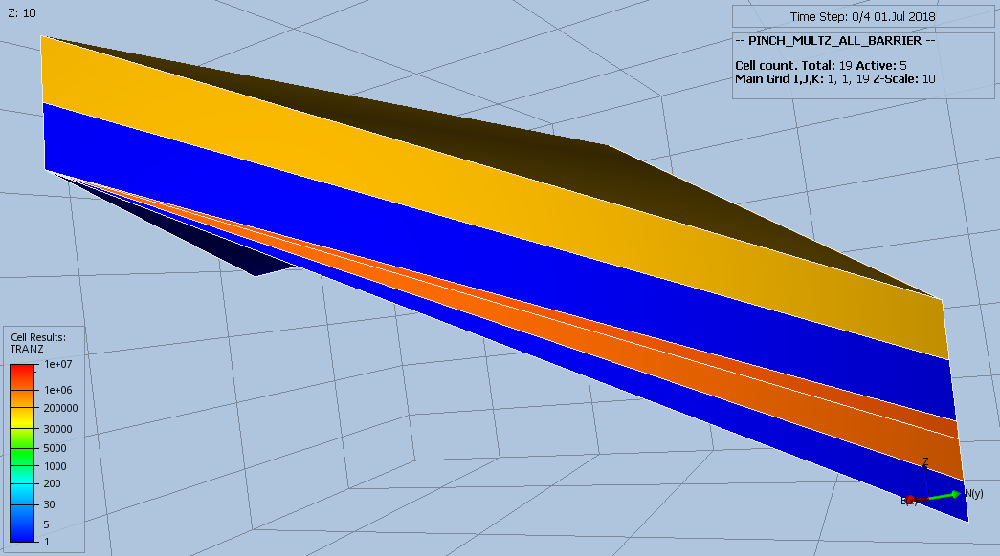
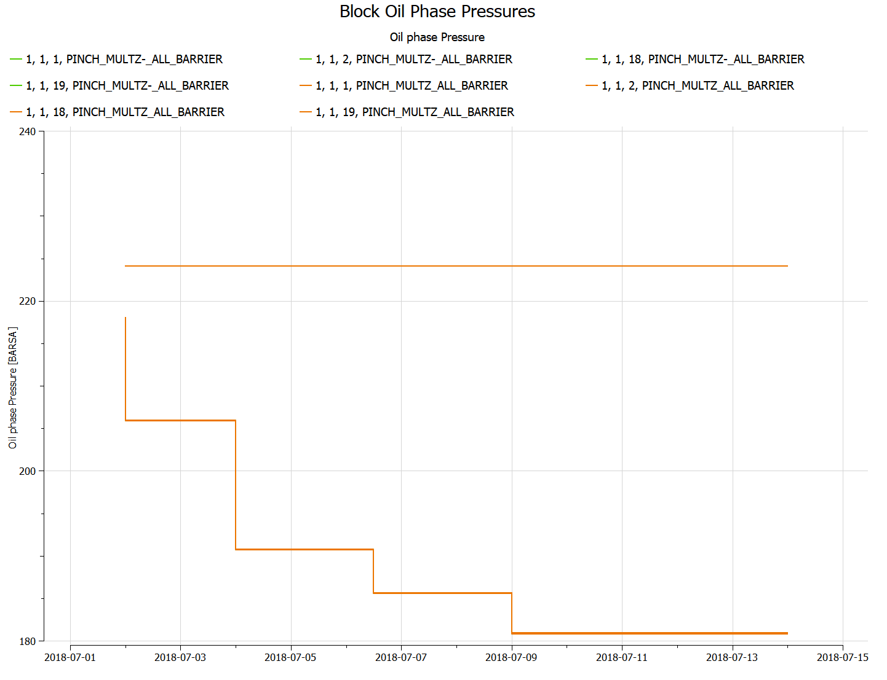

#### PINCH_MULTZ_ALL_BARRIER Results
PINCH(PINCHMUL) equal to ALL, which results in the pinch-out transmissibility being calculated from the minimum value
of the MULTZ of the active cell at the top of the pinch-out and all the inactive cells in the pinch-out vertical
column. Here, MULTZ is set to 1.0, except layer 10 where MULTZ is set equal 0.0 to enable a barrier.
```
MULTZ
 19*1.0 /
PINCH
     1*      'GAP'     1*  'TOPBOT'  'ALL'  / --default values
EQUALS
 'MULTZ' 0.0 4* 10 10 /
/
```
This should generate a barrier for vertical flow as layer 10 has been made inactive.

_Base Case_


_Modified_



