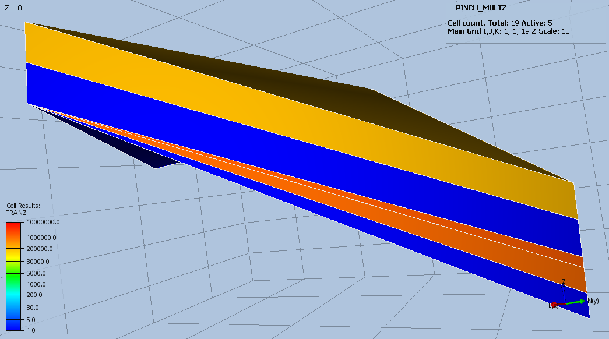
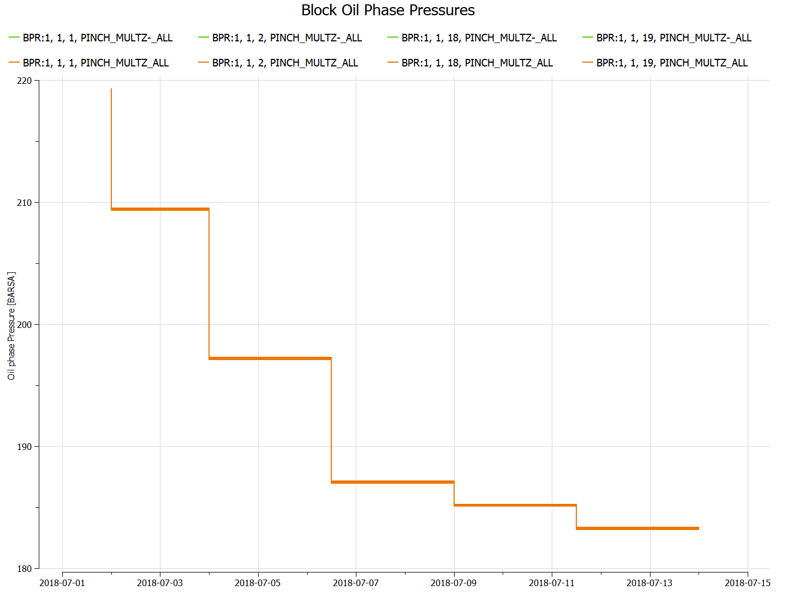

#### PINCH_MULTZ_ALL Results
Same as PINCH_MULTZ_ALL, but using MULTZ- instead, that is:
```
MULTZ-
 19*1.0 /

PINCH
     1*      'GAP'     1*  'TOPBOT'  'ALL'  / --default values
```

_Base Case_



_Modified_



