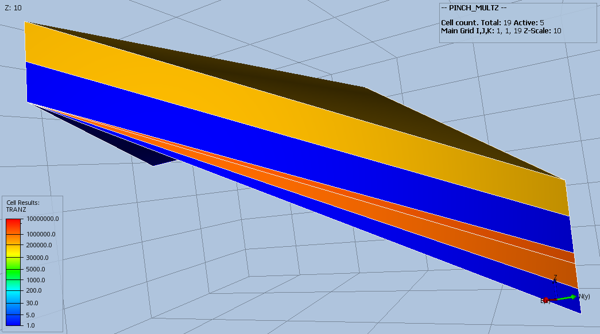
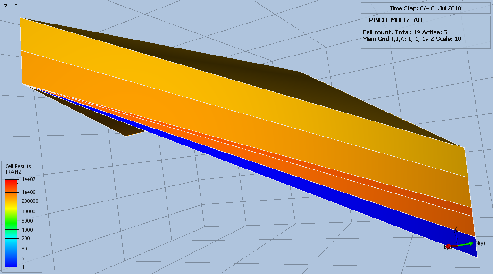
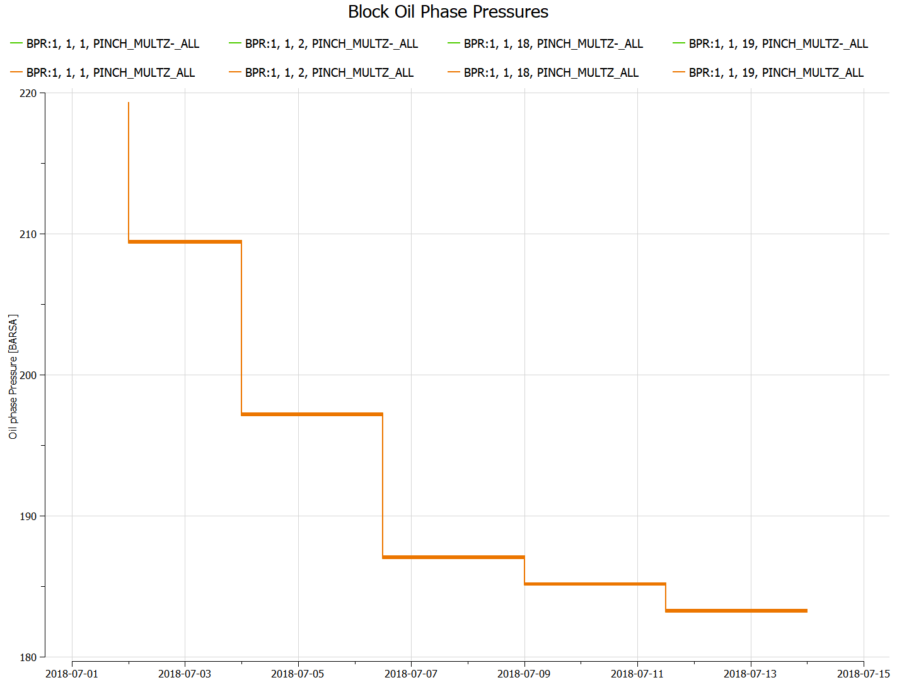

#### PINCH_MULTZ_ALL Results
PINCH(PINCHMUL) equal to ALL, which results in the pinch-out transmissibility being calculated from the minimum value
of the MULTZ of the active cell at the top of the pinch-out and all the inactive cells in the pinch-out vertical
column. Here,MULTZ is set to 1.0
```
MULTZ
 19*1.0 /

PINCH
     1*      'GAP'     1*  'TOPBOT'  'ALL'  / --default values
```

_Base Case_



_Modified_



