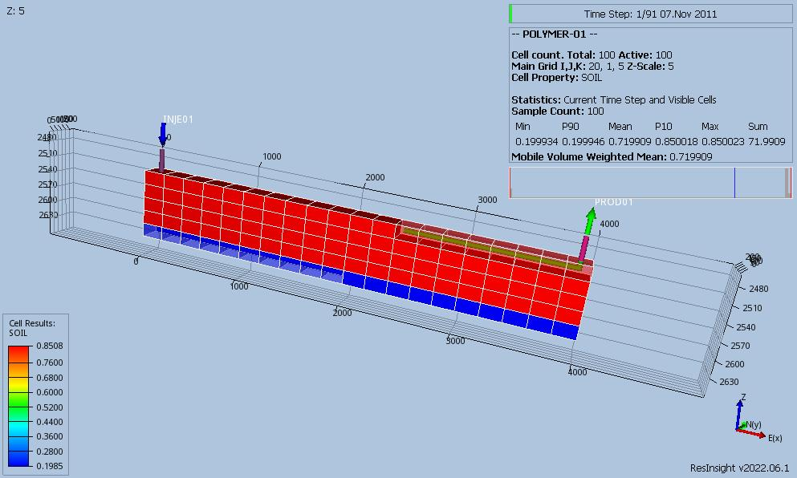
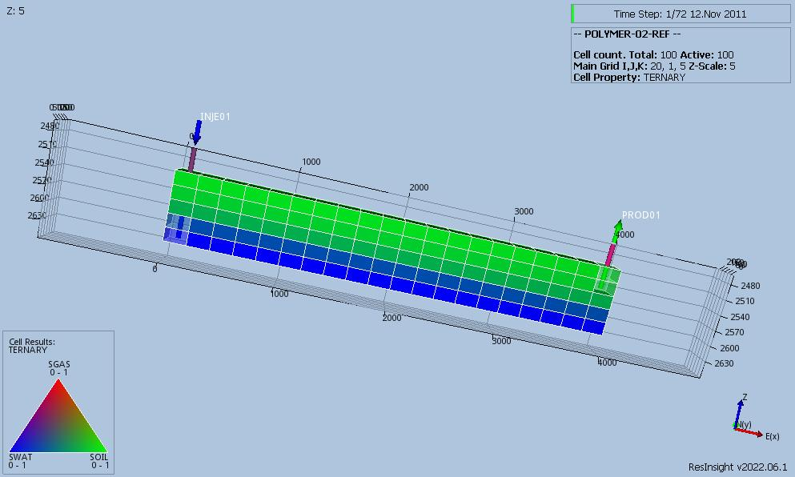

# Polymer Test Documentation

Case Name  | Case Desciption                                           | Base Model | Test Type | Results Match | Comments |
---------  | -----------------------------                             | ---------- | ---- | ------- | ------------------------------------- |
POLYMER-01 | Advanced molecular polymer model (2D_POLYMER_INJECTIVITY).| POLYMER-01 | Reg  | Yes     | Perfect match with reference case.
POLYMER-02 | Standard polymer model (2D_OILWATER_POLYMER).             | AQUFET-01  | Reg  | Yes     | Perfect match with reference case.

**Notes:** 

1. _Test Type_ column shows if the the case is used for intergration testing (_Int_), or regression teststing (_Reg_).
2. _Results Match_ column indicate if the OPM Flow results match the commercial simulator.

**Version: 7 November 2022**
    
### POLYMER-01 Description and Results

Simple two-dimension polymer model with only oil and water, one vertical water/polymer injector and one horizontal oil
well. The case is used to test polymer injectivity using OPM Flow's advanced molecular polymer model, and users the 
following OPM Flow specific keywords:

 1) POLYMW in the RUNSPEC section.
 2) PLYVMH, PLYMWINJ and SKPWAT in the PROPS section.
 3) WPMITAB and WSKPTAB in the SCHEDULE section. 

This model is not available in the commercial simulator. The case differs from the original version by writing out all
the various polymer summary variables; note that not all the summary variables are currently available in OPM Flow.

[POLYMER-01 REF Results](plots/POLYMER-01-REF.md)  

---

### POLYMER-02 Description and Results

Simple two-dimension polymer model with only oil and water, one vertical water/polymer injector and one vertical oil
well. The case is used to test polymer injectivity using OPM Flow's polymer model, and users the  same keywords as the
commercial simulator.

[POLYMER-02 REF Results](plots/POLYMER-02-REF.md) 

---
