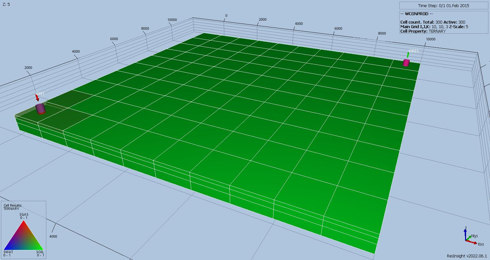
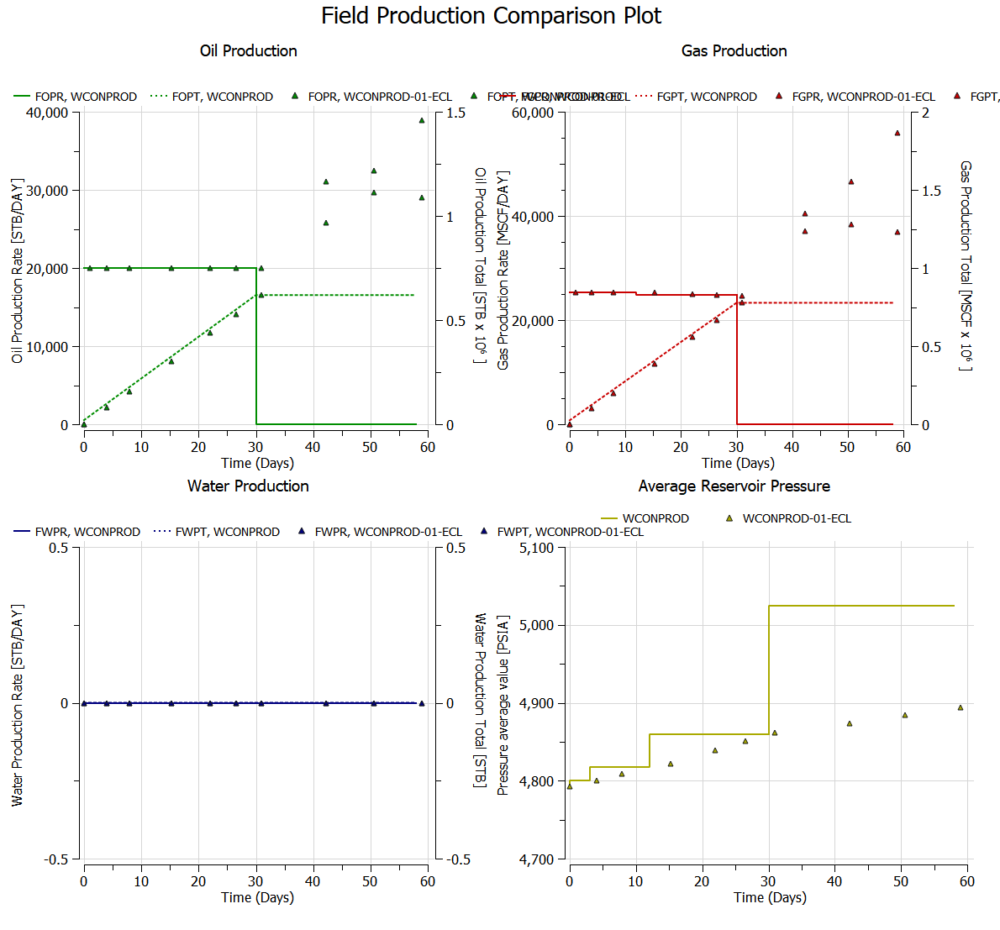
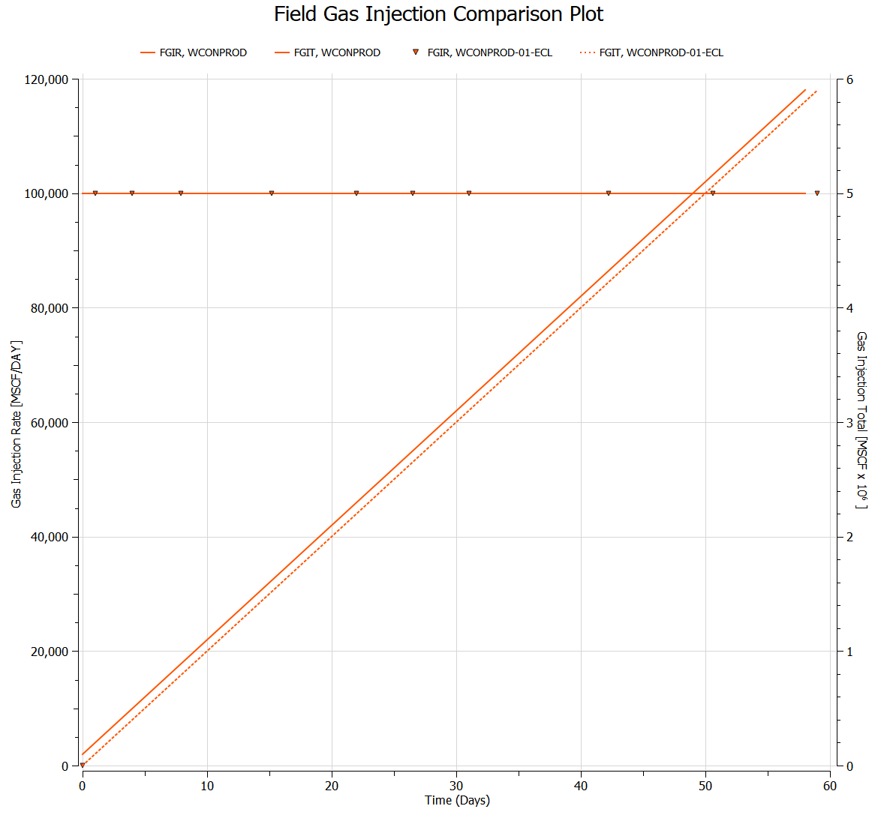
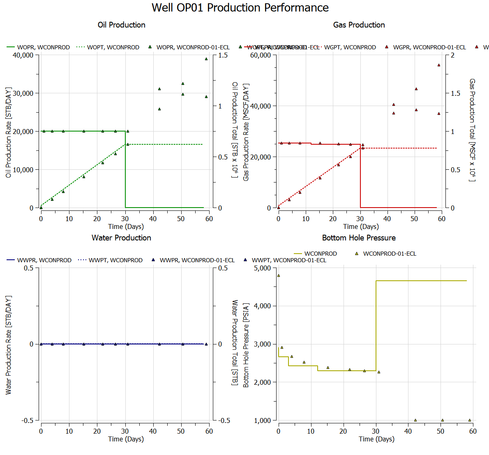
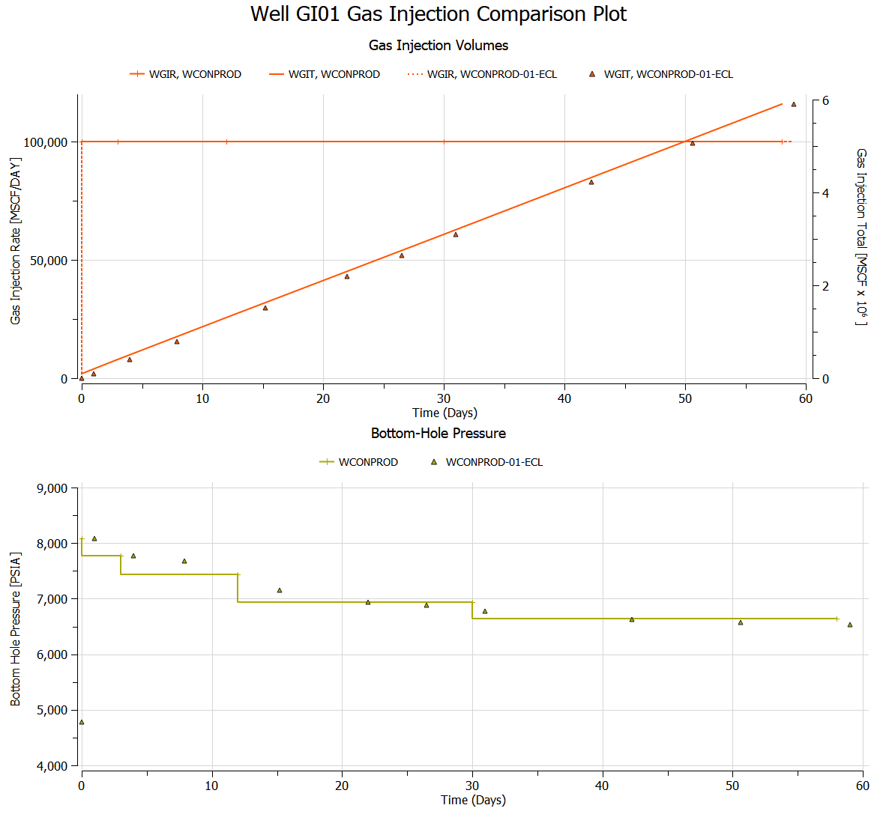

# WCONPROD Test Documentation

Case Name  | Case Desciption                                          | Base Model | Results Match | Comments |
---------  | -----------------------------                            | ---------- | ------- | ------------------------------------- |
WCONPROD   | Base case model base on SPE01 Case 2                     | WCONPROD   | Complete| Runs as expected, but results are different.
WCONPROD-01| STATUS=1*, ORAT=20E3, BHP=1000.0 only                    | WCONPROD   | Fails   | Issues error message and continues, but then fails.
WCONPROD-02| STATUS=1*, LRAT=20E3, BHP=1000.0 only                    | WCONPROD   | Fails   | Issues error message and continues, but then fails.
WCONPROD-03| STATUS=1*, LRAT=20E3, BHP=1000.0 GRAT=5E3 only           | WCONPROD   | Fails   | Issues error message and continues, but then fails.
WCONPROD-04| STATUS=1*, LRAT=20E3, BHP=1000.0 GRAT=5E3, WRAT=5E3 only | WCONPROD   | Fails   | Issues error message and continues, but then fails.
WCONPROD-05| STATUS=1*, ORAT=20E3, BHP=1000.0, and group constraints  | WCONPROD   | Fails   | Issues error message and continues, but then fails.
WCONPROD-06| STATUS='', ORAT=20E3, BHP=1000.0 only                    | WCONPROD   | Fails   | Error: WCONPROD,Internal error: Unknown enum state string
WCONPROD-07| STATUS='', LRAT=20E3, BHP=1000.0 only                    | WCONPROD   | Fails   | Error: WCONPROD,Internal error: Unknown enum state string
WCONPROD-08| STATUS='', LRAT=20E3, BHP=1000.0 GRAT=5E3 only           | WCONPROD   | Fails   | Error: WCONPROD,Internal error: Unknown enum state string
WCONPROD-09| STATUS='', LRAT=20E3, BHP=1000.0 GRAT=5E3, WRAT=5E3 only | WCONPROD   | Fails   | Error: WCONPROD,Internal error: Unknown enum state string
WCONPROD-10| STATUS='', ORAT=20E3, BHP=1000.0, and group constraints  | WCONPROD   | Fails   | Error: WCONPROD,Internal error: Unknown enum state string
WCONPROD-11| STATUS=1*, only                                          | WCONPROD   | Fails   | Issues error message and continues, but then fails.
WCONPROD-12| STATUS='', only                                          | WCONPROD   | Fails   | Error: WCONPROD,Internal error: Unknown enum state string

The default tokens of 1* and '' should behave the same; however, the actual values used when WCONPROD(TARGET) is defaulted is variable, as outlined below:

*   If the well is **not** under group control, then WCONPROD(TARGET) is set to the first non-defaulted hydrocarbon rate (ORAT, GRAT, LIQ, RESV).
    If all rates are defaulted and BHP is entered, then the BHP is used. It is assumed that if the BHP is defaulted as well, and THP has been entered,
    then THP would be used (this configuration has not been tested). Finally, if all parameters are defaulted, then the default value of BHP (14.70 psia)
    will be used combined with BHP control.
    In all the above scenarios the well has been declared as open, that is WCONPROD(STATUS) is set to OPEN.

*   If, **and only if**, the well’s group parameters have been defined via the GCONPROD keyword, then WCONPROD(TARGET) is set equal to GRUP.

In summary, for wells belonging to groups, where GCONPROD has **not** been set or defined, then WCONPROD(TARGET) is defined as the first non-defaulted value on the WCONPROD keyword,
except for WAT control mode. If all parameters are defaulted, then the default BHP value is used and the WCONPROD(TARGET) is set to BHP.

**Notes:**

1.   _Results Match_ column indicate if the OPM Flow results match the commercial simulator Currently, there is WCONPROD.odp document at the moment.
2.   Under comments, _Complete_ means that the test case is completed, it does not mean that the runs are necessarily comparable to the commercial simulator.

**Version: 05 October, 2022**

** WCONPROD Model (Cartesian Regular Grid)
This simulation is based on the SPE Comparison Case Number 01 based on the data given in:

   'Comparison of Solutions to a Three-Dimensional Black-Oil Reservoir Simulation Problem' by Aziz S. Odeh,
    Journal of Petroleum Technology, January 1981

There are two version of this SPE case based on how gas resolution is modeled. If DRSDT is set to 0, GOR cannot rise and free gas does not dissolve in undersaturated oil and implies a constant bubble point pressure, or full resolution. This is controlled by the DRSDT keyword in the SCHEDULE. The two cases are therefore:

1.  Case 1 - Has no resolution of the gas and has the following two TA lines in the SCHEDULE section, DRSDT () set equal to zero.
2.  Case 2 - Has full resolution of the gas and therefore the DRSDT keyword is commented out.

This run is for SPE01 Case 2

## Results

** WCONPROD Results

** WCONPROD-01 Results

Fails

** WCONPROD-02 Results

Fails

** WCONPROD-03 Results

Fails

** WCONPROD-04 Results

Fails

** WCONPROD-05 Results

Fails

** WCONPROD-06 Results

Fails

** WCONPROD-07 Results

Fails

** WCONPROD-08 Results

Fails

** WCONPROD-09 Results

Fails

** WCONPROD-10 Results

Fails

** WCONPROD-11 Results

Fails

** WCONPROD-12 Results

Fails

